# SYSTEM USER MANUAL

## Comprehensive Guide to System Modules, Functions, and Procedures

**LGMED-iMMS** - Local Government Monitoring and Evaluation Division - Information Management and Monitoring System  
Department of the Interior and Local Government  
Regional Office XIII - Caraga  
Manual version 1.0 - 8 October 2026 - System build 3129cb5

---

## Document Control and Version History

| Version | Date | Description | Prepared by |
|---|---|---|---|
| 1.0 | 8 October 2026 | First edition, generated from the system as built (commit 3129cb5). Screenshots captured from the live application on demonstration data. | Documentation team / LGMED-iMMS |

> This Markdown file is generated by `docs/manual/build/build.py` from `docs/manual/src/`. Edit the sources, not this file.

---

# 1. Introduction and Purpose

The **Local Government Monitoring and Evaluation Division – Information Management and Monitoring System (LGMED-iMMS)** is the internal information system of the Local Government Monitoring and Evaluation Division (LGMED), Department of the Interior and Local Government (DILG), Regional Office XIII – Caraga.

LGMED-iMMS brings the Division's records into one place: programmes, projects and activities; monitoring of local government units (LGUs); incoming and outgoing correspondence; the document register; reports; the work calendar; the Division's weekly updates and accomplishments; announcements for the public website; and electronic signature and routing of documents (e-SIRA). Every action is recorded with the name of the person who performed it and the time it was performed.

This manual explains, step by step, how to use each part of the system. It is written for first-time users and for staff who use only some modules. No technical knowledge is needed to follow it.

## 1.1 Purpose of this manual

This manual is intended to:

- show how to sign in to the system safely and how to find your way around it;
- explain what each module is for and who may use it;
- give step-by-step procedures, with annotated screenshots, for every task the system supports;
- explain the workflows that pass a record from one person to another (for example, from the encoder to the Division Chief to the focal person);
- describe the messages, warnings and errors the system may show, and what to do about them.

## 1.2 How to use this manual

| Convention | Meaning |
|---|---|
| **Bold text** | A label exactly as it appears on screen: a menu item, button, field or tab. |
| Sidebar › Module | A path to follow, for example **Sidebar › Incoming Monitoring**. |
| Figure N | An annotated screenshot. The orange numbered markers on the picture match the numbered rows of the legend beneath it. |
| *Who can do this* | The roles that may perform a procedure. If your role is not listed, the button or page will not be available to you. |

Four kinds of notices are used:

> **NOTE:** Additional information that helps you understand a step.

> **TIP:** A shortcut or a better way of doing something.

> **IMPORTANT:** Something you must do, or a rule the system enforces.

> **WARNING:** An action that cannot be undone, or that could expose information. Read carefully before continuing.

> **NOTE:** All screenshots in this manual were taken from the actual LGMED-iMMS application running on a separate documentation copy that holds only the system's own **illustrative demonstration records** (sample programmes, sample documents and fictitious staff names). No live office records appear in this manual. Names, numbers and dates in the screenshots will differ from what you see.

# 2. Scope of the Manual

This manual covers the **internal system** used by DILG Caraga LGMED personnel after signing in (the pages under `/app/` and `/accounts/`), and briefly describes the **public website** that the system publishes to.

It covers every module that appears in the sidebar:

| Sidebar group | Modules covered |
|---|---|
| Main | Dashboard; Programs & Projects; PPA Review Queue; Publication Authorities; Monitoring; Incoming Monitoring; Outgoing Monitoring; Data Sync; LGU Management; Frontline Services |
| Information | Accomplishments (Updates & Accomplishments); Announcements; Document Management; Analytics; Reports; Calendar; Activity Monitoring; Public Website |
| Administration | Users & Roles; Menu Permissions; System Settings; Audit Logs |
| LGMED Innovation Action | e-SIRA (Electronic Signature, Identification, Routing and Approval) |

It also covers **My Profile**, **two-step verification**, and **Notifications**, which are reached from the top bar.

**Not covered.** Installing, configuring, backing up or deploying the system, the database, and the Django administration site (`/django-admin/`) are technical tasks for the system administrator and developer. They are described in the project's `README.md` and in `docs/`, not here.

# 3. System Overview

LGMED-iMMS is a web application. It runs on a server in the office and is opened in a web browser; nothing needs to be installed on your computer. It can also be installed as an app on a computer or phone (see Section 7.9).

## 3.1 The modules at a glance

| Module | What it is for |
|---|---|
| **Dashboard** | Headline figures, charts and the work that needs attention, calculated from the records. |
| **Programs & Projects** | The Division's Programs, Projects, Sub-projects and Activities (PPAs) under the Department's five Organizational Outcomes, their supporting documents, review and publication to the public website. |
| **PPA Review Queue** | Files and records waiting for a reviewer's decision. |
| **Publication Authorities** | Memoranda that authorise the release of files to the public. |
| **Monitoring** | Monitoring activities conducted in LGUs: findings, recommendations, follow-up and attachments. |
| **Incoming Monitoring** | Correspondence received by the Division: recorded by the encoder, reviewed and assigned by the Division Chief, acknowledged and acted on by the focal person. |
| **Outgoing Monitoring** | Action on acknowledged documents: updates, returns for revision, and the communication sent. |
| **Data Sync** | Importing the Incoming and Outgoing spreadsheet registers into the system. |
| **LGU Management** | The directory of the 78 LGUs of Region XIII and their compliance status. |
| **Frontline Services** | The Division's frontline services, published on the public website. |
| **Accomplishments** | The Division's weekly Updates & Accomplishments record, the Division Chief's review, the Monday convocation view and public disclosure. |
| **Announcements** | News, advisories, issuances, activities and commendations for the public website. |
| **Document Management** | The Division's document register: registration, review, assignment, processing, approval, archive, retention and authorised disposal. |
| **Analytics** | Performance analysis: coverage, trend, compliance and the least-monitored LGUs. |
| **Reports** | Monitoring and evaluation reports and their review status. |
| **Calendar** | Each employee's work plan: activities, ownership, assignment and visibility. |
| **Activity Monitoring** | The supervisor's view of everyone's workload. |
| **Public Website** | What the public can see, and the website's standing text. |
| **Users & Roles, Menu Permissions, System Settings, Audit Logs** | Administration of accounts, access, settings and the audit trail. |
| **e-SIRA** | Uploading or scanning documents, placing signature boxes, routing for signature or approval, digital signing with DICT PNPKI certificates, and tracking. |

## 3.2 How work flows through the Division

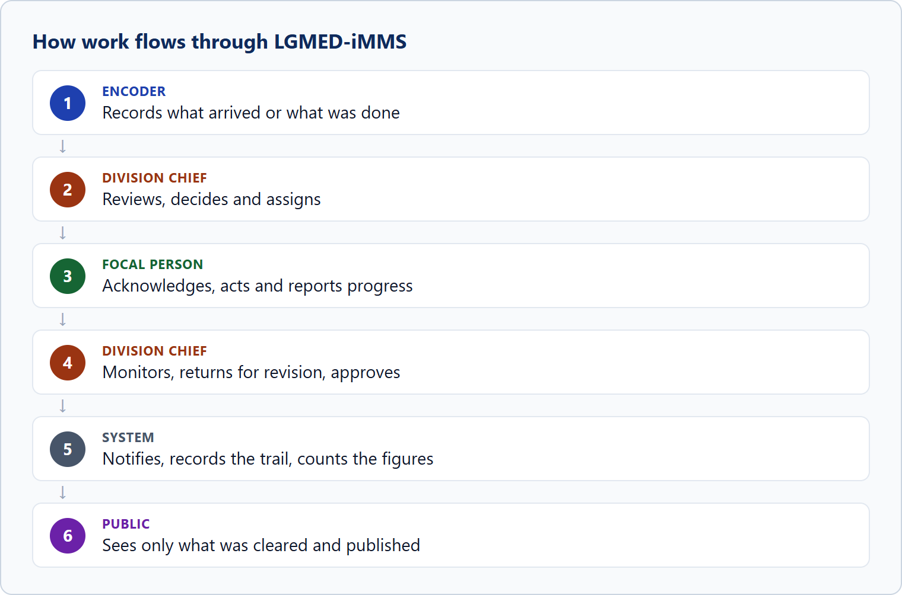

*Figure 1. How work flows through LGMED-iMMS*

The principle that runs through the whole system is that **the encoder records and the Division Chief decides**. Encoders can record a document but cannot name the focal person; contributors can file accomplishments but cannot select what is presented or published. Decisions are made on separate screens by the people authorised to make them, and every decision is recorded.

# 4. System Requirements and Supported Browsers

| Requirement | Details |
|---|---|
| Device | A desktop or laptop computer is recommended for data entry. The interface also adapts to tablets and phones (the sidebar becomes a menu button). |
| Browser | A current version of **Google Chrome** or **Microsoft Edge** (recommended; the screenshots in this manual were taken in Chrome). Current versions of Mozilla Firefox and Safari can also be used. |
| JavaScript | Must be switched on. The sign-in page uses JavaScript for its security check and shows a notice if it is switched off. |
| Network | Access to the office network or the address the system administrator gives you. If the sign-in security check (reCAPTCHA) is enabled, the browser must also be able to reach `www.google.com`. |
| Account | A user account issued by the system administrator. |
| For two-step verification | An authenticator app on your phone (for example Google Authenticator or Microsoft Authenticator). Required for Administrators and System Administrators. |
| For digital signing (e-SIRA) | Your DICT PNPKI digital certificate file (.p12 or .pfx) and its password. |
| For viewing files | PDF files open inside the system's own viewer; other file types are downloaded and opened with the usual program (Word, Excel, an image viewer). |

> **NOTE:** The system can be installed as an app from the browser (account menu › **Install app**) where the browser supports it. Installation needs a secure (HTTPS) address. See Section 7.9.

# 5. Accessing the System

LGMED-iMMS has two parts:

| Part | Address | Who uses it |
|---|---|---|
| Public website | The site's home address, for example `https://<server>/` | Anyone. It shows news, accomplishments, programs, frontline services, statistics, reports, the document library, the calendar, About and Contact. |
| Internal system | `https://<server>/staff` (which opens `/accounts/login/`) | DILG Caraga LGMED personnel with an account. |

**Nothing on the public website links to the staff sign-in page.** Type the address yourself or use a bookmark.

### Procedure 5.1: Open the sign-in page

**Purpose:** Reach the staff sign-in page.

**Who can do this:** Anyone with a user account.

**Steps:**

1. Open Google Chrome or Microsoft Edge.
2. In the address bar, type the system's address followed by `/staff` (for example `https://<server>/staff`) and press **Enter**. Your system administrator will tell you the server address.
3. Bookmark the page so you can return to it easily.

**Expected Result:** The sign-in page (Figure 2) opens.

**Important Notes:** If the page does not open, see Chapter 15, *Troubleshooting*.

# 6. Logging In and Logging Out

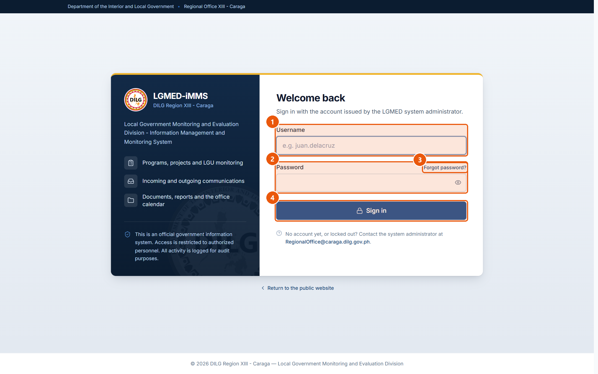

*Figure 2. The staff sign-in page (/staff or /accounts/login/).* Signed in as: Public visitor.

| No. | Element | Description |
|:-:|---|---|
| 1 | **Username** | The username issued by the system administrator. |
| 2 | **Password** | Your password. The eye button shows or hides what you typed; a warning appears if Caps Lock is on. |
| 3 | **Forgot password?** | Opens an e-mail to the office asking for a password reset. Passwords are reset by an administrator. |
| 4 | **Sign in** | Submits your username and password. |

### Procedure 6.1: Sign in

**Purpose:** Start a session in LGMED-iMMS.

**Who can do this:** All roles.

**Steps:**

1. Open the sign-in page (Procedure 5.1).
2. Type your username in **Username** (marker 1).
3. Type your password in **Password** (marker 2). Click the eye button to check what you typed. A message warns you if Caps Lock is on.
4. Click **Sign in** (marker 4).
5. If your account has two-step verification, the system asks for an **Authentication code**. Open your authenticator app and type the six-digit code it shows for LGMED-iMMS, then continue. If you no longer have your phone, use one of your **recovery codes** instead.
6. The first time you sign in, read the **Data Privacy Notice** and accept it (Procedure 6.2).

**Expected Result:** The **Dashboard** opens. If you were sent to the sign-in page from a link, the system takes you to the page you originally asked for.

**Important Notes:**

- If the username or password is wrong, the page shows **Sign-in unsuccessful**. Check both and try again. Failed sign-ins are recorded in the audit log.
- **Administrators must use two-step verification.** If an Administrator account has not yet set it up, the system leads the user through setup at sign-in.
- If **Forgot password?** (marker 3) is clicked, an e-mail addressed to the office opens so you can request a reset. Passwords are reset by an administrator (Section 10.17).

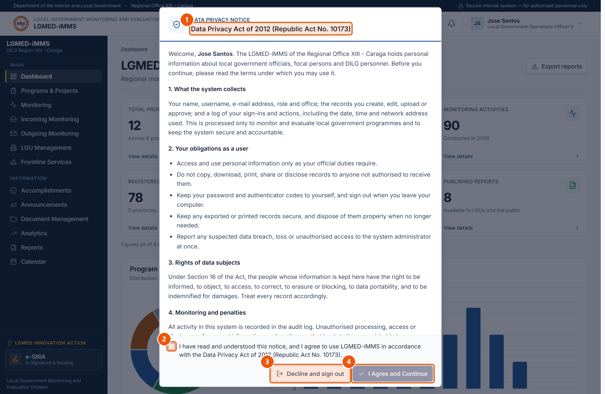

*Figure 3. The Data Privacy Notice shown at first sign-in.* Signed in as: Viewer.

| No. | Element | Description |
|:-:|---|---|
| 1 | **Notice title** | Data Privacy Act of 2012 (Republic Act No. 10173). Scroll to read all sections. |
| 2 | **Agreement box** | Tick to confirm you have read and agree to the notice. |
| 3 | **Decline and sign out** | Leaves the system without accepting. You cannot use LGMED-iMMS until you accept. |
| 4 | **I Agree and Continue** | Becomes available once the box is ticked; records your acceptance and opens the system. |

### Procedure 6.2: Accept the Data Privacy Notice

**Purpose:** Confirm that you understand your obligations under the Data Privacy Act of 2012 (Republic Act No. 10173) before using records that contain personal information.

**Who can do this:** All roles, at first sign-in.

**Steps:**

1. Read the notice. It explains (1) what the system collects, (2) your obligations as a user, (3) the rights of data subjects and (4) monitoring and penalties. Scroll inside the notice to read every section.
2. Tick **I have read and understood this notice, and I agree to use LGMED-iMMS in accordance with the Data Privacy Act of 2012 (Republic Act No. 10173)** (marker 2).
3. Click **I Agree and Continue** (marker 4).

**Expected Result:** The notice closes and the system can be used. It is not shown again unless the notice is changed.

**Important Notes:** **Decline and sign out** (marker 3) signs you out. You cannot use the system without accepting the notice.

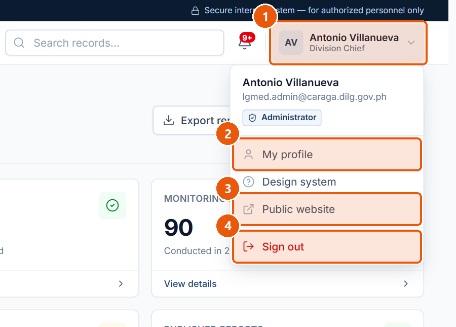

*Figure 4. The account menu in the top bar.* Signed in as: Administrator (Division Chief).

| No. | Element | Description |
|:-:|---|---|
| 1 | **Account menu** | Your name and position. Click to open or close the menu. |
| 2 | **My profile** | Your account details, profile photo, permissions and two-step verification. |
| 3 | **Public website** | Opens the public LGMED website. |
| 4 | **Sign out** | Ends your session. Always sign out on a shared computer. |

### Procedure 6.3: Sign out

**Purpose:** End your session so nobody else can use your account.

**Who can do this:** All roles.

**Steps:**

1. Click your name at the top right of the screen (**Account menu**, marker 1).
2. Click **Sign out** (marker 4).

**Expected Result:** The session ends and the sign-in page is shown.

**Important Notes:**

- Always sign out before leaving a shared or public computer.
- Your session also ends when you **close the browser**, and after **eight hours without activity**. A warning appears a few minutes before the session expires (the number of minutes is set by the administrator; the default is 5). Save your work when you see it.

# 7. User Interface Overview

Every internal page has the same frame, so once you know one page you know where to find things on all of them.

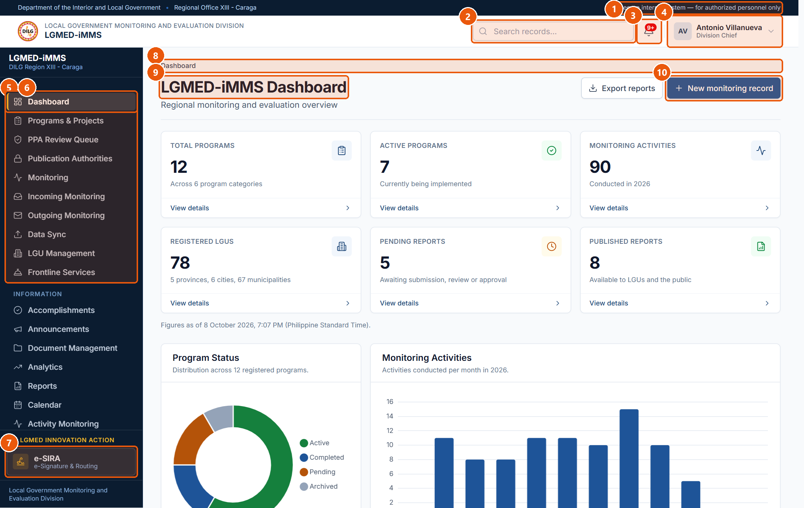

*Figure 5. Parts of the LGMED-iMMS screen (Dashboard, signed in as the Division Chief).* Signed in as: Administrator (Division Chief).

| No. | Element | Description |
|:-:|---|---|
| 1 | **System banner** | Confirms you are in the secure internal system, for authorised personnel only. |
| 2 | **Search records** | Quick search box in the top bar. |
| 3 | **Notifications bell** | The red badge counts your unread notifications. Click to see the latest. |
| 4 | **Account menu** | Profile, public website and Sign out. |
| 5 | **Sidebar - Main** | Operational modules. You only see the modules your role and menu permissions allow. |
| 6 | **Current page** | The highlighted item shows where you are. |
| 7 | **LGMED Innovation Action** | e-SIRA, pinned at the foot of the sidebar. |
| 8 | **Breadcrumb** | The path to the current page. Click an earlier part to go back. |
| 9 | **Page title** | The name of the page, with a short description beneath it. |
| 10 | **Page actions** | The main actions for the page, at the top right. |

## 7.1 The top bar

- **System banner** (marker 1): *Department of the Interior and Local Government • Regional Office XIII – Caraga* on the left, *Secure internal system — for authorized personnel only* on the right.
- **Search records** (marker 2): a quick search box. On module list pages, use the module's own search box (Section 7.4), which searches that module's records.
- **Notifications bell** (marker 3): the red badge shows how many notifications you have not read. Click the bell to see the latest; see Chapter 12.
- **Account menu** (marker 4): your name and position. It opens **My profile**, **Design system** (a reference page of interface components), **Public website**, **Install app** (where the browser supports it) and **Sign out** (Figure 4).

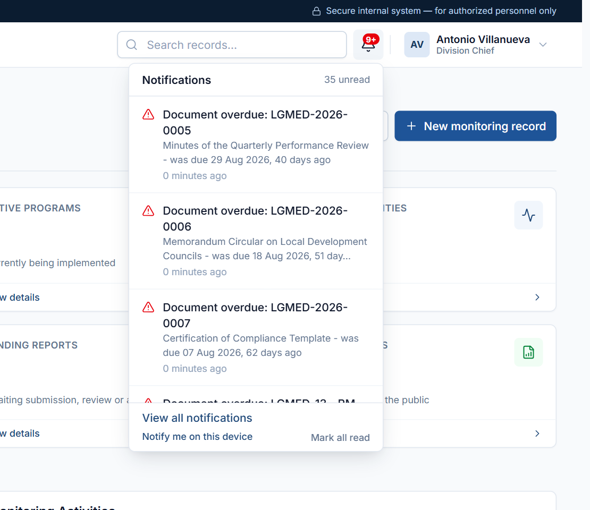

*Figure 6. The notifications drop-down.* Signed in as: Administrator (Division Chief).

## 7.2 The sidebar

The sidebar on the left lists the modules in groups: **Main**, **Information**, **Administration** (Administrators only) and, pinned at the bottom, **LGMED Innovation Action** (e-SIRA). The item for the page you are on is highlighted (marker 6).

> **IMPORTANT:** The sidebar shows only the modules your role allows (Chapter 9), and the System Administrator can close further modules to a role or to a single account (Section 10.17). A module that is not in your sidebar is not available to you; typing its address shows an *access denied* page.

On a narrow screen (tablet or phone) the sidebar is hidden. Tap the menu button at the top left to open it.

## 7.3 The page header

Under the top bar, each page shows:

- the **breadcrumb** (marker 8) — the path to the current page; click an earlier part to go back;
- the **page title** and a short description (marker 9);
- the **page actions** (marker 10) — buttons for the main tasks on that page, such as **New monitoring record**, **Export CSV** or **Add LGU**.

## 7.4 Lists of records

Most modules open on a list (a *register*). All lists work the same way (Figure 21):

| Control | How to use it |
|---|---|
| **Search box** | Type part of a title, name, code or other text and press **Enter** or click **Apply**. |
| **Filters** | Drop-down lists (for example *Status: All*, *Province: All*). Choose a value and click **Apply**. Filters can be combined with the search. |
| **Date range** | Some lists have **From** and **To** dates; some let you choose which date the range applies to (for example *Date received* or *Date completed*). |
| **Sortable headings** | Click an underlined column heading to sort by it; click again to reverse the order. |
| **Row actions** | The eye icon (**View** / **Open**), pencil (**Edit**) and bin (**Delete**) at the end of each row. Only the actions your role may perform are shown. |
| **Pagination** | **Previous** / **Next** and page numbers at the foot of the list. The number of rows per page is set by the administrator (default 15). |
| **Export CSV** | Downloads the rows that match the current search and filters as a CSV file that opens in Excel. Every export is recorded in the audit log. |

## 7.5 Record pages

Opening a record shows its details in panels (*cards*). Common elements:

- **Back to list** returns to the register.
- **Print** prints the record in a print-friendly layout.
- **Edit** opens the form; **Delete** asks for confirmation first (Figure 24).
- **Progress** / **Lifecycle** shows each stage of the record's workflow, with the current stage highlighted.
- **Record Information** shows who created the record and who last changed it, and when.
- **Audit Trail** / **Record trail** / **Document Trail** lists what happened to the record, by whom and when.

## 7.6 Forms

- Required fields are marked with a red asterisk (**\***). The note *\* indicates a required field* appears at the bottom of each form.
- Grey text under a field explains what to enter.
- **Save** stores the record; **Cancel** returns without saving.
- If something is wrong, the form is shown again with the problem written in red under the field (Chapter 13).

## 7.7 Status labels

Statuses are shown as coloured labels that also carry a symbol and a word, so they can be read without relying on colour: for example **Completed** (green, tick), **In progress** (blue), **Overdue** and **Returned / for revision** (red, warning sign).

## 7.8 Viewing PDF files

PDF files open in the system's built-in viewer inside the page. Other files are downloaded. Files are never served from a public address: every view and download is checked against your access and, in Document Management, recorded on the document's trail.

## 7.9 Installing the system as an app

Where the browser supports it (Chrome or Edge on Windows and Android; *Add to Home Screen* on iPhone/iPad), LGMED-iMMS can be installed as an app.

### Procedure 7.1: Install LGMED-iMMS as an app

**Purpose:** Open the system from its own icon, like a desktop or phone app.

**Who can do this:** All roles.

**Steps:**

1. Sign in.
2. Open the **Account menu** at the top right.
3. Click **Install app**. (On iPhone or iPad, follow the on-screen instructions to use **Share › Add to Home Screen**.)
4. Confirm the installation in the browser's prompt.

**Expected Result:** An LGMED-iMMS icon is added to the desktop, Start menu or home screen.

**Important Notes:** **Install app** only appears when the browser can install the system, which requires a secure (HTTPS) address. The app keeps only the screen design and an offline notice on the device — never your records. You still need to be online and signed in.

# 8. Dashboard Guide

The **Dashboard** is the first page after sign-in (**Sidebar › Dashboard**). Every figure, chart and list on it is calculated from the records at the moment the page opens; when there is nothing to count, the panel says so.

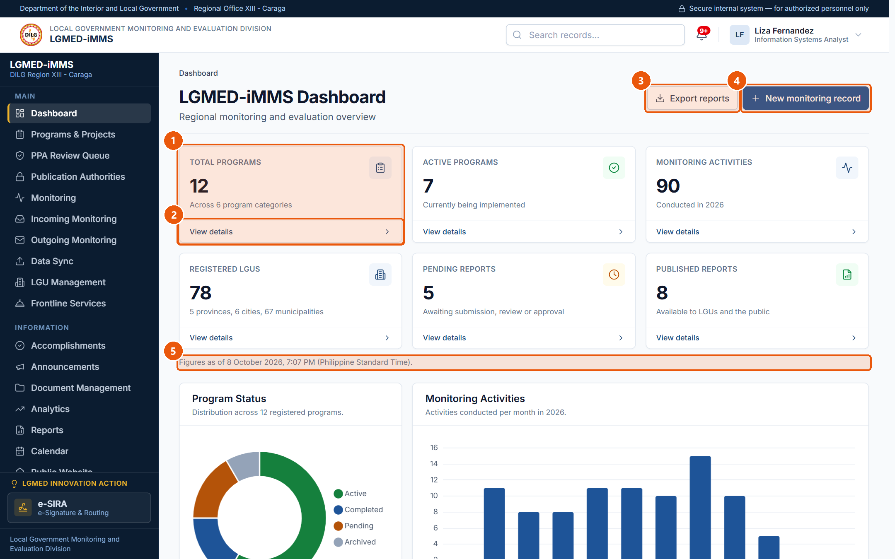

*Figure 7. The Dashboard - summary figures.* Signed in as: LGMED Staff.

| No. | Element | Description |
|:-:|---|---|
| 1 | **Summary figure** | A headline count taken directly from the records. |
| 2 | **View details** | Opens the records behind the figure. |
| 3 | **Export reports** | Downloads the Reports register as a CSV file. |
| 4 | **New monitoring record** | Shortcut to record a monitoring activity (roles that may encode). |
| 5 | **Time stamp** | When the figures were calculated (Philippine Standard Time). |

| Part | What it shows |
|---|---|
| **Summary figures** | Total Programs, Active Programs, Monitoring Activities, Registered LGUs, Pending Reports and Published Reports. **View details** under each figure opens the records it counts. |
| **Analytics charts** | Program Status, Monitoring Activities (per month), LGU Monitoring Coverage and Report Submissions. |
| **View figures** | Each chart has a **View figures** disclosure that shows the same numbers as a table — useful for printing and for screen readers. |
| **Recent Monitoring Activities** | The most recent monitoring records. **View all** opens the Monitoring register. |
| **Requires Attention** | Work waiting on the Division, for example incoming documents awaiting the Division Chief's review, overdue documents, monitoring records awaiting review, documents awaiting review and overdue follow-ups. Each line is a link to exactly those records. |
| **Upcoming Activities** | Calendar activities coming up that you are allowed to see. |

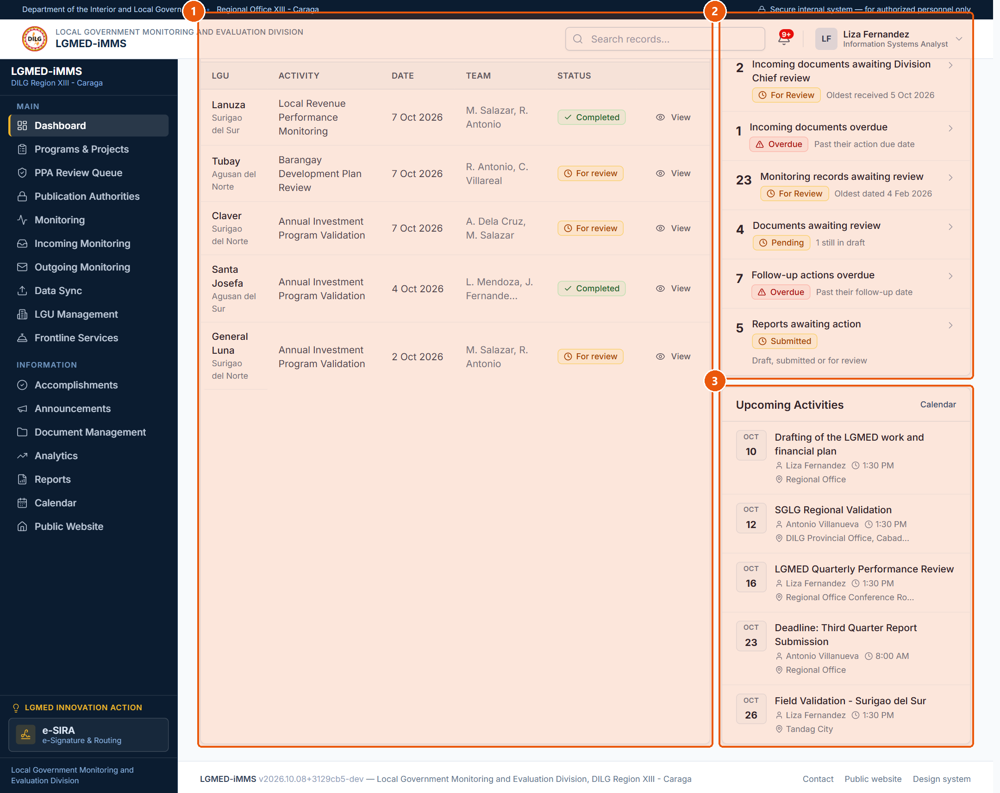

*Figure 8. The Dashboard - recent activity and items requiring attention.* Signed in as: LGMED Staff.

| No. | Element | Description |
|:-:|---|---|
| 1 | **Recent Monitoring Activities** | The latest monitoring records; click an LGU or the eye icon to open one. |
| 2 | **Requires Attention** | Work waiting on the Division, such as documents awaiting review or overdue follow-ups. Each line opens the matching records. |
| 3 | **Upcoming Activities** | Calendar activities coming up that you are allowed to see. |

### Procedure 8.1: Use the Dashboard to find work that needs attention

**Purpose:** Go straight from a figure to the records behind it.

**Who can do this:** All roles.

**Steps:**

1. Click **Dashboard** in the sidebar.
2. Scroll to **Requires Attention**.
3. Click a line, for example *Incoming documents awaiting Division Chief review*.

**Expected Result:** The module opens, already filtered to the records that were counted.

**Important Notes:** **Export reports** downloads the Reports register as a CSV file. **New monitoring record** is shown only to roles that may encode (not to Viewers).

# 9. User Roles and Access Permissions

Every account has one of five roles. The role decides which modules appear in the sidebar and which buttons appear on each page. **The system also checks permission on the server for every request**, so hiding a button is only a courtesy: an action that is not permitted is refused even if its address is typed directly.

## 9.1 The five roles

| Role | Typical holder | In short |
|---|---|---|
| **System Administrator** | Information Technology Officer | Everything an Administrator can do, plus **Menu Permissions** and editing or deleting any employee's calendar activities. |
| **Administrator** | Division Chief and designated administrators | Reviews and assigns incoming documents and registered documents; supervises the calendar; publishes PPAs; manages users, settings and the audit log; verifies e-SIRA certificates. Two-step verification is mandatory. |
| **LGMED Staff** | Technical staff | Encodes records; reviews PPAs; approves reports and the public website content; archives documents; acts as focal person on assigned documents. |
| **Encoder** | Administrative staff | Records and edits operational records (incoming documents, monitoring, documents, updates, etc.). Cannot review, assign, approve or publish. |
| **Viewer** | Read-only users | Reads the modules. No Add, Edit or Delete buttons. Can still receive, sign and act on documents routed to them in e-SIRA. |

## 9.2 Module access by role

The table below was verified by signing in with each role and opening every page.

| Module / page | System Administrator | Administrator | LGMED Staff | Encoder | Viewer |
|---|:-:|:-:|:-:|:-:|:-:|
| Dashboard | ✔ | ✔ | ✔ | ✔ | ✔ (no *New* button) |
| Programs & Projects | ✔ | ✔ | ✔ | ✔ | Read only |
| PPA Review Queue | ✔ | ✔ | ✔ | — | — |
| Publication Authorities | ✔ | ✔ | ✔ | — | — |
| Monitoring | ✔ | ✔ | ✔ | ✔ | Read only |
| Incoming Monitoring (register) | ✔ | ✔ | ✔ | ✔ | Read only |
| Incoming › Monitoring dashboard | ✔ | ✔ | — | — | — |
| Incoming › Monitoring reports | ✔ | ✔ | ✔ | ✔ | — |
| Outgoing Monitoring | ✔ | ✔ | ✔ | ✔ | Read only |
| Data Sync | ✔ | ✔ | ✔ | ✔ | — |
| LGU Management | ✔ | ✔ | ✔ | ✔ | Read only |
| Frontline Services | ✔ | ✔ | ✔ | ✔ | Read only |
| Accomplishments (entries and weeks) | ✔ | ✔ | ✔ | ✔ | Read only |
| Accomplishments › Review the week, Public disclosure | ✔ | ✔ | ✔ | — | — |
| Announcements | ✔ | ✔ | ✔ | ✔ | Read only |
| Document Management (register) | ✔ | ✔ | ✔ | ✔ | Read only |
| Document Management › Retention & Archive | ✔ | ✔ | ✔ | — | — |
| Analytics | ✔ | ✔ | ✔ | ✔ | ✔ |
| Reports | ✔ | ✔ | ✔ | ✔ | Read only |
| Calendar | ✔ | ✔ | ✔ | ✔ | Read only |
| Activity Monitoring | ✔ | ✔ | — | — | — |
| Public Website | ✔ | ✔ | ✔ | — | — |
| Users & Roles, System Settings, Audit Logs | ✔ | ✔ | — | — | — |
| Menu Permissions | ✔ | — | — | — | — |
| e-SIRA (dashboard, documents, my certificate, signature style) | ✔ | ✔ | ✔ | ✔ | ✔ (no upload) |
| e-SIRA › Certificate Verification, Audit Trail | ✔ | ✔ | — | — | — |

## 9.3 Key permissions

| Permission | Held by | What it allows |
|---|---|---|
| Encode | System Administrator, Administrator, LGMED Staff, Encoder | Create and edit operational records; upload files; submit PPAs and weekly records for review. |
| Approve | System Administrator, Administrator, LGMED Staff | Review PPAs and their files; review and publish the Division's week; manage the Public Website; archive documents. |
| Review incoming / assign documents | System Administrator, Administrator | Review incoming documents and registered documents and name the focal person. |
| Supervise | System Administrator, Administrator | See every employee's calendar activity and the Activity Monitoring page; oversee all e-SIRA documents. |
| Publish PPAs | System Administrator, Administrator | Publish, unpublish and archive PPA records and release their files. |
| Delete | System Administrator, Administrator | Delete records (always after confirmation). |
| Dispose of documents | System Administrator, Administrator | Permanently dispose of archived documents under a recorded disposal authority. |
| Administer | System Administrator, Administrator | Users & Roles, System Settings, Audit Logs, e-SIRA certificate verification. |
| Manage any calendar activity | System Administrator | Edit or delete another employee's activity. |

> **NOTE:** Some permissions depend on the record, not only on the role. For example, only the **assigned focal person** sees **Acknowledge receipt** on an incoming document, and only the recipient **whose turn it is** can sign or approve an e-SIRA document. The Division Chief can *read* every calendar activity but cannot *edit* another employee's activity.

The live permission matrix is always available to administrators at **Users & Roles › Roles & permissions** (Figure 78). It is generated from the same rules the system enforces, so it cannot be out of date.

# 10. Module-by-Module Instructions

This chapter takes each module in the order it appears in the sidebar. Every module section has the same parts:

- **A. Module overview** — purpose, who may use it, and what it can do;
- **B. Visual interface guide** — annotated screenshots with numbered markers and a legend;
- **C. Step-by-step procedures** — one procedure per task;
- **D. Workflow** — for modules where a record passes between people.

My Profile and Notifications, reached from the top bar, come first because every user needs them.

## 10.1 My Profile and Two-Step Verification

### A. Module overview

| Item | Details |
|---|---|
| Where | Account menu › **My profile** (`/accounts/profile/`) |
| Purpose | See your account details, role and permissions; upload a profile photo; set up two-step verification; see your recent activity. |
| Who | All roles. |
| Actions | Upload or remove a profile photo; request a correction; set up, renew recovery codes for, or switch off two-step verification. |

### B. Visual interface guide

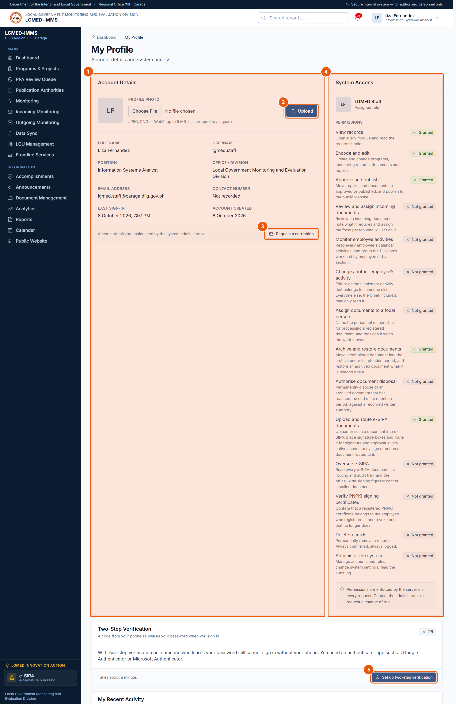

*Figure 9. My Profile.* Signed in as: LGMED Staff.

| No. | Element | Description |
|:-:|---|---|
| 1 | **Account Details** | Your name, username, e-mail, position and office as recorded by the administrator. |
| 2 | **Profile photo** | Choose a JPEG, PNG or WebP picture (up to 5 MB) and click Upload. |
| 3 | **Request a correction** | Opens an e-mail to the office to correct your account details. |
| 4 | **System Access** | Your role and the permissions it carries. |
| 5 | **Two-step verification** | Protect your account with an authenticator app (required for administrators). |

### C. Procedures

### Procedure 10.1.1: Upload a profile photo

**Purpose:** Show your photo beside your name in the system.

**Who can do this:** All roles.

**Steps:**

1. Open the **Account menu** and click **My profile**.
2. In **Account Details**, under **Profile photo**, click the file field and choose a picture.
3. Click **Upload** (marker 2).

**Expected Result:** The photo replaces your initials in the top bar and on your account.

**Important Notes:** JPEG, PNG or WebP, up to 5 MB. The picture is cropped to a square.

### Procedure 10.1.2: Request a correction to your account details

**Purpose:** Have the administrator correct your name, position, office or e-mail.

**Steps:**

1. On **My Profile**, click **Request a correction** (marker 3).
2. Your e-mail program opens a message to the office. Describe the correction and send it.

**Expected Result:** An administrator updates your account (Procedure 10.17.3).

**Important Notes:** You cannot change your own role or account details yourself.

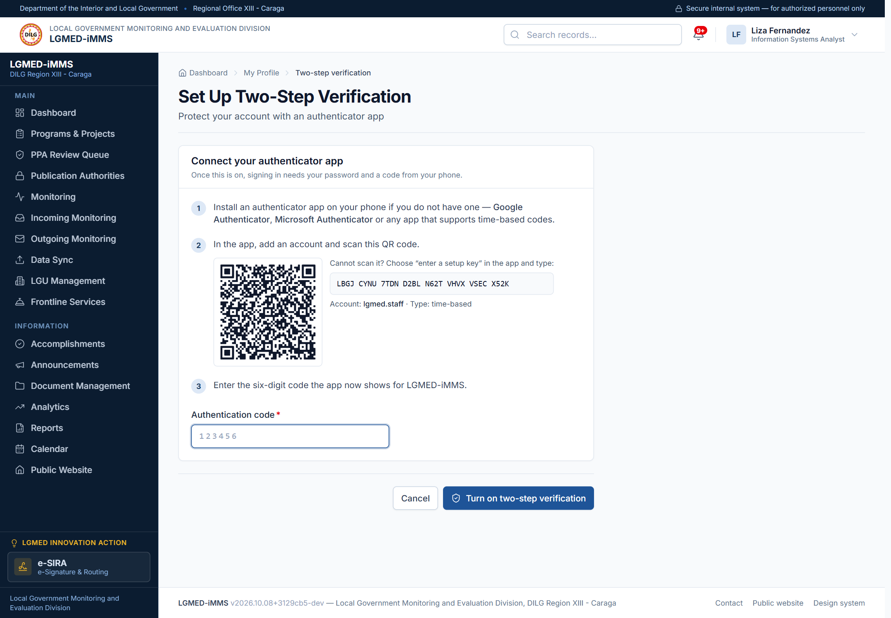

*Figure 10. Setting up two-step verification.* Signed in as: LGMED Staff.

### Procedure 10.1.3: Set up two-step verification

**Purpose:** Protect your account with a code from your phone in addition to your password.

**Who can do this:** All roles. **Mandatory for Administrators and System Administrators.**

**Steps:**

1. Install an authenticator app on your phone (for example Google Authenticator or Microsoft Authenticator).
2. On **My Profile**, click **Set up two-step verification** (marker 5).
3. Under **Connect your authenticator app**, follow the steps on the page: in the app, add an account and scan the QR code. If you cannot scan it, choose *enter a setup key* in the app and type the key shown.
4. Type the six-digit code the app now shows into the **Authentication code** field and click **Turn on two-step verification**.
5. The system shows your **recovery codes**. Print them or write them down and keep them somewhere safe.

**Expected Result:** **Two-Step Verification** on your profile shows that it is on. From the next sign-in, you will be asked for a code after your password.

**Important Notes:**

- Each recovery code can be used once, if your phone is lost. You can generate a new set from **My Profile**; the old set then stops working.
- If you lose both your phone and your recovery codes, an administrator can reset two-step verification on your account (Procedure 10.17.4).
- The new phone replaces the old one only after it has produced a correct code, so a half-finished setup never locks you out.

## 10.2 Notifications

### A. Module overview

| Item | Details |
|---|---|
| Where | The bell in the top bar, and **View all** in its drop-down (`/app/notifications/`) |
| Purpose | Tell you about work that is waiting on you: items to review, documents assigned to you, overdue work, items awaiting publication, account and system notices. |
| Who | All roles. Notifications are addressed to a person, never to a whole role. |
| Actions | Open, dismiss, mark all as read, filter by category and priority, show unread only. |

### B. Visual interface guide

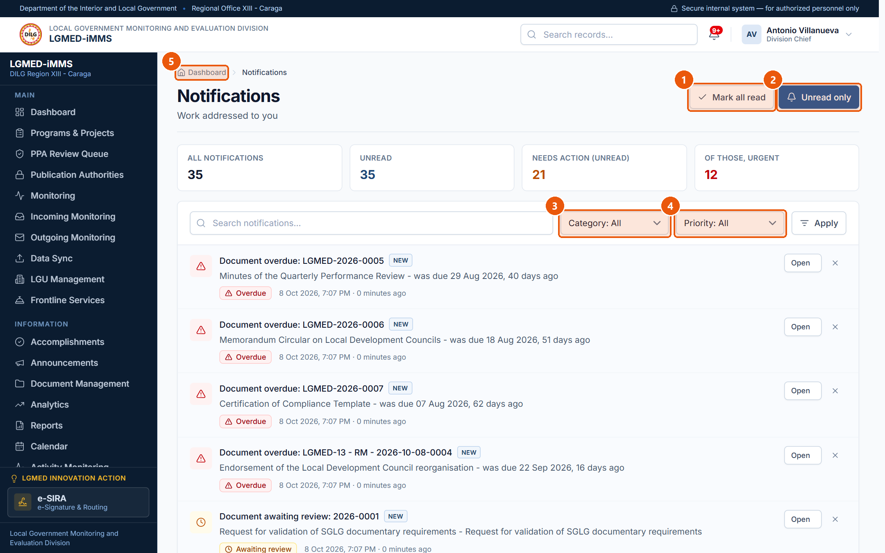

*Figure 11. The Notifications page.* Signed in as: Administrator (Division Chief).

| No. | Element | Description |
|:-:|---|---|
| 1 | **Mark all read** | Marks every notification as read. |
| 2 | **Unread only** | Shows only notifications you have not opened. |
| 3 | **Category filter** | Awaiting review, Overdue, Awaiting publication, Assigned to you, Account or System. |
| 4 | **Priority filter** | Information, Needs action or Urgent. |
| 5 | **Notification** | Click the title or Open to go to the record it concerns. Dismiss removes it from your list. |

### C. Procedures

### Procedure 10.2.1: Open and clear notifications

**Purpose:** Go to the record a notification concerns, and keep the list tidy.

**Who can do this:** All roles.

**Steps:**

1. Click the bell in the top bar. The latest notifications are listed (Figure 6).
2. Click a notification to open the record it concerns, or click **View all** to open the Notifications page.
3. On the Notifications page, use **Category** (marker 3) and **Priority** (marker 4) and click **Apply** to narrow the list, or click **Unread only** (marker 2).
4. Click **Open** on a notification to go to its record, or **Dismiss** to remove it from your list.
5. Click **Mark all read** (marker 1) to clear the unread count.

**Expected Result:** Opened notifications are marked as read and the bell's count goes down.

**Important Notes:** A notification **withdraws itself when the work is done** — for example, once a report is approved it stops asking to be reviewed. A standing problem (such as a follow-up that is three weeks overdue) produces **one** notification, not one per day. See Chapter 12.

## 10.3 Programs, Projects and Activities (PPAs)

### A. Module overview

| Item | Details |
|---|---|
| Where | **Sidebar › Programs & Projects** (`/app/programs/`); **PPA Review Queue** (`/app/programs/queue/`); **Publication Authorities** (`/app/programs/authorities/`) |
| Purpose | Record the Division's Programs, Projects, Sub-projects and Activities under the Department's five Organizational Outcomes; attach supporting documents and photographs; review them; and publish cleared content to the public website. |
| Who | **Encode** (create, edit, upload, submit): Encoder, LGMED Staff, Administrators. **Review** (decide on content and files; record memoranda): LGMED Staff, Administrators. **Publish** (publish, take down, archive): Administrators. **Delete**: Administrators. Viewers read only. |
| Organisation | Five Organizational Outcomes › Programs › Projects › Sub-projects › Activities. An activity belongs to a project or to a sub-project. |

The five Organizational Outcomes are: *Excellence in Local Governance Upheld*; *Peaceful, Orderly, Safe, and Secure Communities Strengthened*; *Resilient Communities Reinforced*; *Inclusive Communities Enabled*; *Highly Trusted Department and Partner*.

**Publication statuses**

| Status | Meaning |
|---|---|
| Draft | Being written. |
| For review | Submitted to a reviewer. |
| Screening | Attached files are being scanned (brief). |
| Review required | The screening flagged something, or could not read a file. |
| Approved | A reviewer read it and cleared the content. |
| Published | Live on the public website. |
| Unpublished | Taken off the public website. |
| Archived | Closed out; kept for the record; not public. |

### B. Visual interface guide

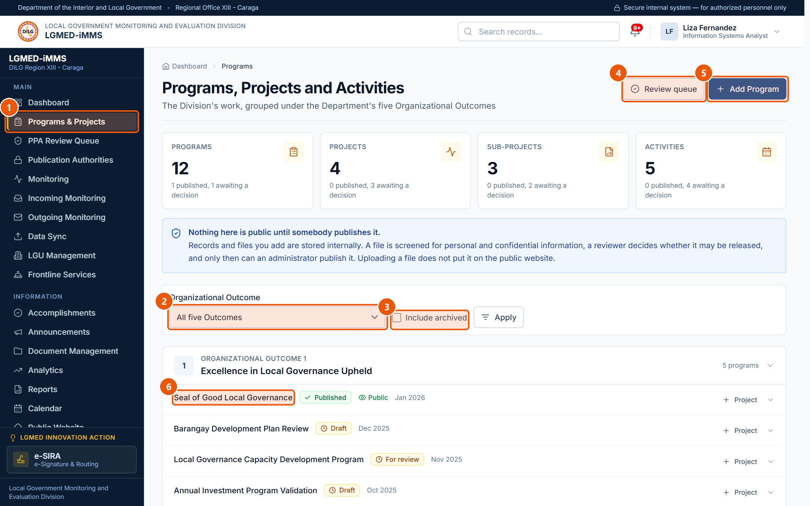

*Figure 12. Programs, Projects and Activities - the workbench.* Signed in as: LGMED Staff.

| No. | Element | Description |
|:-:|---|---|
| 1 | **Programs & Projects** | Sidebar entry for the module. |
| 2 | **Organizational Outcome** | Shows the programmes under one of the Department's five outcomes, or all of them. |
| 3 | **Include archived** | Also lists archived records. |
| 4 | **Review queue** | Items waiting for review (reviewers only). |
| 5 | **Add Program** | Starts a new programme. |
| 6 | **Programme** | Click a title to open the record. |

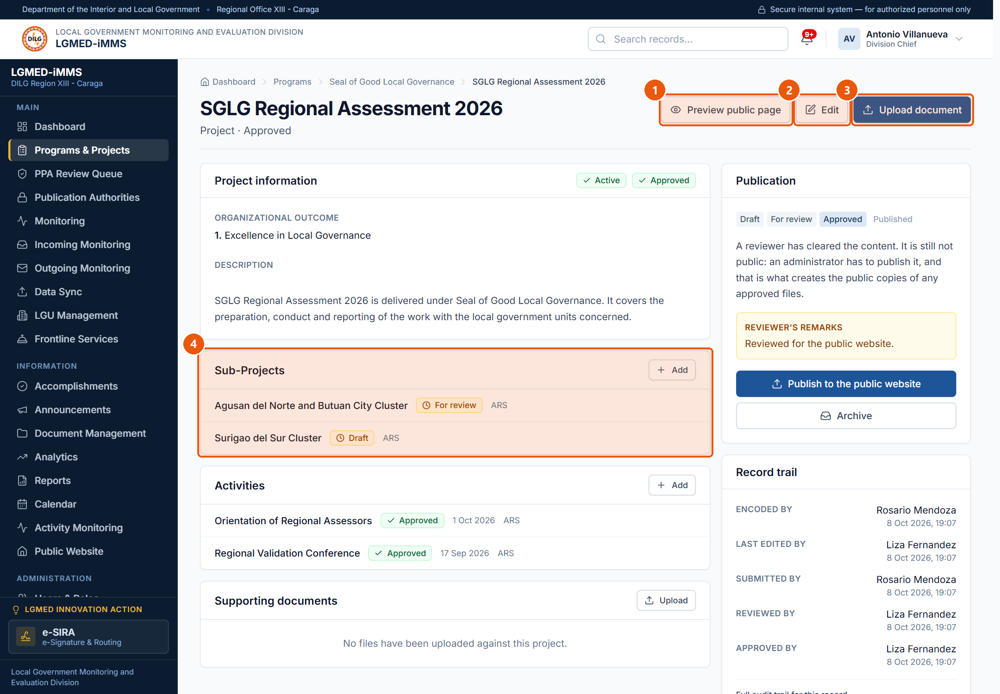

*Figure 13. A project record (Administrator view).* Signed in as: Administrator (Division Chief).

| No. | Element | Description |
|:-:|---|---|
| 1 | **Preview public page** | Shows how the page will look on the public website. |
| 2 | **Edit** | Changes the record's details. |
| 3 | **Upload document** | Adds supporting files or photographs. |
| 4 | **Sub-Projects / Activities** | Records under this one. Add creates a new one. |

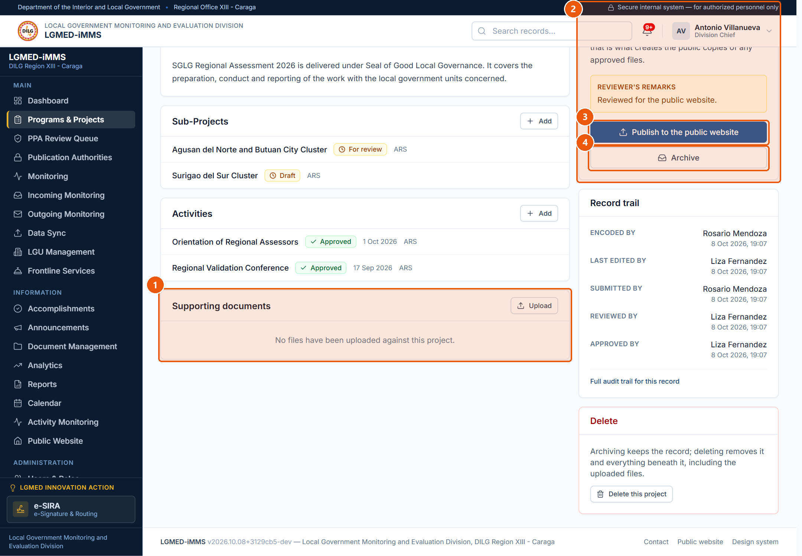

*Figure 14. Supporting documents and the Publication panel.* Signed in as: Administrator (Division Chief).

| No. | Element | Description |
|:-:|---|---|
| 1 | **Supporting documents** | Uploaded files with their screening result and review status. |
| 2 | **Publication** | Where the record stands: Draft, For review, Screening, Review required, Approved, Published, Unpublished, Archived. |
| 3 | **Publish to the public website** | Administrators only, once the content is approved. |
| 4 | **Archive** | Closes the record out; kept, not public. |

### C. Procedures

### Procedure 10.3.1: Add a program

**Purpose:** Create a new programme record.

**Who can do this:** Encoder, LGMED Staff, Administrators.

**Steps:**

1. Click **Programs & Projects** in the sidebar.
2. Click **Add Program** (Figure 12, marker 5).
3. Fill in **Program information**: **Title\***, **Organizational outcome\***, and optionally Reference number, Category, Description and Objectives.
4. Fill in **Implementation period** (Start date, End date, **Implementation status\***).
5. Fill in **Responsibility and coverage**: Responsible office / division, Lead office, Focal person and **Covered LGUs** (hold **Ctrl** to select several).
6. Optionally change the **Public page headings**.
7. Click **Save**.

**Expected Result:** The program record opens with the status **Draft**.

**Visual Reference:** Figure 15.

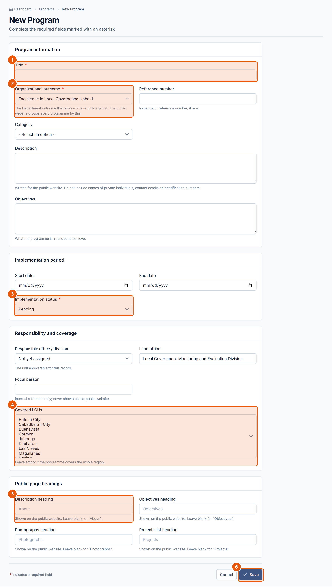

*Figure 15. New Program form.* Signed in as: LGMED Staff.

| No. | Element | Description |
|:-:|---|---|
| 1 | **Title** | Required. The programme's name. |
| 2 | **Organizational outcome** | Required. Which of the five Department outcomes it serves. |
| 3 | **Implementation status** | Required. Pending, Active, Completed, Suspended or Archived. |
| 4 | **Covered LGUs** | Select the LGUs the programme covers. |
| 5 | **Public page headings** | Optional headings used on the public page. |
| 6 | **Save** | Saves the record as a Draft. Cancel returns without saving. |

### Procedure 10.3.2: Add a project, sub-project or activity

**Purpose:** Build the tree under a programme.

**Who can do this:** Encoder, LGMED Staff, Administrators.

**Steps:**

1. Open the parent record (click its title on the workbench).
2. In the **Projects**, **Sub-Projects** or **Activities** panel, click **Add**. (On the workbench, the **Project**, **Add a sub-project** and **Add an activity** links do the same.)
3. Complete the form and click **Save**.

**Expected Result:** The new record opens and is listed under its parent.

### Procedure 10.3.3: Upload supporting documents or photographs

**Purpose:** Attach the papers and photographs behind a record. Each file is automatically screened for personal or confidential information.

**Who can do this:** Encoder, LGMED Staff, Administrators.

**Steps:**

1. Open the record and click **Upload document** (Figure 13, marker 3).
2. In **File or photographs\***, choose one file, or several photographs at once.
3. Enter the **Document title\*** and choose the **Type of document\***.
4. Optionally add a **Description**.
5. Tick **I have opened these files and checked what is in them\***.
6. Click **Upload and screen**.

**Expected Result:** The file appears under **Supporting documents** with its screening result.

**Visual Reference:** Figure 16.

**Important Notes:**

- Accepted: PDF, Word, Excel, PowerPoint, JPG and PNG, up to 25 MB.
- The screening looks for things such as government ID numbers, bank details, contact numbers, signatures, attendance sheets, confidentiality markings and passwords. A clean result is **Low risk**, which means *nothing was found* — it is not an approval. A file the scanner could not read is marked **Review required**.
- Uploaded files are stored internally and are **never public** until approved, cited against a publication authority, and published.

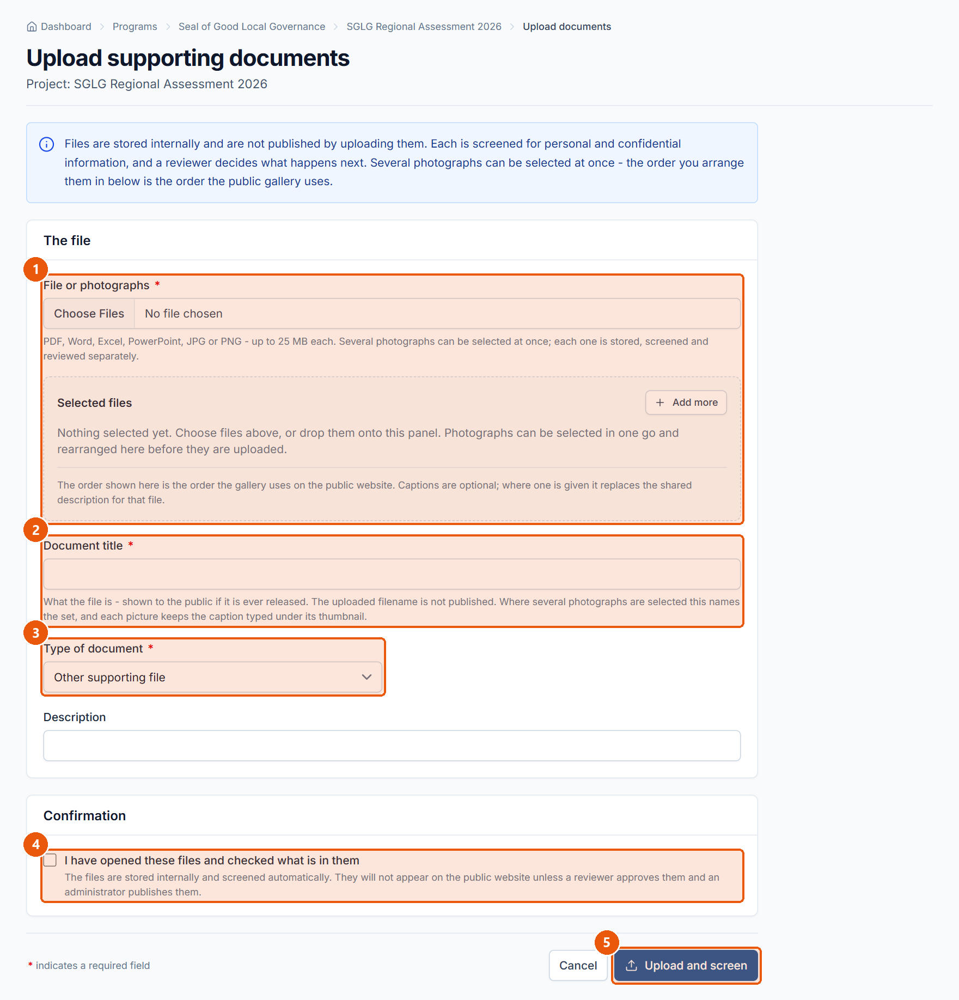

*Figure 16. Upload supporting documents.* Signed in as: LGMED Staff.

| No. | Element | Description |
|:-:|---|---|
| 1 | **File or photographs** | Required. One file, or several photographs at once. |
| 2 | **Document title** | Required. |
| 3 | **Type of document** | Issuance, report, guidelines, presentation, photograph, certificate or other. |
| 4 | **Confirmation** | Required. Confirms you checked the file's contents before uploading. |
| 5 | **Upload and screen** | Uploads the file and runs the automated screening for personal or confidential information. |

### Procedure 10.3.4: Submit a record for review

**Purpose:** Hand a finished record to a reviewer.

**Who can do this:** Encoder, LGMED Staff, Administrators.

**Steps:**

1. Open the record and scroll to **Publication**.
2. Click **Submit for review**.

**Expected Result:** The status becomes **For review** (or **Review required** if a file was flagged) and the record appears in the **PPA Review Queue**.

### Procedure 10.3.5: Review a record (approve, request revision, or reject)

**Purpose:** Clear content for publication, or send it back.

**Who can do this:** LGMED Staff, Administrators.

**Steps:**

1. Click **PPA Review Queue** in the sidebar (Figure 17).
2. Under **Content awaiting review**, click **Review** beside the record.
3. Read the record and open each supporting file. Files with findings are listed under **Files awaiting review**; open each, read **What the screening found**, and record a decision on the file.
4. In **Your decision**, choose **Approve the content**, **Request revision** or **Reject**.
5. Enter **Review comments** — required when requesting revision or rejecting.
6. Click **Record decision**.

**Expected Result:** Approved records move to **Approved** and wait for an administrator to publish. Records sent back return to the encoder with your comments.

**Visual Reference:** Figure 18.

**Important Notes:** On a file, the choices are **Approve for publication**, **Request revision** and **Reject**. A **High risk** file can be approved only after ticking *I have opened and read this file in full, and I confirm it contains nothing that should not be released.*

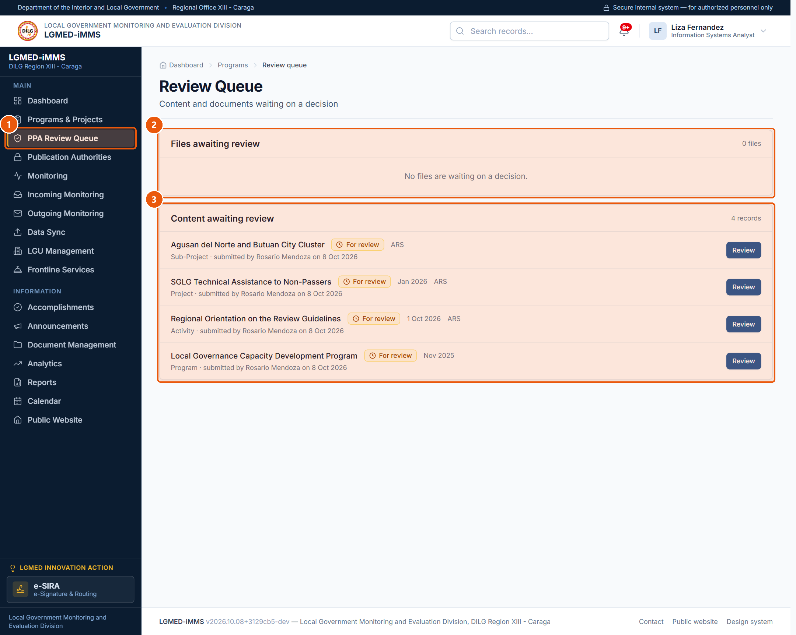

*Figure 17. The PPA Review Queue.* Signed in as: LGMED Staff.

| No. | Element | Description |
|:-:|---|---|
| 1 | **PPA Review Queue** | Visible to LGMED Staff, the Division Chief and administrators. |
| 2 | **Files awaiting review** | Uploaded files whose screening needs a reviewer's decision. |
| 3 | **Content awaiting review** | Records submitted for review. Click Review to open one. |

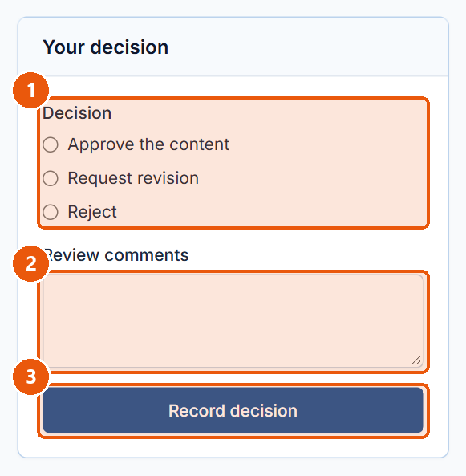

*Figure 18. Recording a review decision on a submitted record.* Signed in as: LGMED Staff.

| No. | Element | Description |
|:-:|---|---|
| 1 | **Decision** | Approve the content, Request revision, or Reject. |
| 2 | **Review comments** | Required when requesting revision or rejecting, so the encoder knows what to change. |
| 3 | **Record decision** | Saves the decision; the record moves to Approved, back to Draft, or is rejected. |

### Procedure 10.3.6: Record a publication authority (memorandum)

**Purpose:** Record the memorandum that authorises releasing files to the public. A file can be published only when it is cited against an authority that is in effect.

**Who can do this:** LGMED Staff, Administrators.

**Steps:**

1. Click **Publication Authorities** in the sidebar.
2. Click **Record a memorandum**.
3. Complete **The issuance** (reference, title, date approved, approved by), **What it covers** (scope, and the signed memorandum file) and **Period of effect** (effective from, effective until, and whether it is active), then click **Save**. The memorandum file is stored internally and is never itself published.
4. When reviewing a file, choose this memorandum in **Published under** / **Memorandum**.

**Expected Result:** The memorandum is listed with the number of files released under it.

**Visual Reference:** Figure 19.

**Important Notes:** Withdrawing a memorandum stops it authorising anything further; it does not unpublish files it already released.

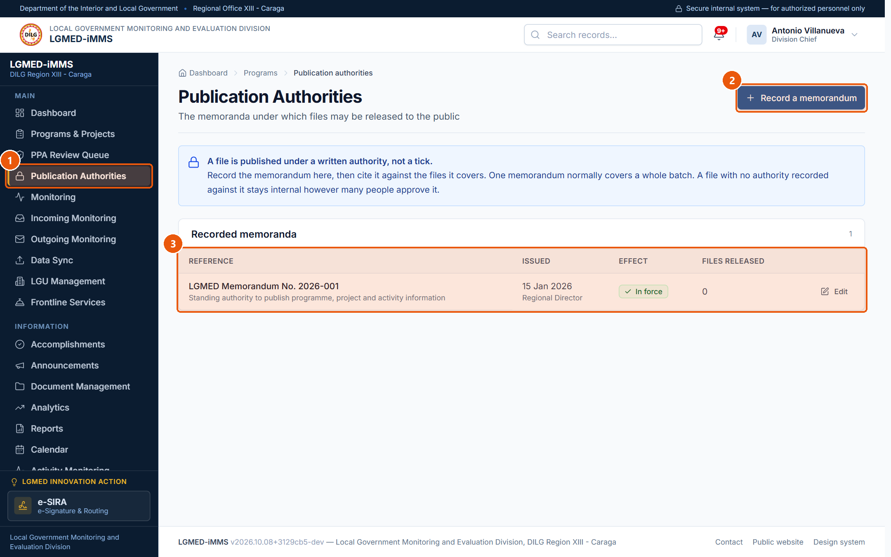

*Figure 19. Publication Authorities.* Signed in as: Administrator (Division Chief).

| No. | Element | Description |
|:-:|---|---|
| 1 | **Publication Authorities** | Memoranda that authorise releasing files to the public. |
| 2 | **Record a memorandum** | Records a new memorandum before any file is cited against it. |
| 3 | **Recorded memoranda** | Reference, date issued, whether it is in effect, and how many files it released. |

### Procedure 10.3.7: Publish, take down, archive or restore a record

**Purpose:** Put approved content on the public website, or remove it.

**Who can do this:** Administrators.

**Steps:**

1. Open the record. Optionally click **Preview public page** to check how it will look.
2. In **Publication**, click **Publish to the public website** (marker 3 of Figure 14).
3. To remove it later, click **Take off the public website**. To close it out, click **Archive**; an archived record can be brought back with **Restore from the archive**.

**Expected Result:** A published record appears on the public website under **Programs**. Approved files that are cited against an authority are released with it; files without an authority are held back and named on the page.

**Important Notes:** A record is visible to the public only while every level above it is also published.

### Procedure 10.3.8: Arrange photographs

**Purpose:** Choose the order in which a record's photographs appear on its public page.

**Who can do this:** Encoder, LGMED Staff, Administrators.

**Steps:**

1. Open the record. When it has photographs, **Supporting documents** shows a link **Arrange N photographs**.
2. Click it, put the photographs in the order you want, and save.

**Expected Result:** The public page shows the photographs in the new order.

> **NOTE:** No screenshot is included: the demonstration data has no photographs, so the link does not appear. See the documentation report.

### Procedure 10.3.9: Delete a record

**Who can do this:** Administrators.

**Steps:** Open the record, scroll to **Delete**, click **Delete this program** (or project/activity), and confirm.

**Important Notes:** **WARNING:** Deletion cannot be undone. Prefer **Archive** for records that should be kept.

### D. Workflow

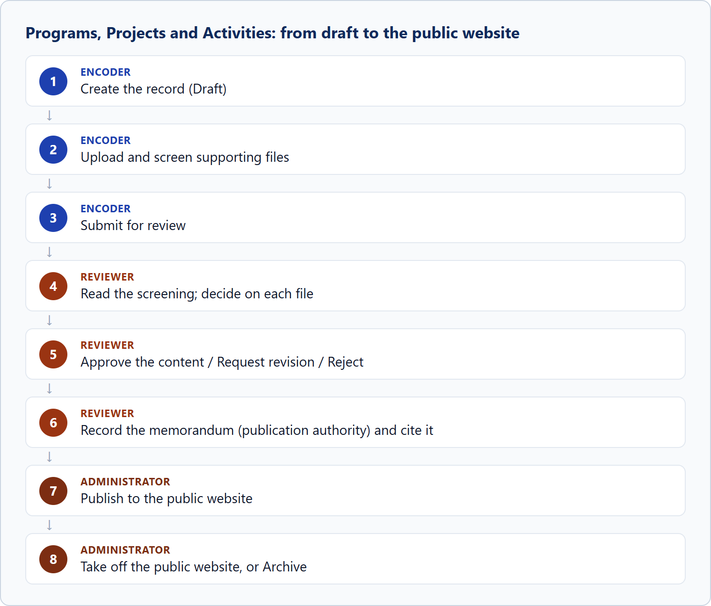

*Figure 20. Programs, Projects and Activities: from draft to the public website*

## 10.4 Monitoring

### A. Module overview

| Item | Details |
|---|---|
| Where | **Sidebar › Monitoring** (`/app/monitoring/`) |
| Purpose | Record each monitoring activity conducted in an LGU: the team, the date, the findings, recommendations and the follow-up action with its due date, plus supporting documents. |
| Who | All roles can view. Encoder, LGMED Staff and Administrators can add and edit. Only Administrators can delete. |
| Statuses | Scheduled, In progress, For review, Completed, Cancelled. |
| Actions | Search, filter (Province, LGU type, Status, Year), sort, export CSV, add, view, edit, print, attach documents, delete. |

### B. Visual interface guide

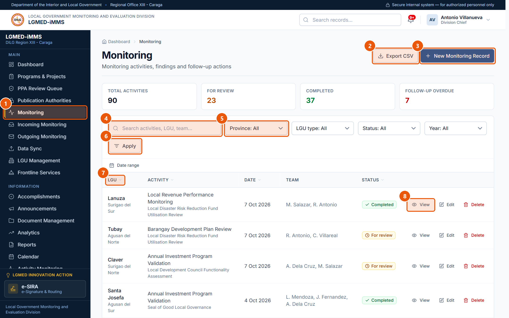

*Figure 21. The Monitoring register.* Signed in as: Administrator (Division Chief).

| No. | Element | Description |
|:-:|---|---|
| 1 | **Monitoring** | Sidebar entry. |
| 2 | **Export CSV** | Downloads the rows currently listed - with the search and filters applied - as a spreadsheet file. Every export is recorded in the audit trail. |
| 3 | **New Monitoring Record** | Records a monitoring activity. |
| 4 | **Search box** | Type part of a name, title, code or other text, then press Enter or click Apply. |
| 5 | **Filters** | Province, LGU type, Status and Year narrow the list. |
| 6 | **Apply** | Runs the search and filters. |
| 7 | **Sortable heading** | Click to sort by this column. |
| 8 | **Row actions** | View (eye), Edit (pencil) and Delete (bin) for that record. Only the actions your role permits are shown. |

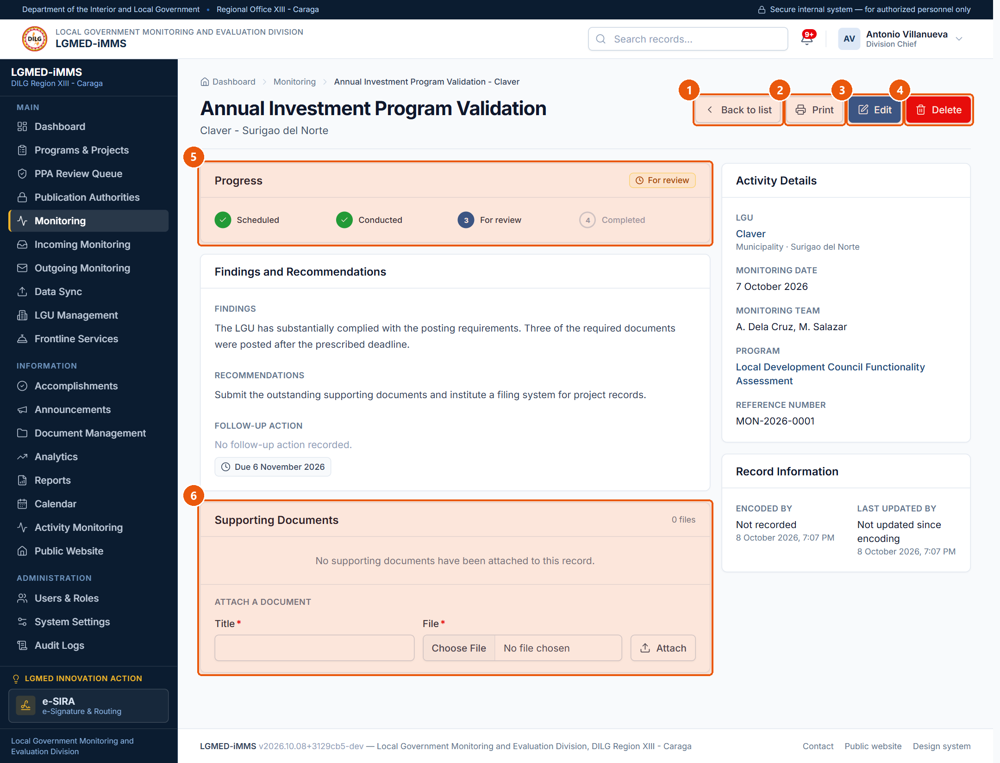

*Figure 22. A monitoring record.* Signed in as: Administrator (Division Chief).

| No. | Element | Description |
|:-:|---|---|
| 1 | **Back to list** | Returns to the register. |
| 2 | **Print** | Prints the record. |
| 3 | **Edit** | Changes the record. |
| 4 | **Delete** | Administrators only; asks for confirmation. |
| 5 | **Progress** | Where the record stands. |
| 6 | **Supporting Documents** | Attach files with a title and click Attach. |

### C. Procedures

### Procedure 10.4.1: Find a monitoring record

**Purpose:** Locate records by LGU, activity, team, status or year.

**Who can do this:** All roles.

**Steps:**

1. Click **Monitoring** in the sidebar.
2. Type in the search box (marker 4 of Figure 21), for example the LGU name.
3. Choose filters such as **Province**, **LGU type**, **Status** or **Year** (marker 5).
4. Click **Apply** (marker 6).
5. Click a column heading such as **LGU** or **Date** to sort (marker 7).

**Expected Result:** The list shows only matching records, in the chosen order.

### Procedure 10.4.2: Record a monitoring activity

**Purpose:** Add a new monitoring record.

**Who can do this:** Encoder, LGMED Staff, Administrators.

**Steps:**

1. Click **Monitoring › New Monitoring Record** (or **New monitoring record** on the Dashboard).
2. Under **Activity Details**, enter **Activity\***, optional **Reference number**, choose **LGU\*** and optional **Program**, and enter **Monitoring date\*** and **Monitoring team\***.
3. Under **Findings and Recommendations**, enter the **Findings** and **Recommendations**.
4. Under **Follow-up**, enter the **Follow up action** and **Follow-up due date**, and choose the **Status\***.
5. Click **Save**.

**Expected Result:** The record opens with a success message and appears in the register, in the LGU's **Monitoring History**, and on the Dashboard.

**Visual Reference:** Figure 23.

**Important Notes:** When the follow-up due date passes and the record is not completed, the system raises a *Follow-up overdue* notification.

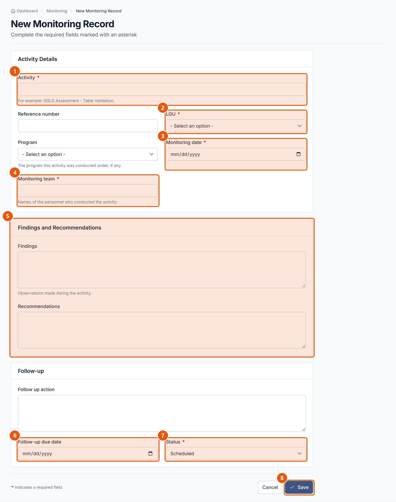

*Figure 23. New Monitoring Record form.* Signed in as: Encoder.

| No. | Element | Description |
|:-:|---|---|
| 1 | **Activity** | Required. What was monitored. |
| 2 | **LGU** | Required. The LGU monitored. |
| 3 | **Monitoring date** | Required. |
| 4 | **Monitoring team** | Required. Who conducted it. |
| 5 | **Findings and Recommendations** | What was found and what is recommended. |
| 6 | **Follow-up due date** | When the follow-up action falls due; overdue follow-ups raise notifications. |
| 7 | **Status** | Required. Scheduled, In progress, For review, Completed or Cancelled. |
| 8 | **Save** | Saves the record. |

### Procedure 10.4.3: Edit, print or attach a document to a monitoring record

**Who can do this:** Edit and attach: Encoder, LGMED Staff, Administrators. Print: all roles.

**Steps:**

1. Open the record (click the LGU name or the eye icon).
2. To change it, click **Edit** (marker 3 of Figure 22), change the fields and click **Save**.
3. To attach a file, go to **Supporting Documents › Attach a document**, enter a **Title\***, choose the **File\*** and click **Attach**.
4. To print, click **Print** (marker 2).

**Expected Result:** Changes are saved and recorded in **Record Information** and the audit log; attached files are listed under **Supporting Documents**.

### Procedure 10.4.4: Delete a monitoring record

**Who can do this:** Administrators.

**Steps:**

1. Open the record and click **Delete** (marker 4).
2. Read the confirmation and click **Delete Record**, or **Cancel** to keep it.

**Expected Result:** The record is removed and the register is shown with a confirmation message.

**Visual Reference:** Figure 24.

**Important Notes:** **WARNING:** Deletion is permanent. The deletion itself is recorded in the audit log.

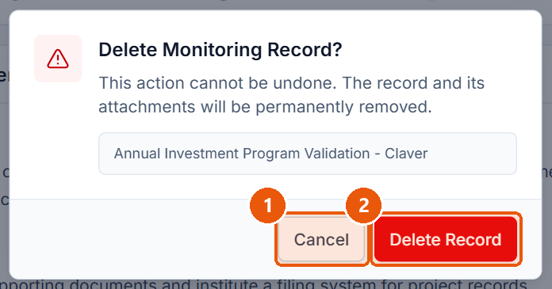

*Figure 24. Every deletion asks for confirmation.* Signed in as: Administrator (Division Chief).

| No. | Element | Description |
|:-:|---|---|
| 1 | **Cancel** | Closes the dialog; nothing is deleted. |
| 2 | **Delete Record** | Permanently deletes the record. This cannot be undone. |

## 10.5 Incoming Monitoring

### A. Module overview

| Item | Details |
|---|---|
| Where | **Sidebar › Incoming Monitoring** (`/app/incoming/`) with three tabs: **Documents**, **Monitoring dashboard**, **Monitoring reports** |
| Purpose | Register correspondence received by the Division and follow it from receipt to completion: the encoder records it; the Division Chief reviews it, notes what it requires and names the focal person; the focal person acknowledges and acts on it. |
| Who | **Record**: Encoder, LGMED Staff, Administrators. **Review and assign**: Administrators (the Division Chief). **Acknowledge and report action**: the assigned focal person. **Monitoring dashboard**: Administrators. **Monitoring reports**: everyone except Viewers. **Delete**: Administrators. Viewers read only. |
| Statuses | For Division Chief review, Assigned, Acknowledged, In progress, For action, Pending, Returned / for revision, Completed (and *Imported from spreadsheet* for records brought in by Data Sync). A document past its action due date and not completed is shown as **Overdue**. |

### B. Visual interface guide

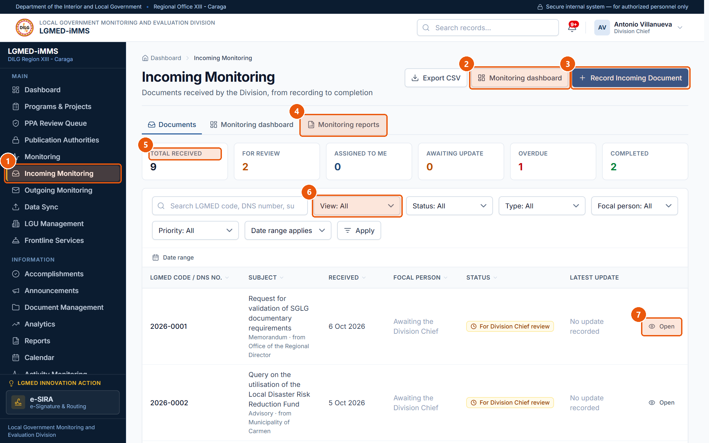

*Figure 25. Incoming Monitoring - the documents register.* Signed in as: Administrator (Division Chief).

| No. | Element | Description |
|:-:|---|---|
| 1 | **Incoming Monitoring** | Sidebar entry. |
| 2 | **Monitoring dashboard** | The Division Chief's overview (Administrators). |
| 3 | **Record Incoming Document** | Records a newly received document. |
| 4 | **Tabs** | Documents, Monitoring dashboard and Monitoring reports. |
| 5 | **Status figures** | Totals by status; overdue items are shown in red. |
| 6 | **View** | Quick lists such as Assigned to me, For Division Chief review, Awaiting acknowledgement, Overdue. |
| 7 | **Open** | Opens the document's record. |

### C. Procedures

### Procedure 10.5.1: Record an incoming document

**Purpose:** Register a document as soon as it is received.

**Who can do this:** Encoder, LGMED Staff, Administrators.

**Steps:**

1. Click **Incoming Monitoring** in the sidebar, then **Record Incoming Document**.
2. Under **Document Details**, enter the **DNS number\*** (the office's own reference, e.g. 2026-0417), **Subject\***, **Document type\***, **Date received\*** (today by default) and **Source / office\*** (the office, agency or LGU it came from).
3. Under **Attachment and Remarks**, attach the scanned document in **Document / file attachment** and add any **Initial remarks**.
4. Click **Save**.

**Expected Result:** The record opens with the status **For Division Chief review** and no focal person. The Division Chief is notified that a document is waiting.

**Visual Reference:** Figures 26 and 27.

**Important Notes:** The encoder's form has no focal-person field: naming the focal person is the Division Chief's decision. An encoder may amend the record (**Edit**) only until the Chief has acted on it.

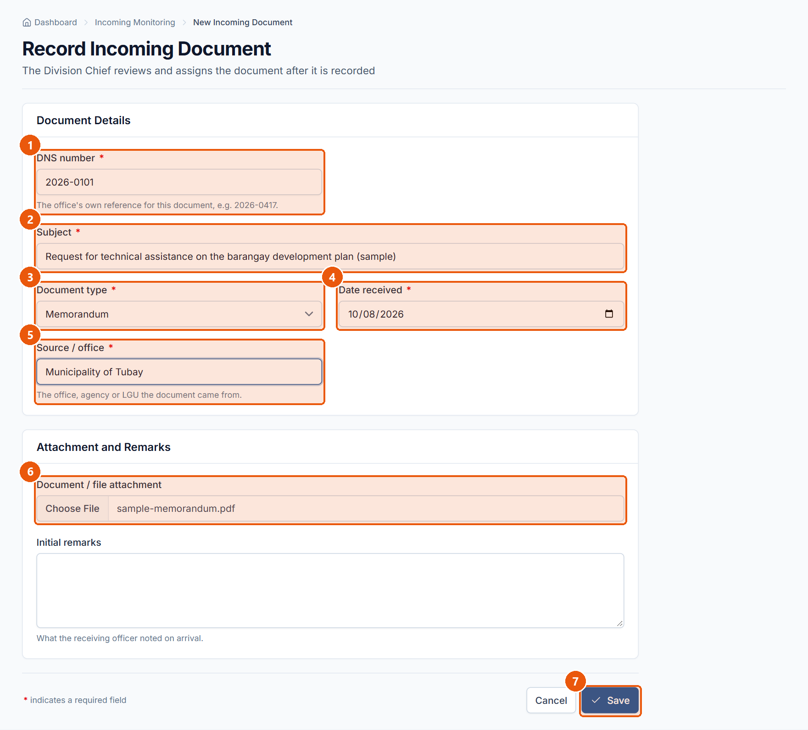

*Figure 26. Recording an incoming document (Encoder).* Signed in as: Encoder.

| No. | Element | Description |
|:-:|---|---|
| 1 | **DNS number** | Required. The document's number in the Document Numbering System. |
| 2 | **Subject** | Required. |
| 3 | **Document type** | Required. |
| 4 | **Date received** | Required. Defaults to today. |
| 5 | **Source / office** | Required. Who sent it. |
| 6 | **Attachment** | The scanned document (optional). |
| 7 | **Save** | Records the document. It starts at For Division Chief review with no focal person. |

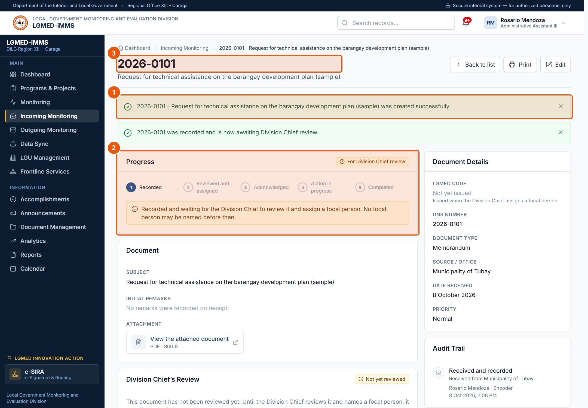

*Figure 27. The new record, awaiting the Division Chief's review.* Signed in as: Encoder.

| No. | Element | Description |
|:-:|---|---|
| 1 | **Confirmation** | Confirms the document was recorded. |
| 2 | **Progress** | Shows each stage; the current one is highlighted. |
| 3 | **LGMED code** | The record's identifier. |

### Procedure 10.5.2: Review an incoming document and assign a focal person

**Purpose:** Record what the document requires and decide who handles it.

**Who can do this:** Administrators (Division Chief).

**Steps:**

1. Open the document (Dashboard › *Requires Attention*, the notification, or **Incoming Monitoring** with **View: For Division Chief review**).
2. In **Division Chief's Review**, type **Notes / instructions\*** and click **Save review notes**.
3. In **Assignment › Assign a focal person**, choose the **Focal person\***, the **Priority\*** (Low, Normal, High, Urgent), the **Action due date** and any **Assignment remarks / instructions**.
4. Click **Assign and notify**.

**Expected Result:** The status becomes **Assigned**, the focal person receives a notification, and the **Audit Trail** on the record shows who assigned it and when.

**Visual Reference:** Figure 28.

**Important Notes:** To change the focal person later, use **Reassign this document** and click **Reassign and notify**; the reassignment is recorded as such.

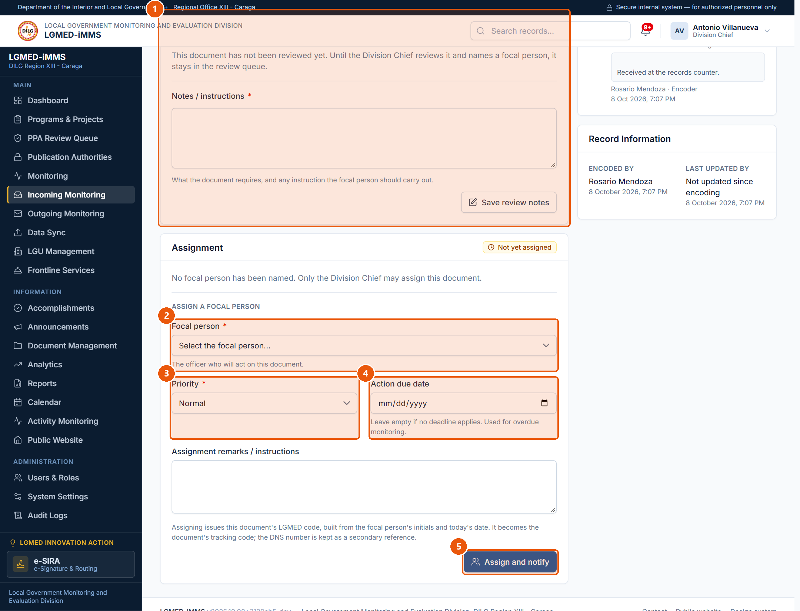

*Figure 28. The Division Chief's review and assignment (Administrator).* Signed in as: Administrator (Division Chief).

| No. | Element | Description |
|:-:|---|---|
| 1 | **Division Chief's Review** | Notes or instructions on what the document requires. Save review notes records them. |
| 2 | **Focal person** | Required. The officer who will act on the document. |
| 3 | **Priority** | Low, Normal, High or Urgent. |
| 4 | **Action due date** | When action is due; the document becomes overdue after this date. |
| 5 | **Assign and notify** | Assigns the document and notifies the focal person. |

### Procedure 10.5.3: Acknowledge an assigned document

**Purpose:** Confirm, as focal person, that you have received the assignment.

**Who can do this:** The assigned focal person.

**Steps:**

1. Open the notification, or choose **View: Assigned to me** on the Incoming register, and open the document.
2. Read the **Assignment** panel and the Chief's instructions.
3. Click **Acknowledge receipt**.

**Expected Result:** The status becomes **Acknowledged** and the document continues in **Outgoing Monitoring** under its LGMED code, where you report your action (Section 10.6). The incoming record shows **Open in Outgoing Monitoring**.

**Visual Reference:** Figure 29.

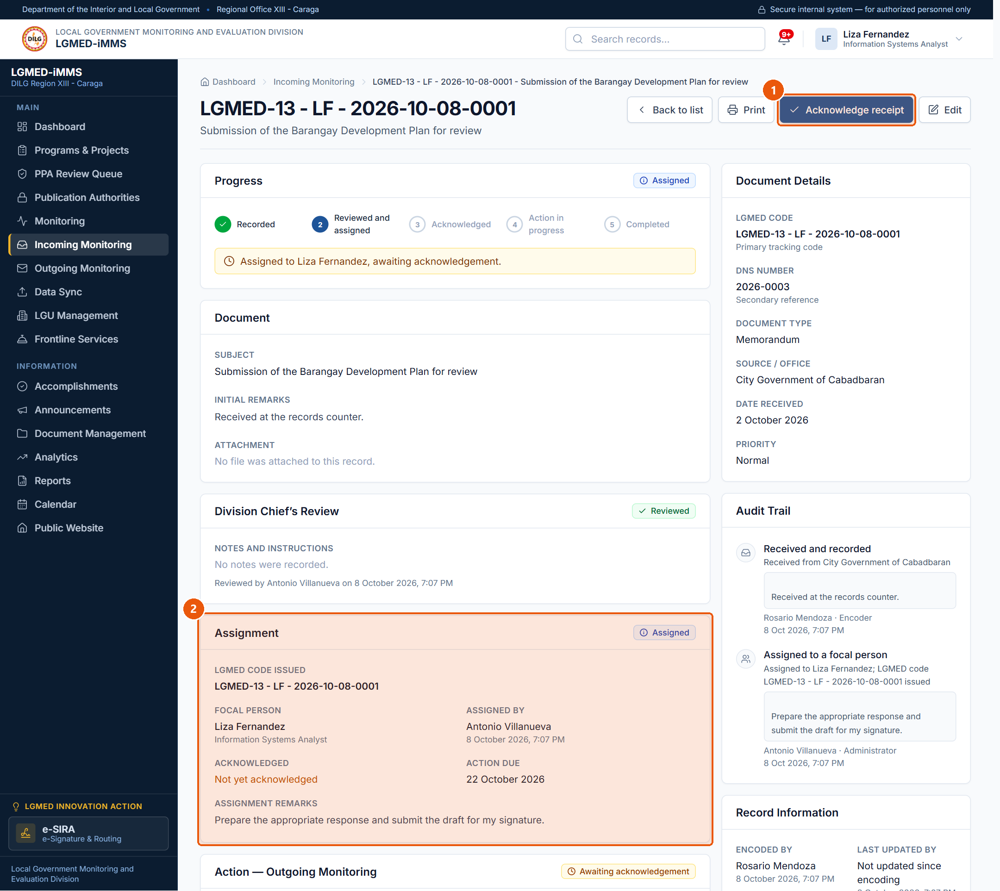

*Figure 29. The focal person acknowledges the assignment (LGMED Staff).* Signed in as: LGMED Staff.

| No. | Element | Description |
|:-:|---|---|
| 1 | **Acknowledge receipt** | Confirms you received the assignment. The document then continues in Outgoing Monitoring under its LGMED code. |
| 2 | **Assignment** | Who assigned it, when, the priority, due date and the Chief's instructions. |

### Procedure 10.5.4: Monitor the caseload (Division Chief)

**Purpose:** See what is waiting, overdue or silent.

**Who can do this:** Administrators.

**Steps:**

1. On **Incoming Monitoring**, click **Monitoring dashboard**.
2. Review the figures, **Incoming Documents for Review**, **Overdue Documents**, **Awaiting a Focal Person Update**, **Latest Updates** and **Documents by Focal Person**.
3. Click any figure to open the documents it counts.

**Expected Result:** The register opens filtered to those documents.

**Important Notes:** *Awaiting a focal person update* means assigned, not finished, and nothing reported for 7 days.

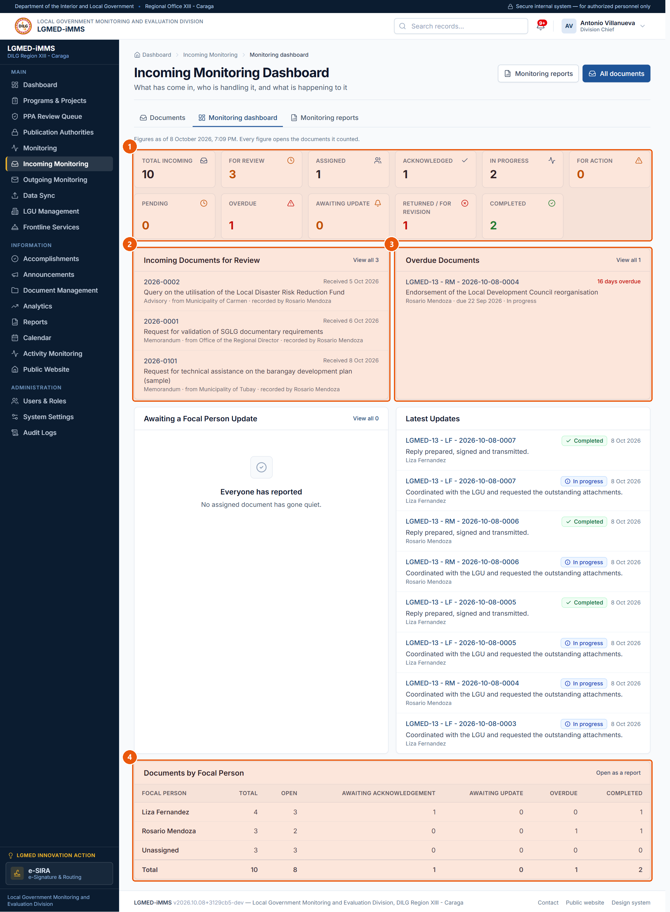

*Figure 30. Incoming Monitoring Dashboard (Administrators).* Signed in as: Administrator (Division Chief).

| No. | Element | Description |
|:-:|---|---|
| 1 | **Figures** | Every figure is a link to the documents it counts. |
| 2 | **For Review** | Documents still waiting for the Chief. |
| 3 | **Overdue Documents** | Past their action due date and not completed. |
| 4 | **Documents by Focal Person** | Workload per officer. |

### Procedure 10.5.5: Produce a monitoring report

**Purpose:** Print or export one of the ten monitoring reports.

**Who can do this:** Encoder, LGMED Staff, Administrators.

**Steps:**

1. On **Incoming Monitoring**, click **Monitoring reports**.
2. Under **Reports**, click a report: Incoming Documents Report; Documents for Division Chief Review; Documents by Focal Person; Documents by Status; Pending Documents Report; Overdue Documents Report; Completed Documents Report; Response / Action Monitoring Report; Processing Time Report; Assignment Monitoring Report.
3. Under **Filters**, set the text search, **Received from** / **Received to**, **Focal person**, **Status**, **Document type** and **Sort by**, then click **Apply** (or **Clear**).
4. Click **Print**, or **Export CSV** to download the same rows.

**Expected Result:** The report shows the filtered documents; the CSV contains exactly the same rows. Exports are recorded in the audit log.

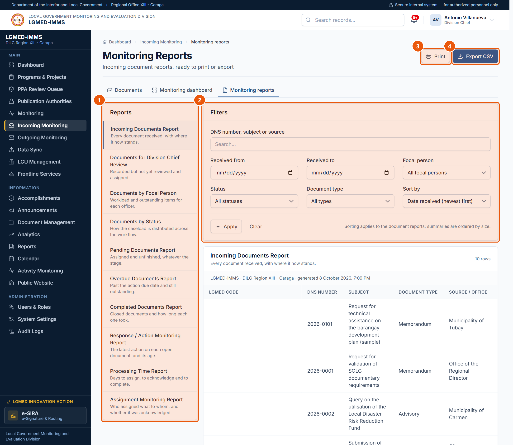

*Figure 31. Monitoring Reports.* Signed in as: Administrator (Division Chief).

| No. | Element | Description |
|:-:|---|---|
| 1 | **Reports** | Ten ready-made reports. Click one to open it. |
| 2 | **Filters** | Narrow the report by text, dates, focal person, status, type; choose the sort order. |
| 3 | **Print** | Prints the report. |
| 4 | **Export CSV** | Downloads the same rows as a spreadsheet file. |

### D. Workflow

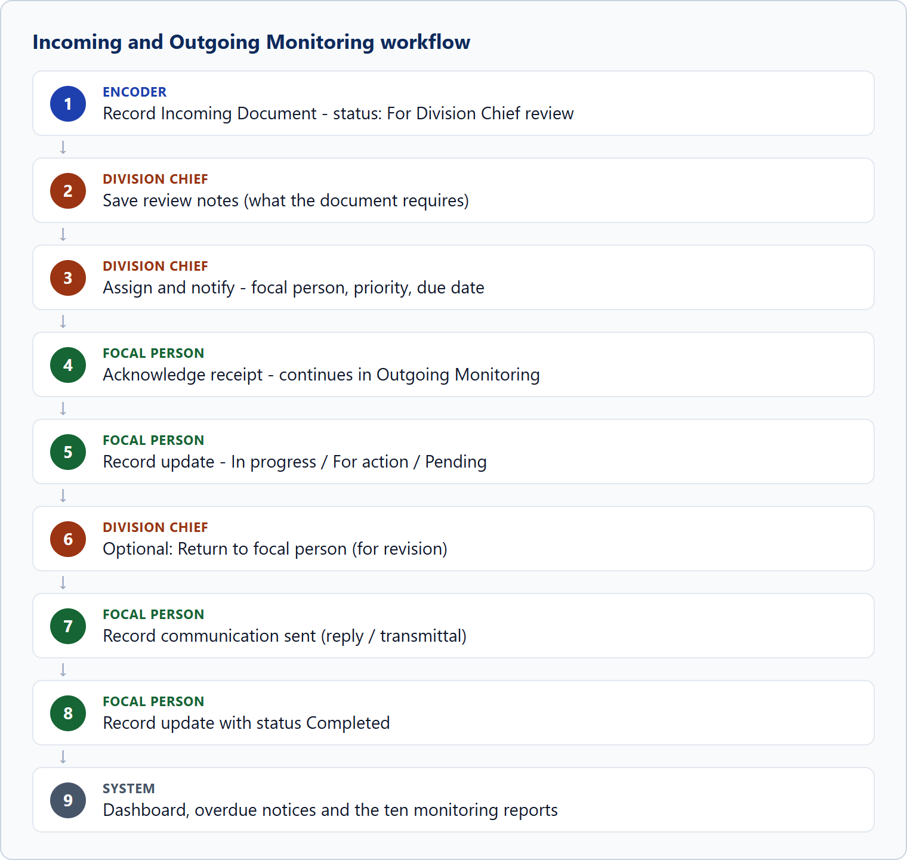

*Figure 32. Incoming and Outgoing Monitoring workflow*

## 10.6 Outgoing Monitoring

### A. Module overview

| Item | Details |
|---|---|
| Where | **Sidebar › Outgoing Monitoring** (`/app/outgoing/`) |
| Purpose | Follow the action on documents the focal person has acknowledged: progress updates, returns for revision, and the communication finally sent. Historical outgoing records can be imported from the spreadsheet register. |
| Who | All roles can view. The focal person reports updates and records the communication sent; Administrators can also return a document to the focal person. |
| Views | All, Assigned to me, For action (open), Action completed, Communication not yet sent, From the spreadsheet register. |

### B. Visual interface guide

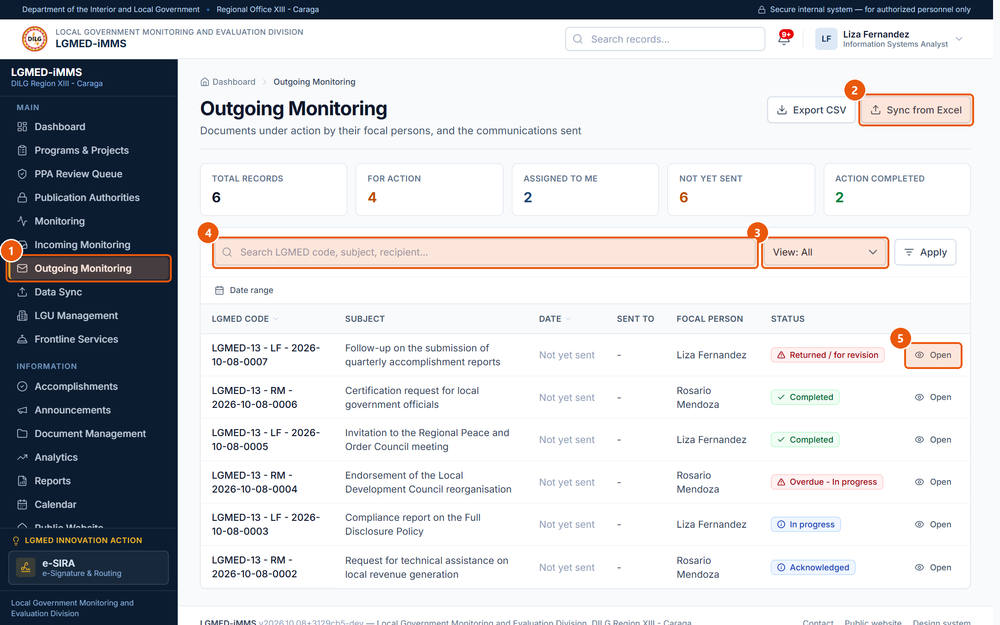

*Figure 33. Outgoing Monitoring.* Signed in as: LGMED Staff.

| No. | Element | Description |
|:-:|---|---|
| 1 | **Outgoing Monitoring** | Sidebar entry. |
| 2 | **Sync from Excel** | Imports historical records from the Outgoing spreadsheet (Data Sync). |
| 3 | **View** | Assigned to me, For action (open), Action completed, Communication not yet sent, From the spreadsheet register. |
| 4 | **Search box** | Type part of a name, title, code or other text, then press Enter or click Apply. |
| 5 | **Open** | Opens the outgoing record. |

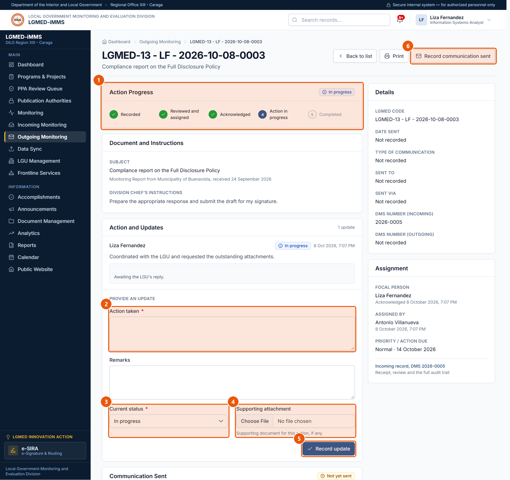

*Figure 34. Reporting action on an assigned document (focal person).* Signed in as: LGMED Staff.

| No. | Element | Description |
|:-:|---|---|
| 1 | **Action Progress** | Where the document stands. |
| 2 | **Action taken** | Required. What you did. |
| 3 | **Current status** | Required. In progress, For action, Pending or Completed - the update and the status change are one act. |
| 4 | **Supporting attachment** | Optional file, e.g. the reply sent. |
| 5 | **Record update** | Saves the update. |
| 6 | **Record communication sent** | Records the reply or transmittal that was sent. |

### C. Procedures

### Procedure 10.6.1: Report action taken (record an update)

**Purpose:** Tell the Division what you did and where the document now stands.

**Who can do this:** The assigned focal person, once the assignment is acknowledged. The Division Chief (Administrators) may also record an update, for example to close a record.

**Steps:**

1. Open the outgoing record (**View: Assigned to me**).
2. Under **Action and Updates › Provide an update**, describe the **Action taken\*** and add **Remarks** if needed.
3. Choose the **Current status\***: In progress, For action, Pending or Completed.
4. Optionally attach a **Supporting attachment**.
5. Click **Record update**.

**Expected Result:** The update is listed on the record, the status changes to the one you chose, and the **Action Progress** panel moves on. Choosing **Completed** stamps the completion time.

**Important Notes:** The update and the status change are one act, so the record always reflects the latest report.

### Procedure 10.6.2: Return a document for revision

**Purpose:** Send the work back to the focal person with instructions.

**Who can do this:** Administrators.

**Steps:**

1. Open the outgoing record.
2. Under **Return for revision**, explain **What needs revision\***.
3. Click **Return to focal person**.

**Expected Result:** The status becomes **Returned / for revision** and the focal person is notified.

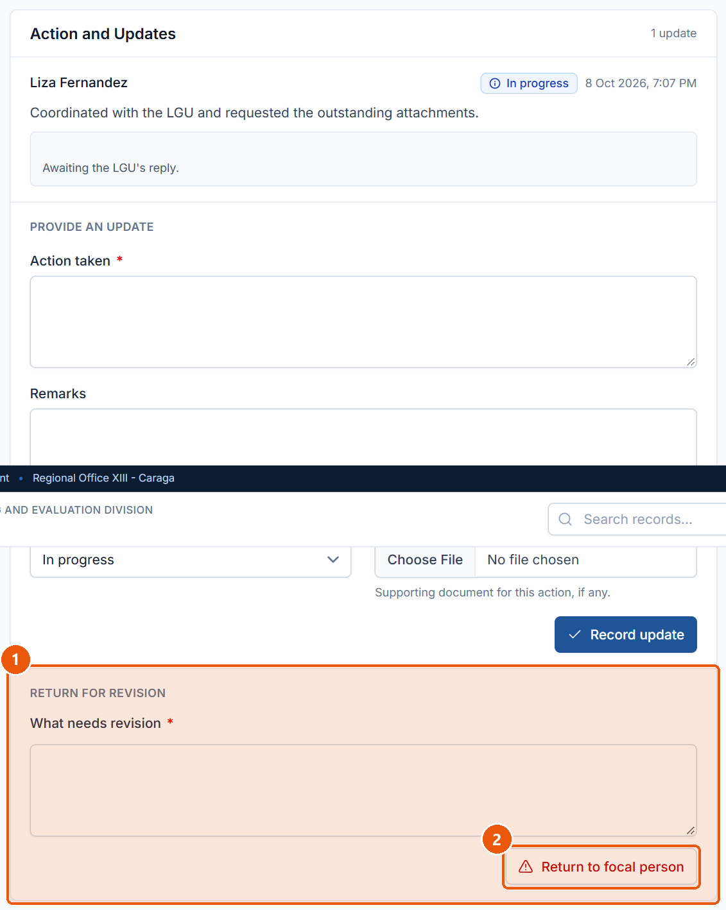

*Figure 35. Returning a document to the focal person (Division Chief).* Signed in as: Administrator (Division Chief).

| No. | Element | Description |
|:-:|---|---|
| 1 | **What needs revision** | Required. Explain what must be revised. |
| 2 | **Return to focal person** | Sends the document back; its status becomes Returned / for revision. |

### Procedure 10.6.3: Record the communication sent

**Purpose:** Record the reply or transmittal that closed the matter.

**Who can do this:** The focal person and Administrators.

**Steps:**

1. Open the outgoing record and click **Record communication sent**.
2. Under **Communication**, enter the **Date sent\***, **Type of communication** and **Subject / title\***.
3. Under **Transmittal**, enter **Sent to**, **Sent via** and the **DMS number (outgoing)**, plus any **Remarks**.
4. Under **File**, attach the **File of the communication** (for example, the signed and scanned reply).
5. Click **Save communication details**.

**Expected Result:** The record's **Communication Sent** panel shows the details. The file is also filed in the Document Management register with the incoming document.

> **IMPORTANT:** Recording the communication sent does **not** close the document. The focal person must still record an update with the status **Completed** (Procedure 10.6.1).

**Important Notes:** Accepted files: PDF, Word, Excel, PowerPoint or an image (JPG, PNG, TIFF), up to 25 MB.

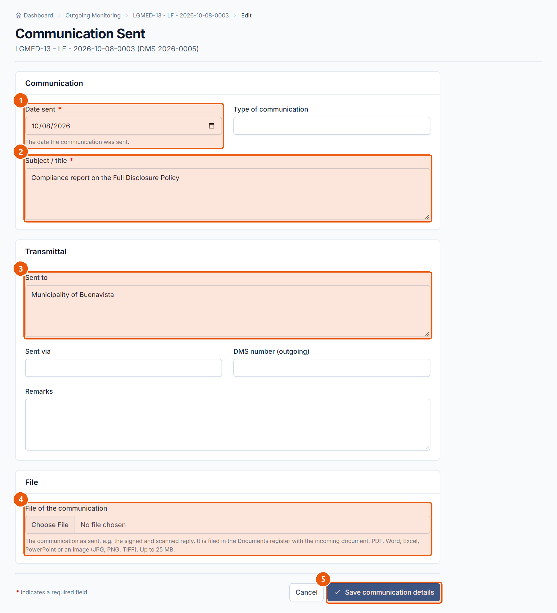

*Figure 36. Recording the communication sent.* Signed in as: LGMED Staff.

| No. | Element | Description |
|:-:|---|---|
| 1 | **Date sent** | Required. The date the reply or transmittal was sent. |
| 2 | **Subject / title** | Required. Filled in from the incoming document; change it if needed. |
| 3 | **Sent to** | The addressee. |
| 4 | **File of the communication** | The communication as sent; it is filed in the Documents register with the incoming document. |
| 5 | **Save communication details** | Records the communication; Cancel returns without saving. |

## 10.7 Data Sync (spreadsheet import)

### A. Module overview

| Item | Details |
|---|---|
| Where | **Sidebar › Data Sync** (`/app/sync/`); also **Sync from Excel** on Outgoing Monitoring |
| Purpose | Bring the Incoming and Outgoing Excel registers into the system. |
| Who | **Outgoing** import: Encoder, LGMED Staff, Administrators. **Incoming** sync: Administrators. Viewers have no access. |
| Two types | **Incoming** — *keep in step with the register*: new rows are added and changed rows updated; the **Docket Number** is the key, and a blank cell never erases a stored value. **Outgoing** — *import historical records once*: existing records are never changed; the **LGMED Code** is the key. |

### B. Visual interface guide

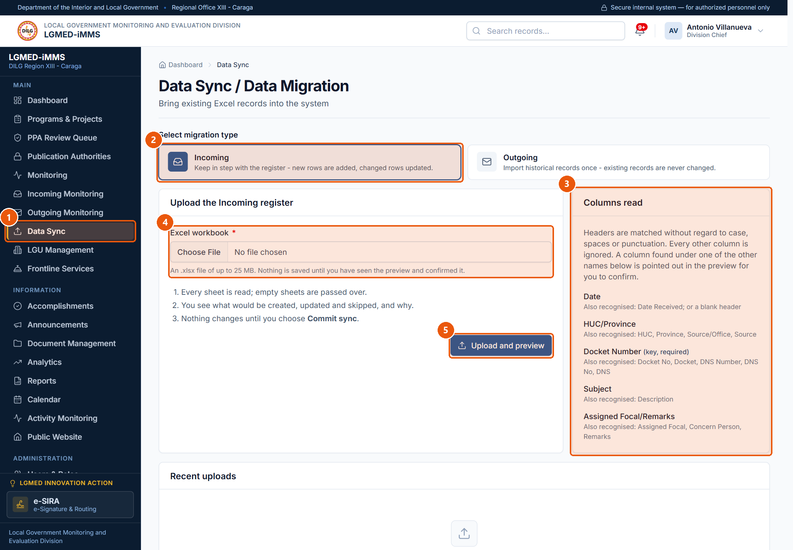

*Figure 37. Data Sync - choosing the register and uploading the workbook.* Signed in as: Administrator (Division Chief).

| No. | Element | Description |
|:-:|---|---|
| 1 | **Data Sync** | Sidebar entry (roles that may encode). |
| 2 | **Migration type** | Incoming keeps the register in step (new rows added, changed rows updated). Outgoing imports historical records once. |
| 3 | **Columns read** | The column headings the sync recognises in the workbook. |
| 4 | **Excel workbook** | Required. Choose the .xlsx file. |
| 5 | **Upload and preview** | Reads every sheet and shows a preview. Nothing is saved yet. |

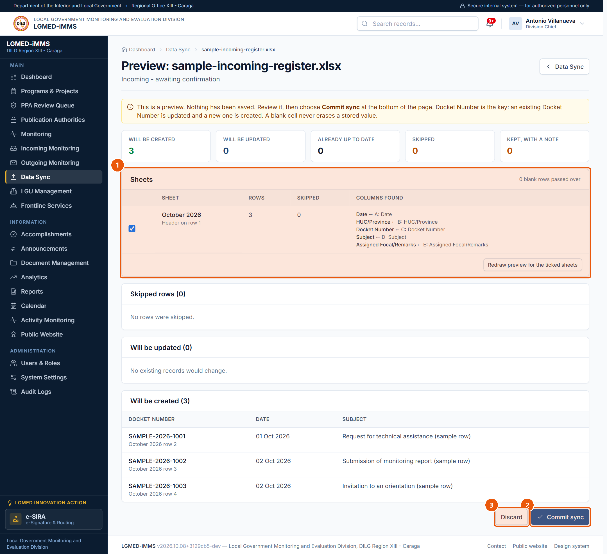

*Figure 38. The preview of an uploaded workbook (illustrative sample file).* Signed in as: Administrator (Division Chief).

| No. | Element | Description |
|:-:|---|---|
| 1 | **Sheets** | Tick the sheets to include, then redraw the preview. |
| 2 | **Commit sync** | Saves the previewed rows to the register. |
| 3 | **Discard** | Throws the upload away; nothing is saved. |

### C. Procedures

### Procedure 10.7.1: Sync a register from Excel

**Purpose:** Import or update records from the spreadsheet register.

**Who can do this:** See the table above.

**Steps:**

1. Click **Data Sync** in the sidebar.
2. Under **Select migration type**, click **Incoming** or **Outgoing**.
3. Check **Columns read** to confirm your workbook uses recognised column headings (for Incoming: Date, HUC/Province, Docket Number, Subject, Assigned Focal/Remarks; for Outgoing: LGMED Code, DNS Number (Incoming), Type of Communication / Documents, Subject / Title, Sent To, Sent Via, Remarks, DNS Number (Outgoing)).
4. Choose the file in **Excel workbook\*** and click **Upload and preview**.
5. Read the preview: **Will be created**, **Will be updated**, **Already up to date**, **Skipped** and **Kept, with a note**. Under **Sheets**, untick any sheet you do not want and click **Redraw preview for the ticked sheets**.
6. Click **Commit sync** to save, or **Discard** to throw the upload away.

**Expected Result:** After **Commit sync**, the records appear in Incoming or Outgoing Monitoring. The upload is listed under **Recent uploads**.

**Important Notes:**

- **Nothing is saved until you click Commit sync.** The preview is safe to inspect.
- For Outgoing, the result page offers **Import Valid Records** and an **Import Error Report** listing the rows that could not be imported.
- Records imported for Incoming carry the status *Imported from spreadsheet*.

> **NOTE:** Figure 38 was produced by uploading a small illustrative workbook created for this manual (three sample rows), not a real office register.

## 10.8 LGU Management

### A. Module overview

| Item | Details |
|---|---|
| Where | **Sidebar › LGU Management** (`/app/lgus/`) |
| Purpose | The directory of the LGUs of Region XIII (5 provinces, 6 cities and 67 municipalities): type, province, income class, contact person, compliance status and monitoring history. |
| Who | All roles can view. Encoder, LGMED Staff and Administrators can add and edit. Administrators can delete. |
| Compliance statuses | Compliant, Partially compliant, Non-compliant, Not yet assessed. |

### B. Visual interface guide

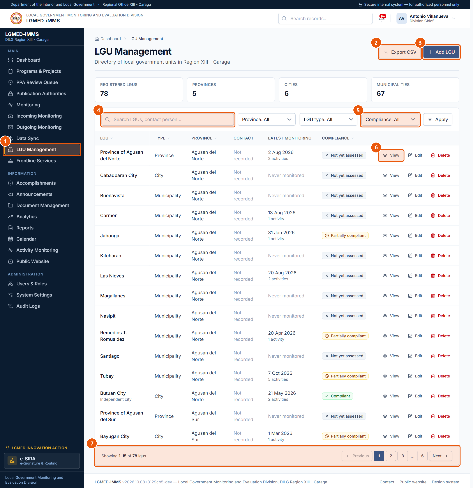

*Figure 39. LGU Management - the directory of the 78 LGUs of Region XIII.* Signed in as: Administrator (Division Chief).

| No. | Element | Description |
|:-:|---|---|
| 1 | **LGU Management** | Sidebar entry. |
| 2 | **Export CSV** | Downloads the rows currently listed - with the search and filters applied - as a spreadsheet file. Every export is recorded in the audit trail. |
| 3 | **Add LGU** | Adds an LGU to the directory. |
| 4 | **Search box** | Type part of a name, title, code or other text, then press Enter or click Apply. |
| 5 | **Compliance filter** | Compliant, Partially compliant, Non-compliant, Not yet assessed. |
| 6 | **Row actions** | View (eye), Edit (pencil) and Delete (bin) for that record. Only the actions your role permits are shown. |
| 7 | **Pagination** | Moves between pages of results. The number of rows per page is a system setting. |

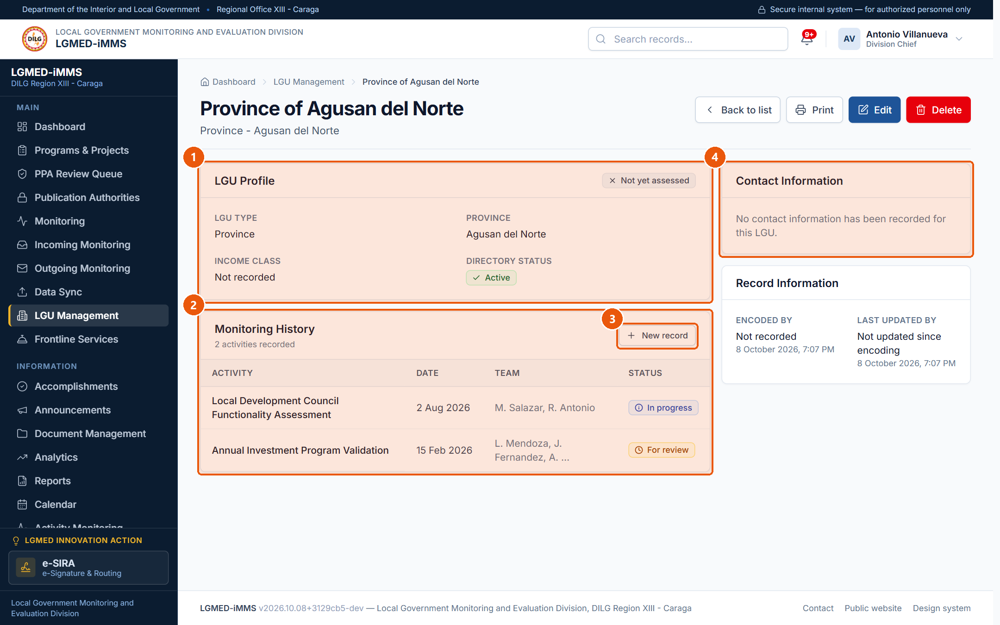

*Figure 40. An LGU profile.* Signed in as: Administrator (Division Chief).

| No. | Element | Description |
|:-:|---|---|
| 1 | **LGU Profile** | Type, province, income class and compliance status. |
| 2 | **Monitoring History** | Monitoring activities recorded for the LGU. |
| 3 | **New record** | Records a monitoring activity. |
| 4 | **Contact Information** | The LGU's contact person and details. |

### C. Procedures

### Procedure 10.8.1: View an LGU's profile and monitoring history

**Who can do this:** All roles.

**Steps:**

1. Click **LGU Management** in the sidebar.
2. Search by name or contact person, or filter by **Province**, **LGU type** or **Compliance**, then click **Apply**.
3. Click the LGU's name (or the eye icon).

**Expected Result:** The LGU's **LGU Profile**, **Monitoring History**, **Contact Information** and **Record Information** are shown. **New record** starts a monitoring record.

### Procedure 10.8.2: Add or edit an LGU

**Who can do this:** Encoder, LGMED Staff, Administrators.

**Steps:**

1. Click **Add LGU** (or **Edit** on an LGU).
2. Under **LGU Identification**, enter **LGU name\***, **LGU type\***, **Province\***, **Income class** and tick **Independent of the province** for an independent city.
3. Under **Contact Information**, enter the address, contact person, position, number and e-mail.
4. Under **Oversight**, choose the **Compliance status\***, keep **Active in the directory** ticked, and add **Notes**.
5. Click **Save**.

**Expected Result:** The LGU is saved and listed in the directory and in LGU drop-down lists throughout the system.

**Visual Reference:** Figure 41.

**Important Notes:** To take an LGU out of use without losing its history, untick **Active in the directory** rather than deleting it. The LGU roster loaded with the system must be checked against the office's official records.

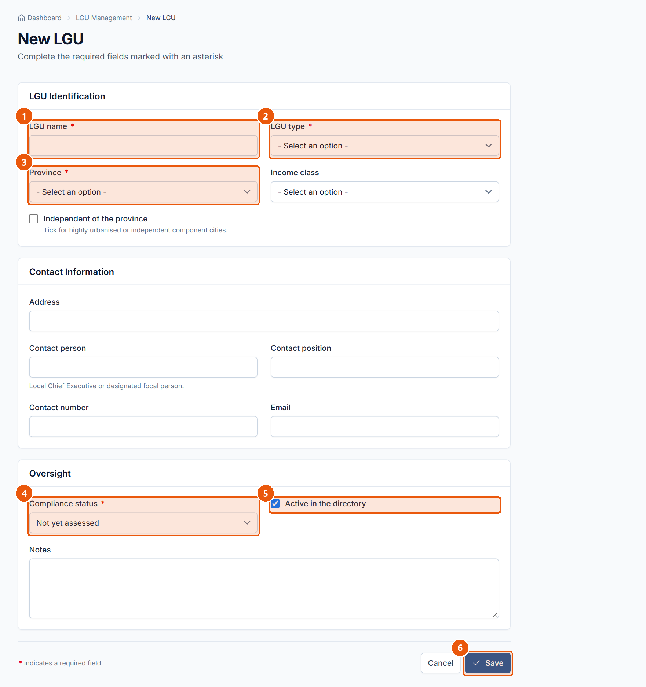

*Figure 41. New LGU form.* Signed in as: Administrator (Division Chief).

| No. | Element | Description |
|:-:|---|---|
| 1 | **LGU name** | Required. |
| 2 | **LGU type** | Required. Province, City or Municipality. |
| 3 | **Province** | Required. |
| 4 | **Compliance status** | Required. |
| 5 | **Active in the directory** | Untick to hide an LGU without deleting it. |
| 6 | **Save** | Saves the LGU. |

## 10.9 Frontline Services

### A. Module overview

| Item | Details |
|---|---|
| Where | **Sidebar › Frontline Services** (`/app/services/`) |
| Purpose | The Division's frontline services — who may avail, requirements, processing time, fees and the responsible office — for listing on the public website. |
| Who | All roles can view. Encoder, LGMED Staff and Administrators can add and edit. Administrators can delete. |

### B. Visual interface guide

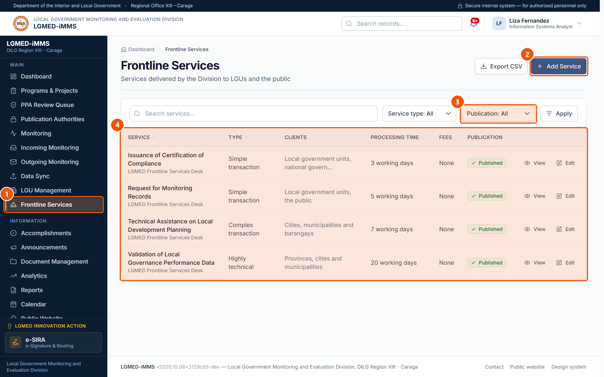

*Figure 42. Frontline Services.* Signed in as: LGMED Staff.

| No. | Element | Description |
|:-:|---|---|
| 1 | **Frontline Services** | Sidebar entry. |
| 2 | **Add Service** | Adds a service. |
| 3 | **Publication filter** | Published or Not published on the public website. |
| 4 | **Records table** | One row per record. Underlined column headings sort the list; click again to reverse the order. |

### C. Procedures

### Procedure 10.9.1: Add or edit a frontline service

**Who can do this:** Encoder, LGMED Staff, Administrators.

**Steps:**

1. Click **Frontline Services › Add Service** (or **Edit** on a service).
2. Under **Service Information**, enter **Service name\***, **Service type\*** (Simple transaction, Complex transaction, Highly technical) and **Description**.
3. Under **Requirements and Processing**, enter **Clients**, **Requirements**, **Processing time** and **Fees**.
4. Under **Responsibility**, enter the **Responsible office** and **Responsible person**.
5. Tick **Published on the public website** to list it publicly.
6. Click **Save**.

**Expected Result:** The service is saved. If published, it appears on the public website's **Frontline Services** page.

**Visual Reference:** Figure 43.

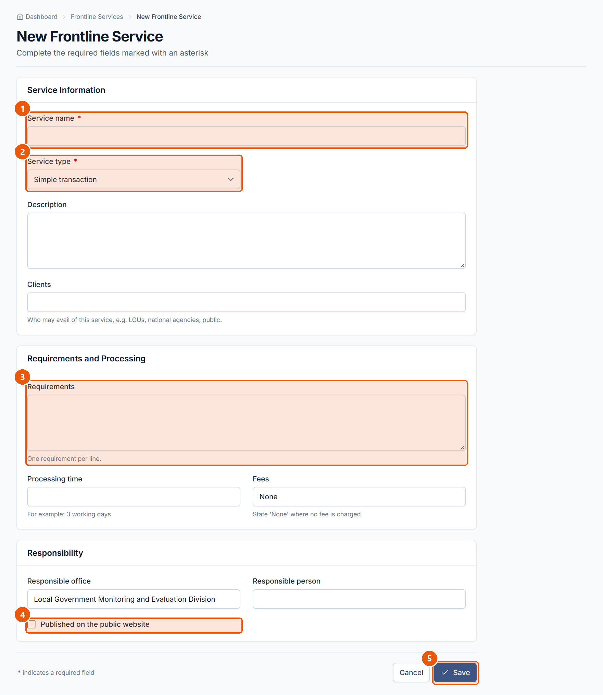

*Figure 43. New Frontline Service form.* Signed in as: LGMED Staff.

| No. | Element | Description |
|:-:|---|---|
| 1 | **Service name** | Required. |
| 2 | **Service type** | Required. Simple, Complex or Highly technical transaction. |
| 3 | **Requirements** | What the client must bring. |
| 4 | **Published on the public website** | Tick to list the service on the public website. |
| 5 | **Save** | Saves the service. |

## 10.10 Updates & Accomplishments

### A. Module overview

| Item | Details |
|---|---|
| Where | **Sidebar › Accomplishments** (`/app/updates/`): the division dashboard; **Division Updates** (entries); **Reporting Weeks**; the Chief's **Review**; the **Convocation view**; **Public disclosure** |
| Purpose | The Division's official weekly record of its own work. Staff contribute activities, communications, accomplishments, photographs and other evidence, POPS Plan progress, ways forward and upcoming activities to **one weekly record for the whole Division**. The record is updated every **Thursday** and presented at the **Monday convocation**. |
| Who | **Contribute** (add entries, evidence, POPS Plan rows, ways forward; submit the week): Encoder, LGMED Staff, Administrators. **Review, select for the convocation, clear for the public, publish, set the disclosure window**: LGMED Staff and Administrators. Viewers read only. |
| Week statuses | Open for contributions; For the Chief's review; Reviewed; Published. |
| Entry statuses | Completed, Ongoing, Pending, Upcoming. |

> **IMPORTANT:** This is a **division accomplishment record, not an employee performance monitor**. The figures belong to the Division; no figure is calculated per staff member. The *Focal person* on an entry only says who can answer for it.

### B. Visual interface guide

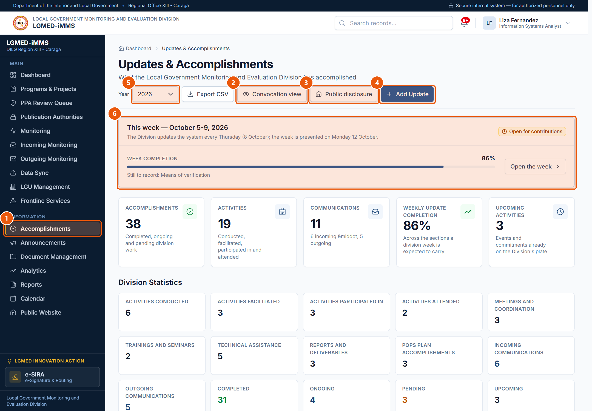

*Figure 44. Updates & Accomplishments - the division dashboard.* Signed in as: LGMED Staff.

| No. | Element | Description |
|:-:|---|---|
| 1 | **Accomplishments** | Sidebar entry. |
| 2 | **Convocation view** | The presentation for the Monday convocation. |
| 3 | **Public disclosure** | How much of the published record the public website shows (Chief / LGMED Staff). |
| 4 | **Add Update** | Contributes an entry to the Division's week. |
| 5 | **Year** | Changes the year the statistics cover. |
| 6 | **This week** | The current reporting week and what it still lacks. |

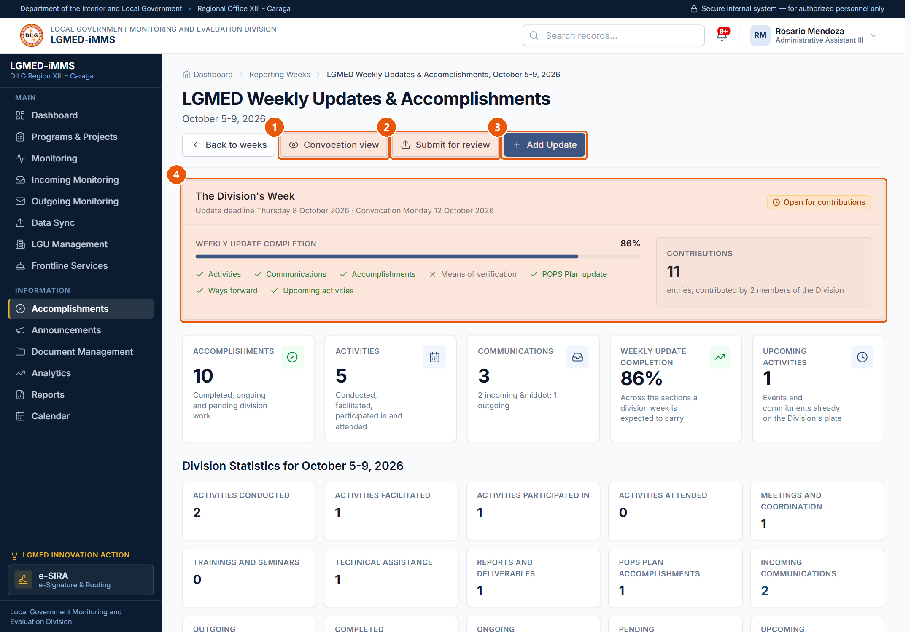

*Figure 45. A reporting week (open for contributions).* Signed in as: Encoder.

| No. | Element | Description |
|:-:|---|---|
| 1 | **Convocation view** | Presentation view of the week. |
| 2 | **Submit for review** | Hands the week to the Division Chief. |
| 3 | **Add Update** | Adds an entry. |
| 4 | **The Division's Week** | Which of the seven parts of the week are recorded and which are still missing. |

### C. Procedures

### Procedure 10.10.1: Contribute an entry to the week

**Purpose:** Record something the Division did, received, sent or is about to do.

**Who can do this:** Encoder, LGMED Staff, Administrators.

**Steps:**

1. Click **Accomplishments › Add Update**.
2. Under **Reporting Period**, choose the **Reporting period\*** (the week).
3. Under **What the Division Did**, enter the **Title\***, **Category\***, **Activity type\*** and **Status\***.
4. Under **When and Where**, enter the **Date\*** (and **End date**), **Location** and **LGU concerned**.
5. Under **Details**, describe **What was accomplished** and any **Remarks**.
6. Under **People**, choose the **Focal person** and list **Assigned personnel / contributors** and any **Partner office or agency**.
7. Under **Communications and References**, enter the **Reference number** and **From / to** for communications.
8. Click **Save**.

**Expected Result:** The entry is added to the week's **Consolidated Division Updates**.

**Visual Reference:** Figure 46.

**Important Notes:** The date must fall inside the chosen week. Only an **Upcoming** entry may be dated after it; upcoming work is not counted as an accomplishment.

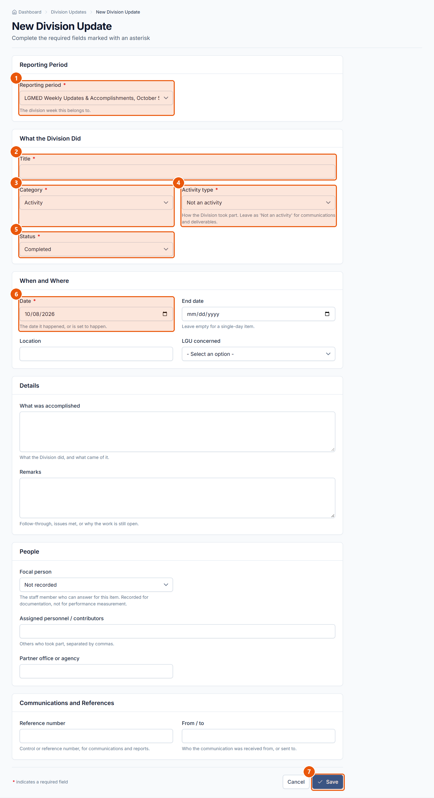

*Figure 46. New Division Update form.* Signed in as: Encoder.

| No. | Element | Description |
|:-:|---|---|
| 1 | **Reporting period** | Required. The week the entry belongs to. |
| 2 | **Title** | Required. |
| 3 | **Category** | Required. Activity, communication, technical assistance, report, POPS Plan accomplishment or other. |
| 4 | **Activity type** | Required. Conducted, Facilitated, Participated in, Attended, Meeting, Training - or Not an activity. |
| 5 | **Status** | Required. Completed, Ongoing, Pending or Upcoming. |
| 6 | **Date** | Required. Must fall inside the reporting week, except for Upcoming items. |
| 7 | **Save** | Saves the entry to the week. |

### Procedure 10.10.2: File a means of verification (evidence)

**Purpose:** Attach the photograph, issuance, report, certificate, attendance sheet or letter that proves an accomplishment.

**Who can do this:** Encoder, LGMED Staff, Administrators.

**Steps:**

1. Open the entry (or, on the week, click **File evidence for …** beside it in **Awaiting a Means of Verification**).
2. Under **Add a Means of Verification**, choose the **Type of evidence\***, choose the **File\*** and describe **What it shows**.
3. Tick **Cleared for the public website** only if the file may be shown publicly.
4. Click **File the evidence**.

**Expected Result:** The file is listed under **Means of Verification**; photographs appear in the week's photo gallery.

**Important Notes:** Evidence is not required to save an entry, but entries without it are listed under **Awaiting a Means of Verification** and counted in the Division's statistics. A file filed as a *Photograph* must be an image.

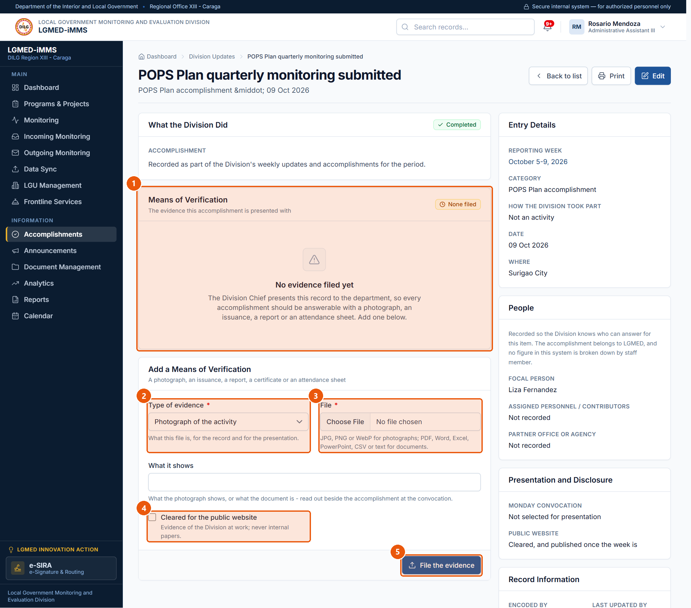

*Figure 47. An entry and its means of verification.* Signed in as: Encoder.

| No. | Element | Description |
|:-:|---|---|
| 1 | **Means of Verification** | Evidence filed for the entry. |
| 2 | **Type of evidence** | Required. Photograph, official document, report, certificate, attendance sheet, letter or other. |
| 3 | **File** | Required. The evidence file. |
| 4 | **Cleared for the public website** | Only cleared evidence on a published week reaches the public website. |
| 5 | **File the evidence** | Attaches the file to the entry. |

### Procedure 10.10.3: Add POPS Plan progress and ways forward

**Who can do this:** Encoder, LGMED Staff, Administrators.

**Steps:**

1. Open the week (**Accomplishments › Reporting weeks**, then the week).
2. In **POPS Plan Updates**, click **Add**. Enter the **Commitment** (the POPS Plan commitment or indicator), the **Target** and the number **Accomplished** (whole numbers), any **Remarks**, and whether it may be shown publicly. Save.
3. In **Ways Forward**, click **Add**. Under **Next Step**, enter the description and detail; under **Tracking**, the target date, status (Pending, Ongoing, Completed) and whether it may be shown publicly. Save.

**Important Notes:** The POPS Plan compliance percentage is calculated from the targets and accomplishments; it is never typed by hand.

**Expected Result:** The rows appear on the week and in the convocation view.

### Procedure 10.10.4: Submit the week for the Chief's review

**Who can do this:** Encoder, LGMED Staff, Administrators.

**Steps:**

1. Open the week. Check **The Division's Week** panel, which lists which of the seven parts of the week are recorded and which are still missing.
2. Click **Submit for review**.

**Expected Result:** The week's status becomes **For the Chief's review**.

### Procedure 10.10.5: Review the week and select what is presented

**Purpose:** The Division Chief's review: theme, remarks, convocation selection and public clearance.

**Who can do this:** LGMED Staff, Administrators.

**Steps:**

1. Open the week and click **Review**.
2. Under **Remarks & Theme**, enter the **Theme** and **Division Chief's remarks**, then click **Save remarks**.
3. Under **Major Accomplishments to Present**, tick the accomplishments to present at the Monday convocation and click **Save selection**. The page warns you if a selected accomplishment has no means of verification.
4. Under **Public Clearance**, tick the entries and photographs the public may see and click **Save clearance**.
5. To publish, click **Publish to the public website**. To send the week back to contributors, click **Reopen for contributions**.

**Expected Result:** The convocation view leads with the selected accomplishments. A published week appears on the public website's **Accomplishments** page, showing only the items that were cleared.

**Visual Reference:** Figure 48.

**Important Notes:** Selecting for the convocation and clearing for the public are **separate decisions**. A week cannot be published with nothing cleared. Reopening a published week withdraws it from the public website. Staff names and the Chief's remarks are never published.

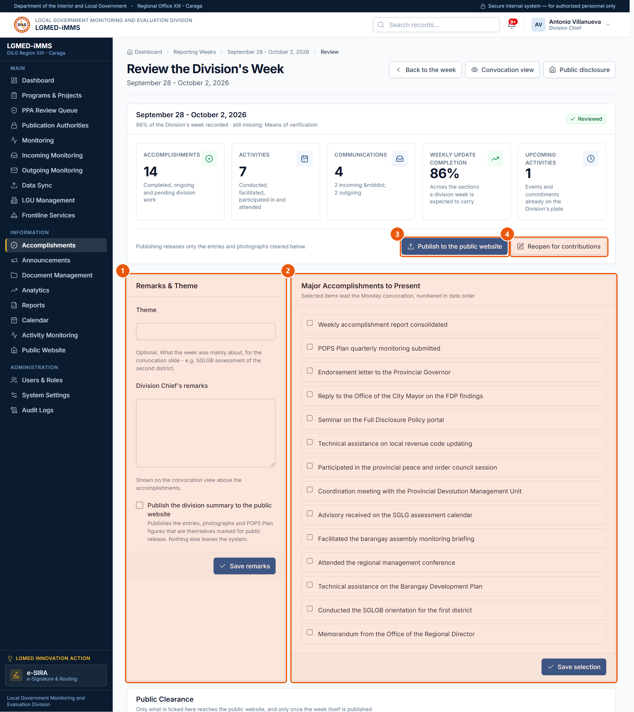

*Figure 48. The Division Chief's review of a week.* Signed in as: Administrator (Division Chief).

| No. | Element | Description |
|:-:|---|---|
| 1 | **Remarks & Theme** | The week's theme and the Chief's remarks (Save remarks). |
| 2 | **Major Accomplishments to Present** | Tick what leads the Monday convocation (Save selection). |
| 3 | **Publish to the public website** | Publishes the cleared items of the week. |
| 4 | **Reopen for contributions** | Returns the week to staff; withdraws it from the public website if it was published. |

### Procedure 10.10.6: Present the week at the Monday convocation

**Who can do this:** All roles can open the view; changing the selection requires review rights.

**Steps:**

1. Click **Accomplishments › Convocation view** (or **Convocation view** on a week).
2. Present the page on a screen; it is set in large type and has no editing controls.
3. Click **Print** for a paper copy, or **Change the selection** to return to the review page.

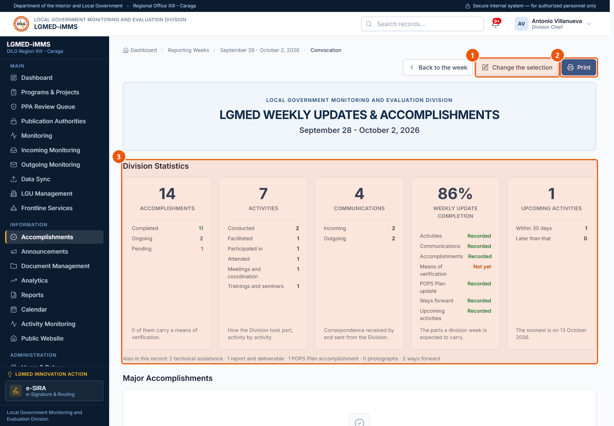

*Figure 49. The Monday Convocation view.* Signed in as: Administrator (Division Chief).

| No. | Element | Description |
|:-:|---|---|
| 1 | **Change the selection** | Returns to the review page to choose what is presented. |
| 2 | **Print** | Prints the presentation. |
| 3 | **Division Statistics** | The week's figures, typed large to be read from the back of a room. |

### Procedure 10.10.7: Set the public disclosure window

**Purpose:** Decide how far back the public website's Accomplishments page goes.

**Who can do this:** LGMED Staff, Administrators.

**Steps:**

1. Click **Accomplishments › Public disclosure**.
2. Choose **What the public website shows\***: *The most recent completed weeks*, *The most recent completed months*, *A fixed range of dates*, or *Every week the Division has published*.
3. Enter the **Number of weeks**, **Number of months**, or **Showing from** / **Showing until**, as applicable.
4. Tick **Also show the week that is still running** only if the current week should be public.
5. Check **Showing Now** and click **Save**.

**Expected Result:** The public website shows exactly the weeks listed under **Showing Now**.

**Important Notes:** Only published weeks can ever be shown. A fixed range with a missing date shows nothing rather than everything.

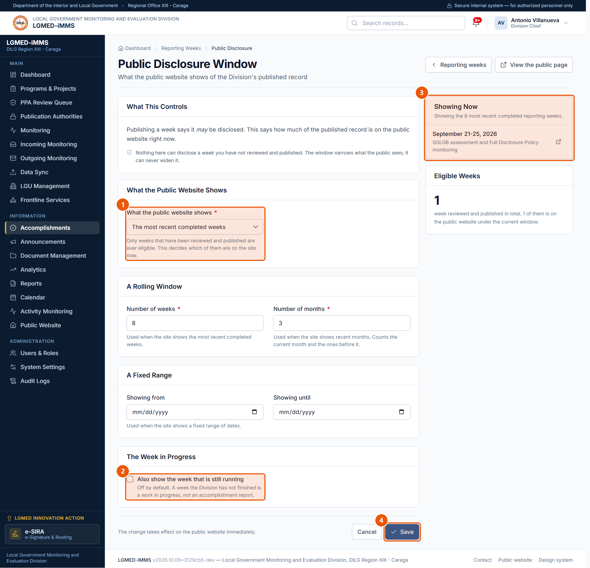

*Figure 50. Public Disclosure Window.* Signed in as: Administrator (Division Chief).

| No. | Element | Description |
|:-:|---|---|
| 1 | **What the public website shows** | Most recent completed weeks, most recent months, a fixed date range, or every published week. |
| 2 | **Week in progress** | Off by default: the running week is not shown publicly. |
| 3 | **Showing Now** | The weeks the current setting puts on the public website. |
| 4 | **Save** | Saves the setting. |

### D. Workflow

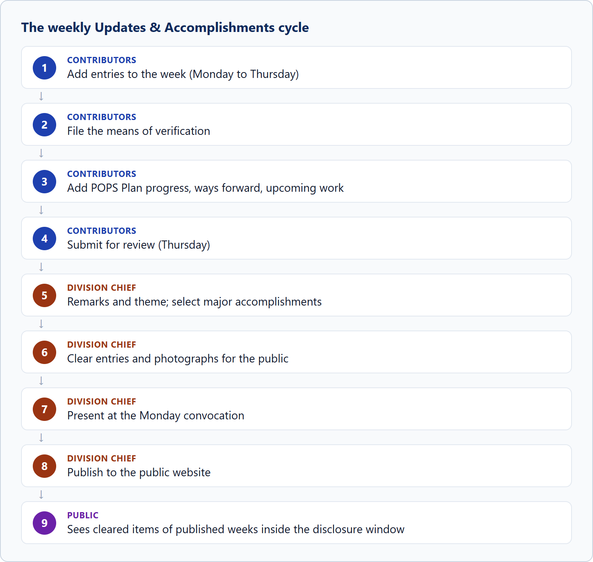

*Figure 51. The weekly Updates & Accomplishments cycle*

## 10.11 Announcements

### A. Module overview

| Item | Details |
|---|---|
| Where | **Sidebar › Announcements** (`/app/announcements/`) |
| Purpose | News, advisories, issuances, activity reports and commendations for the public website's **News** page, which also leads the homepage. |
| Who | All roles can view. Encoder, LGMED Staff and Administrators can add and edit. Administrators can delete. |

### B. Visual interface guide

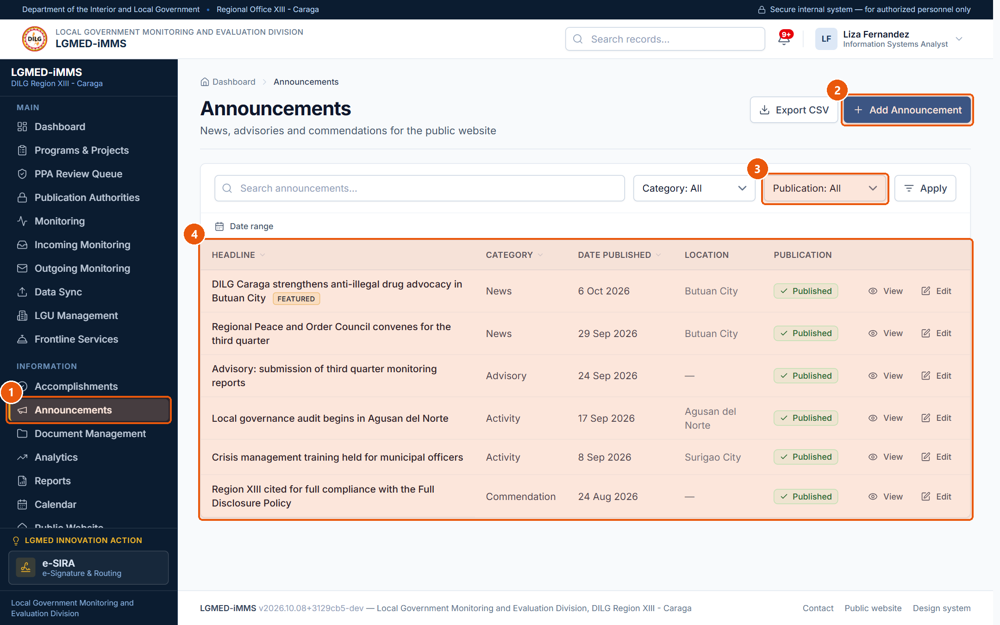

*Figure 52. Announcements.* Signed in as: LGMED Staff.

| No. | Element | Description |
|:-:|---|---|
| 1 | **Announcements** | Sidebar entry. |
| 2 | **Add Announcement** | Writes a news item, advisory, issuance, activity or commendation. |
| 3 | **Publication filter** | Published or Draft. |
| 4 | **Records table** | One row per record. Underlined column headings sort the list; click again to reverse the order. |

### C. Procedures

### Procedure 10.11.1: Write and publish an announcement

**Who can do this:** Encoder, LGMED Staff, Administrators.

**Steps:**

1. Click **Announcements › Add Announcement**.
2. Under **Item Details**, enter the **Headline\***, **Category\*** (News, Advisory, Issuance, Activity, Commendation), **Date published\*** and **Location**.
3. Under **Text**, write the **Lead paragraph\*** and the **Full text**.
4. Under **Photograph and Source**, choose a **Photograph**, describe it, and enter **Read more at** if there is a source link.
5. Under **Publication**, tick **Published on the public website** (untick to keep a draft) and, if wanted, **Feature on the homepage**.
6. Click **Save**.

**Expected Result:** A published item appears on the public **News** page from its publication date. The record page shows its public address.

**Visual Reference:** Figure 53.

**Important Notes:** A draft, or an item dated in the future, is not visible to the public by any route. Photographs: JPG, PNG, WebP or GIF.

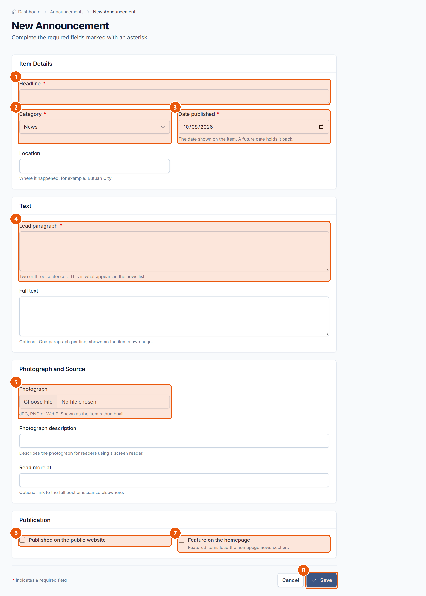

*Figure 53. New Announcement form.* Signed in as: LGMED Staff.

| No. | Element | Description |
|:-:|---|---|
| 1 | **Headline** | Required. |
| 2 | **Category** | Required. |
| 3 | **Date published** | Required. A future date keeps the item off the public site until that day. |
| 4 | **Lead paragraph** | Required. The summary shown on the news feed. |
| 5 | **Photograph** | Optional image for the item. |
| 6 | **Published on the public website** | Untick to keep the item as a draft. |
| 7 | **Feature on the homepage** | Puts the item in the homepage's featured position. |
| 8 | **Save** | Saves the item. |

## 10.12 Document Management

### A. Module overview

| Item | Details |
|---|---|
| Where | **Sidebar › Document Management** (`/app/documents/`) with four tabs: **Register**, **Monitoring**, **Files**, **Retention & Archive** |
| Purpose | The Division's document register: every document received, created, submitted or processed, traceable from registration to archive and, where authorised, disposal. Documents from Incoming and Outgoing Monitoring are filed here automatically. |
| Who | **Register and process**: Encoder, LGMED Staff, Administrators (the owner or focal person acts on their own documents). **Review**: LGMED Staff and Administrators. **Assign the focal person**: Administrators (Division Chief). **Approve and complete, archive and restore, retention decisions**: LGMED Staff and Administrators. **Dispose permanently, delete**: Administrators. Viewers read only. |
| Statuses | Draft, Received, For review, For assignment, Assigned, In progress, For approval, Completed, Archived, Cancelled. |
| Retention decisions | Within retention period, For retention review, For disposal, Permanent preservation. |

### B. Visual interface guide

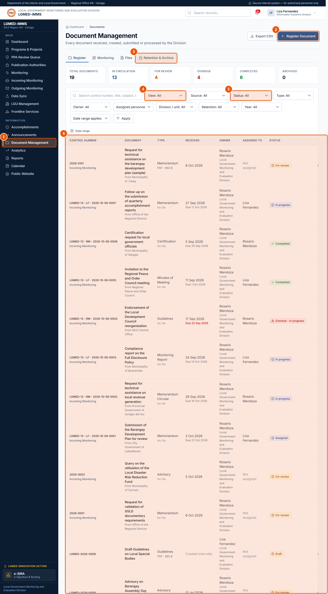

*Figure 54. Document Management - the register.* Signed in as: LGMED Staff.

| No. | Element | Description |
|:-:|---|---|
| 1 | **Document Management** | Sidebar entry. |
| 2 | **Register Document** | Registers a document. |
| 3 | **Tabs** | Register, Monitoring, Files, and Retention & Archive. |
| 4 | **View** | Owned by me, Assigned to me, Not yet assigned, Overdue, Retention review due, Archived and more. |
| 5 | **Status** | Draft, Received, For review, For assignment, Assigned, In progress, For approval, Completed, Archived, Cancelled. |
| 6 | **Records table** | One row per record. Underlined column headings sort the list; click again to reverse the order. |

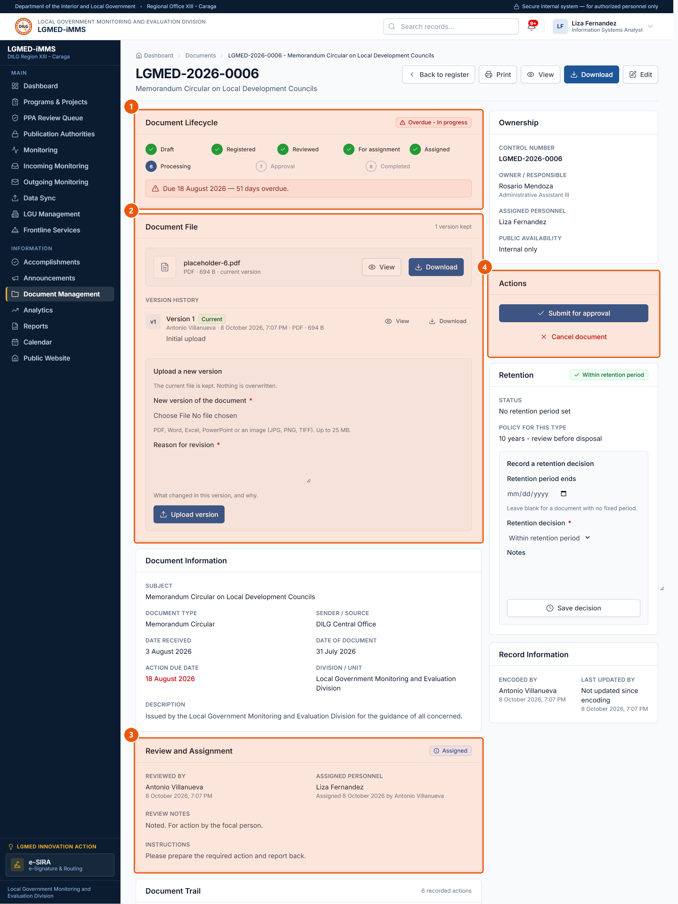

*Figure 55. A document record.* Signed in as: LGMED Staff.

| No. | Element | Description |
|:-:|---|---|
| 1 | **Document Lifecycle** | Each stage from registration to completion; the current stage is highlighted. |
| 2 | **Document File** | View or download the file, its version history, and upload a new version. |
| 3 | **Review and Assignment** | Review notes, the focal person and the Chief's instructions. |
| 4 | **Actions** | The next step for the document's current status (see Table). |

**Lifecycle actions.** The **Actions** panel shows only the next step that fits the document's current status:

| Current status | Button | Who | Result |
|---|---|---|---|
| Draft or Received | **Submit for review** | Owner / editors | For review |
| For review | **Mark reviewed** (with review notes) | LGMED Staff, Administrators | For assignment |
| For review or For assignment | **Assign** in **Review and Assignment** | Administrators | Assigned |
| Assigned | **Start processing** | Owner / focal person | In progress |
| In progress | **Submit for approval** | Owner / focal person | For approval |
| For approval | **Approve and complete** | LGMED Staff, Administrators | Completed (the retention period starts) |
| Completed | **Archive document** | LGMED Staff, Administrators | Archived |
| Archived | **Restore from archive** | LGMED Staff, Administrators | Back in the register |
| Archived and marked *For disposal* | **Dispose permanently** | Administrators | Files destroyed; record and trail kept |
| Any open status | **Cancel document** | Owner / editors | Cancelled |

> **NOTE:** Documents that came from Incoming or Outgoing Monitoring show no lifecycle buttons here: their action is taken in those modules.

### C. Procedures

### Procedure 10.12.1: Register a document

**Who can do this:** Encoder, LGMED Staff, Administrators.

**Steps:**

1. Click **Document Management › Register Document**.
2. Under **Document Information**, enter the **Document title\***, choose the **Document type\***, and enter the **Document / reference / control number**, **Subject** and **Sender / source** as applicable.
3. Under **Dates**, enter the **Date received**, **Date of document**, **Action due date** and **Year**.
4. Under **Ownership and Unit**, choose the **Owner / responsible personnel\***, the **Division / unit** and the **Office / division\***.
5. Under **File and Details**, choose the **Document file** and add a **Description** and **Remarks**.
6. Click **Save**.

**Expected Result:** The document is registered with a control number (for example *LGMED-2026-0010*) and its file becomes **version 1**.

**Visual Reference:** Figure 56.

**Important Notes:** To offer a completed document in the public **Document Library**, edit it and tick **Available on the public website**. Accepted files: PDF, Word, Excel, CSV, PowerPoint and images (JPG, PNG, GIF, BMP, WebP, TIFF), up to 25 MB. Control numbers are never reused, even if a document is deleted.

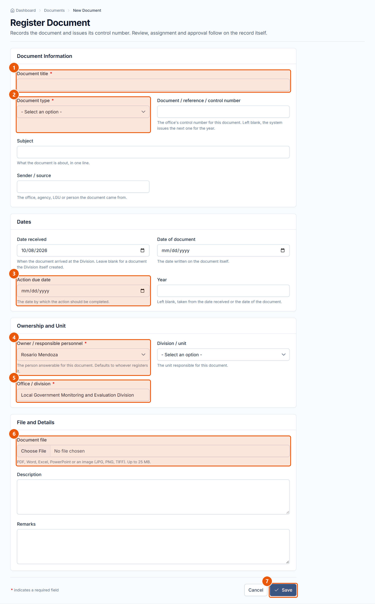

*Figure 56. Register Document form.* Signed in as: Encoder.

| No. | Element | Description |
|:-:|---|---|
| 1 | **Document title** | Required. |
| 2 | **Document type** | Required. The type decides the retention period. |
| 3 | **Action due date** | Optional; overdue documents are flagged. |
| 4 | **Owner** | Required. The person answerable for the document. |
| 5 | **Office / division** | Required. |
| 6 | **Document file** | The file (version 1). |
| 7 | **Save** | Registers the document and issues its control number. |

### Procedure 10.12.2: Review and assign a document

**Who can do this:** Review: LGMED Staff and Administrators. Assign: Administrators (Division Chief).

**Steps:**

1. Open a document with the status **For review** (Monitoring tab › *For review*, or **View: Not yet assigned**).
2. In **Actions**, enter **Review notes** and click **Mark reviewed**. The status becomes **For assignment** and the Division Chief is notified.
3. In **Review and Assignment › Assign a focal person**, choose the **Assigned personnel / focal person**, enter the **Instructions** and **Action due date**, and click **Assign** (or **Reassign** later).

**Expected Result:** The status becomes **Assigned** and the focal person is notified. The **Document Trail** records the review and assignment.

**Visual Reference:** Figure 57.

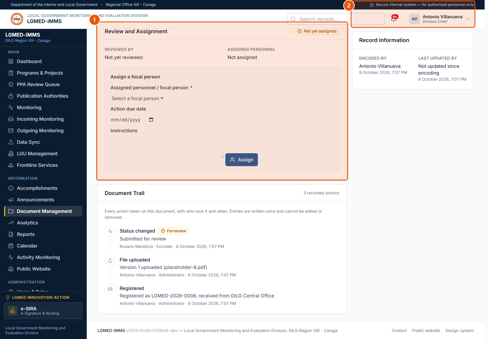

*Figure 57. Review and assignment of a document (Division Chief).* Signed in as: Administrator (Division Chief).

| No. | Element | Description |
|:-:|---|---|
| 1 | **Review and Assignment** | The Chief names the focal person and gives instructions. |
| 2 | **Retention** | Record a retention decision: within period, for review, for disposal, or permanent preservation. |

### Procedure 10.12.3: Process a document to completion

**Who can do this:** The owner or assigned focal person; approval by LGMED Staff or Administrators.

**Steps:**

1. Open the document assigned to you (**View: Assigned to me**).
2. Click **Start processing**.
3. Do the work. To replace the file, use **Document File › Upload a new version**: choose the **New version of the document**, give the **Reason for revision** (required), and click **Upload version**.
4. Click **Submit for approval**.
5. The approver opens the document and clicks **Approve and complete**.

**Expected Result:** The status becomes **Completed** and the retention period starts from the document type's schedule.

**Important Notes:** A file is never overwritten: earlier versions stay in **Version history** with the reason they were replaced.

### Procedure 10.12.4: View or download a file

**Who can do this:** Anyone who may see the document.

**Steps:** Open the document and, in **Document File**, click the view (PDF) or download button; earlier versions are under **Version history**. The **Files** tab (Figure 58) lists every stored file with its **Source** (Incoming document, Focal person's update, Outgoing communication, Registered here).

**Expected Result:** The PDF opens in the viewer, or the file downloads.

**Important Notes:** Every download is recorded on the document's trail; viewing is recorded once a day per person.

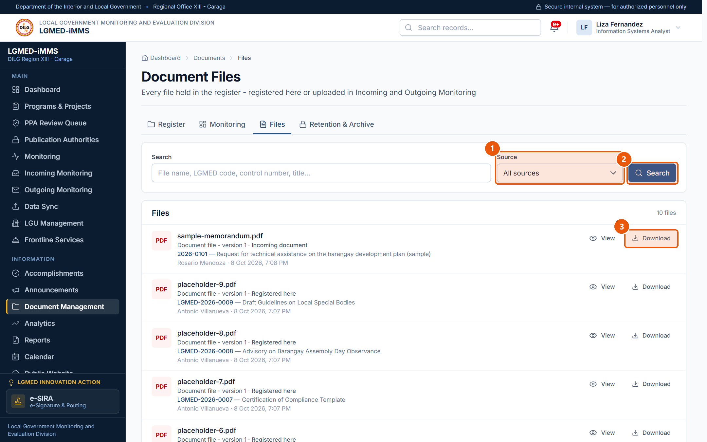

*Figure 58. Document Files - every stored file in one list.* Signed in as: LGMED Staff.

| No. | Element | Description |
|:-:|---|---|
| 1 | **Source** | Incoming document, Focal person's update, Outgoing communication, or Registered here. |
| 2 | **Search** | Runs the search. |
| 3 | **Download** | Downloads the file. Every download is recorded on the document's trail. |

### Procedure 10.12.5: Monitor documents

**Who can do this:** All roles that can see the register.

**Steps:** Click the **Monitoring** tab. Review **Document counts**, **By lifecycle stage**, **Awaiting action**, **Overdue documents**, **Retention**, **Documents by owner** and **By document type**. Click any figure to open the documents it counts.

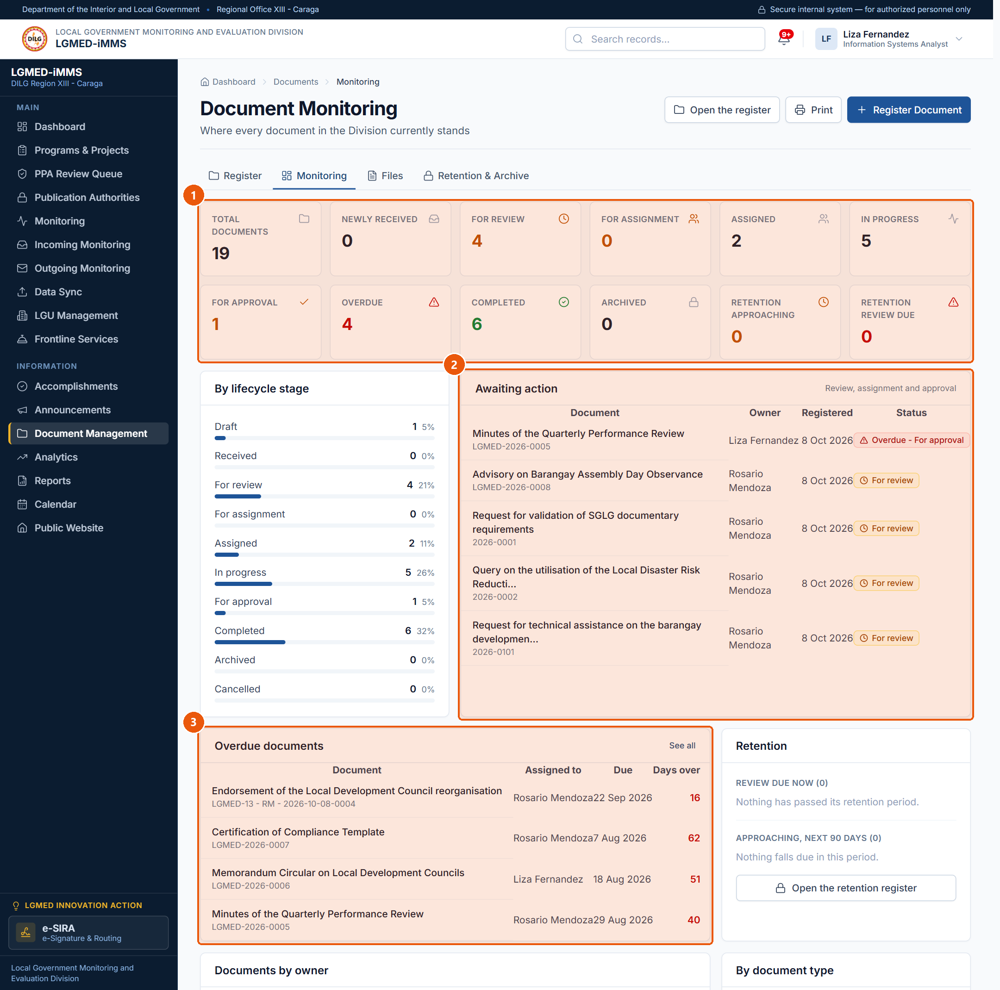

*Figure 59. Document Monitoring.* Signed in as: LGMED Staff.

| No. | Element | Description |
|:-:|---|---|
| 1 | **Document counts** | Each figure is a link to the documents it counts. |
| 2 | **Awaiting action** | Documents waiting at each stage. |
| 3 | **Overdue documents** | Past their action due date. |

### Procedure 10.12.6: Record a retention decision

**Who can do this:** LGMED Staff, Administrators.

**Steps:**

1. Open the document and scroll to **Retention › Record a retention decision**.
2. Check or change **Retention period ends**, choose the **Retention decision\*** and add **Notes**.
3. Click **Save decision**.

**Expected Result:** The decision is shown on the document and in **Retention & Archive**.

### Procedure 10.12.7: Archive and restore a document

**Who can do this:** LGMED Staff, Administrators.

**Steps:**

1. Open a **Completed** document and click **Archive document** in **Actions**.
2. Enter the **Reason for archiving** and click **Archive document**.
3. To bring it back, open it from **Retention & Archive › Browse the archive**, click **Restore from archive**, give the **Reason for restoring**, and click **Restore document**.

**Expected Result:** Archived documents leave the working register and the public website; nothing is deleted.

**Visual Reference:** Figure 60.

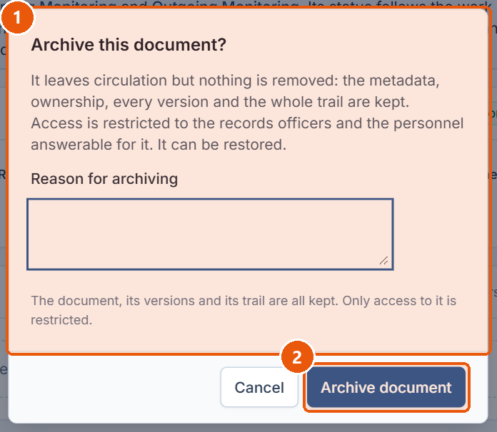

*Figure 60. Archiving a completed document.* Signed in as: LGMED Staff.

| No. | Element | Description |
|:-:|---|---|
| 1 | **Reason for archiving** | Why the document is being archived. |
| 2 | **Archive document** | Archives it. Nothing is deleted; access is restricted and it leaves the public website. |

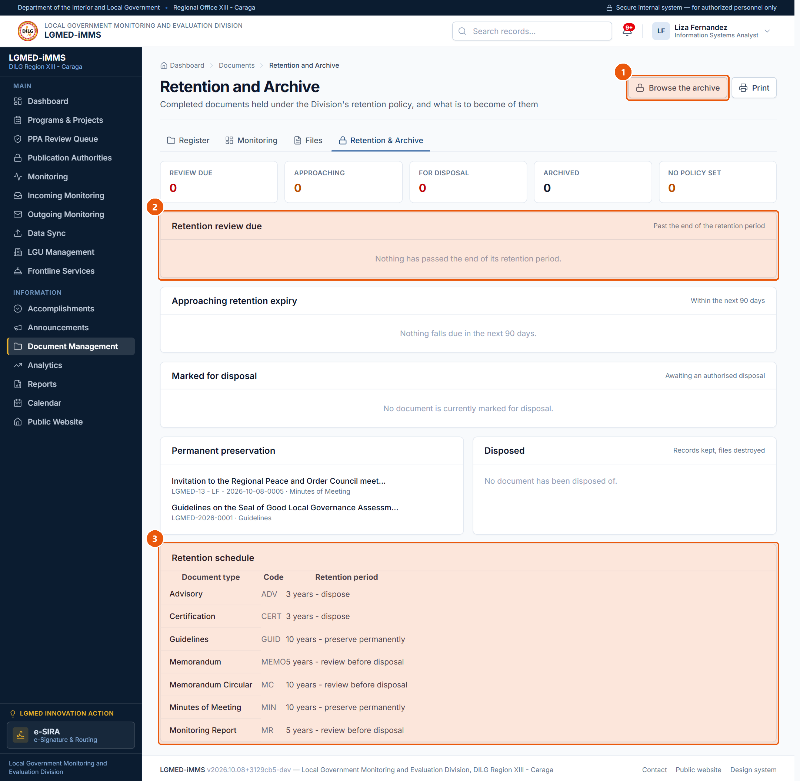

*Figure 61. Retention and Archive.* Signed in as: LGMED Staff.

| No. | Element | Description |
|:-:|---|---|
| 1 | **Browse the archive** | Lists archived documents. |
| 2 | **Retention review due** | Documents whose retention period has run out. |
| 3 | **Retention schedule** | The retention period of each document type. |

### Procedure 10.12.8: Dispose of a document permanently

**Who can do this:** Administrators.

**Before you start:** The document must be **archived**, its retention decision must be **For disposal**, and the **disposal authority** (board resolution or approved records disposal schedule) must already be recorded in **System Settings › Disposal authorities**.

**Steps:**

1. Open the archived document and click **Dispose permanently**.
2. Choose the **Disposal authority**, add **Disposal notes**, and type **DISPOSE** in the confirmation box.
3. Click **Dispose permanently**.

**Expected Result:** The document's files are destroyed. The record, its ownership, its version list and its complete trail are kept as proof of the disposal.

**Important Notes:** **WARNING:** Disposal is the only irreversible action in the module. The files cannot be recovered.

### D. Workflow

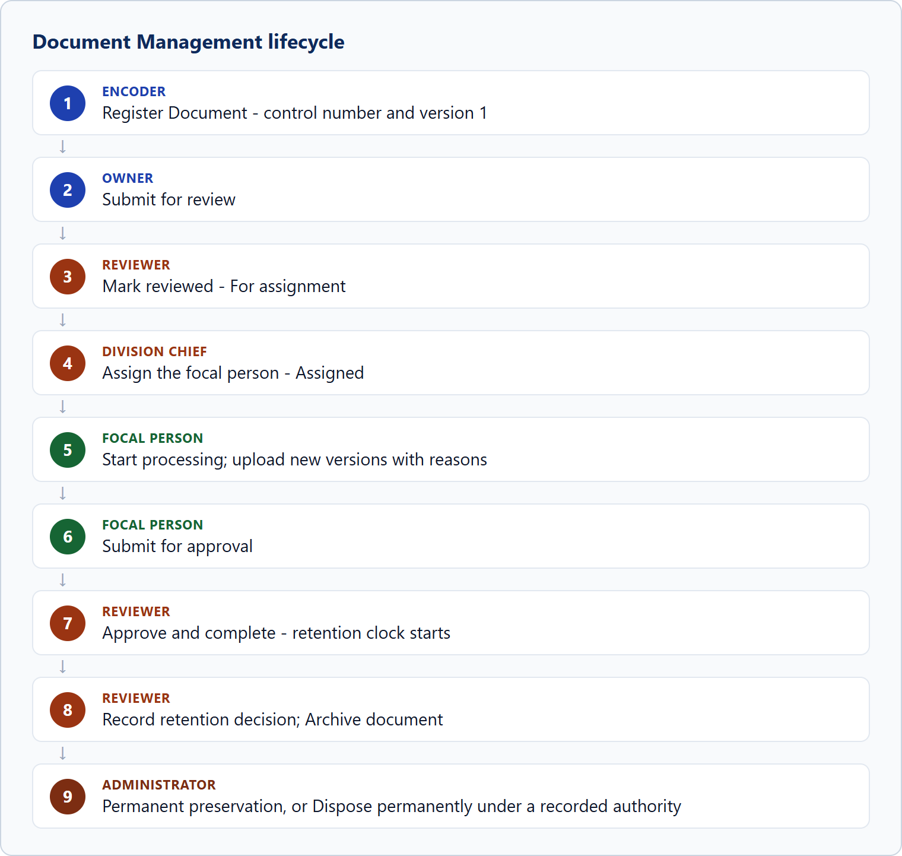

*Figure 62. Document Management lifecycle*

## 10.13 Analytics

### A. Module overview

| Item | Details |
|---|---|
| Where | **Sidebar › Analytics** (`/app/analytics/`) |
| Purpose | Performance analysis for the year: headline figures, Monitoring by Province, LGU Compliance, Monitoring Trend, Coverage by LGU Type, Programs by Category, Report Pipeline, and **Least-Monitored LGUs**. |
| Who | All roles. |

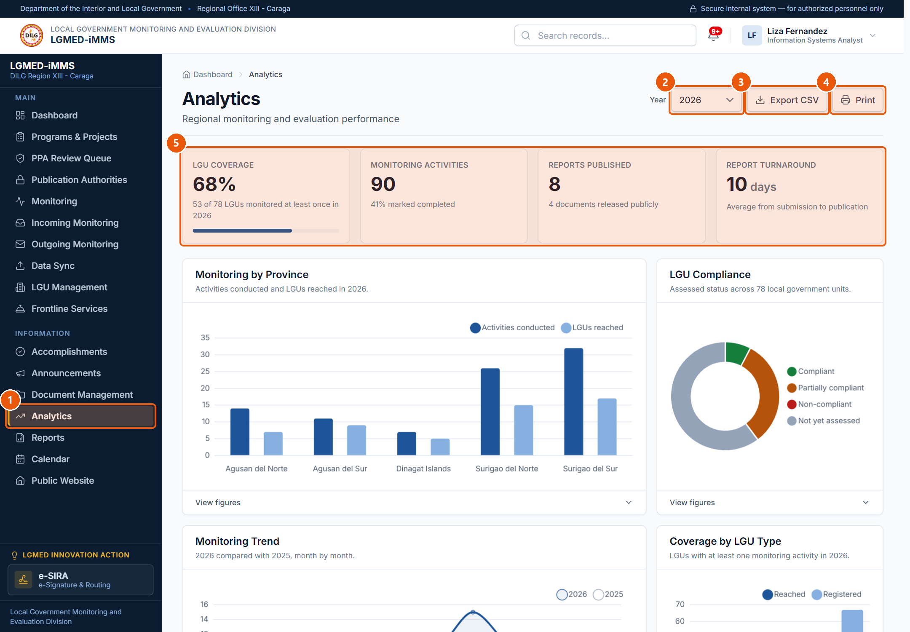

*Figure 63. Analytics.* Signed in as: LGMED Staff.

| No. | Element | Description |
|:-:|---|---|
| 1 | **Analytics** | Sidebar entry. |
| 2 | **Year** | The year analysed. |
| 3 | **Export CSV** | Downloads the figures. |
| 4 | **Print** | Prints the page. |
| 5 | **Headline figures** | Coverage, trend and turnaround for the year. |

### Procedure 10.13.1: Analyse a year and act on the least-monitored LGUs

**Steps:**

1. Click **Analytics**. Choose the **Year**.
2. Read each chart; open **View figures** under a chart to see its numbers as a table.
3. Scroll to **Least-Monitored LGUs**, which lists the LGUs the Division has reached least, in the order it should reach them.
4. Click **Schedule monitoring for …** to start a monitoring record (roles that may encode).
5. Use **Export CSV** or **Print** as needed.

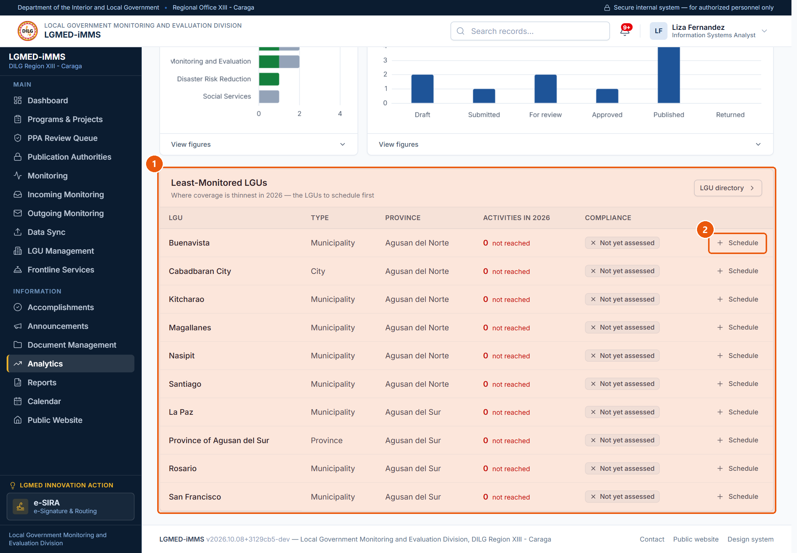

*Figure 64. Least-Monitored LGUs.* Signed in as: LGMED Staff.

| No. | Element | Description |
|:-:|---|---|
| 1 | **Least-Monitored LGUs** | LGUs the Division has reached least, in the order to reach them. |
| 2 | **Schedule monitoring** | Opens a new monitoring record. |

## 10.14 Reports

### A. Module overview

| Item | Details |
|---|---|
| Where | **Sidebar › Reports** (`/app/reports/`) |
| Purpose | Monitoring and evaluation reports, their files, and their review status. Published reports appear on the public website's **Reports** page. |
| Who | All roles can view. Encoder, LGMED Staff and Administrators can add and edit. Administrators can delete. |
| Statuses | Draft, Submitted, For review, Approved, Published, Returned. |

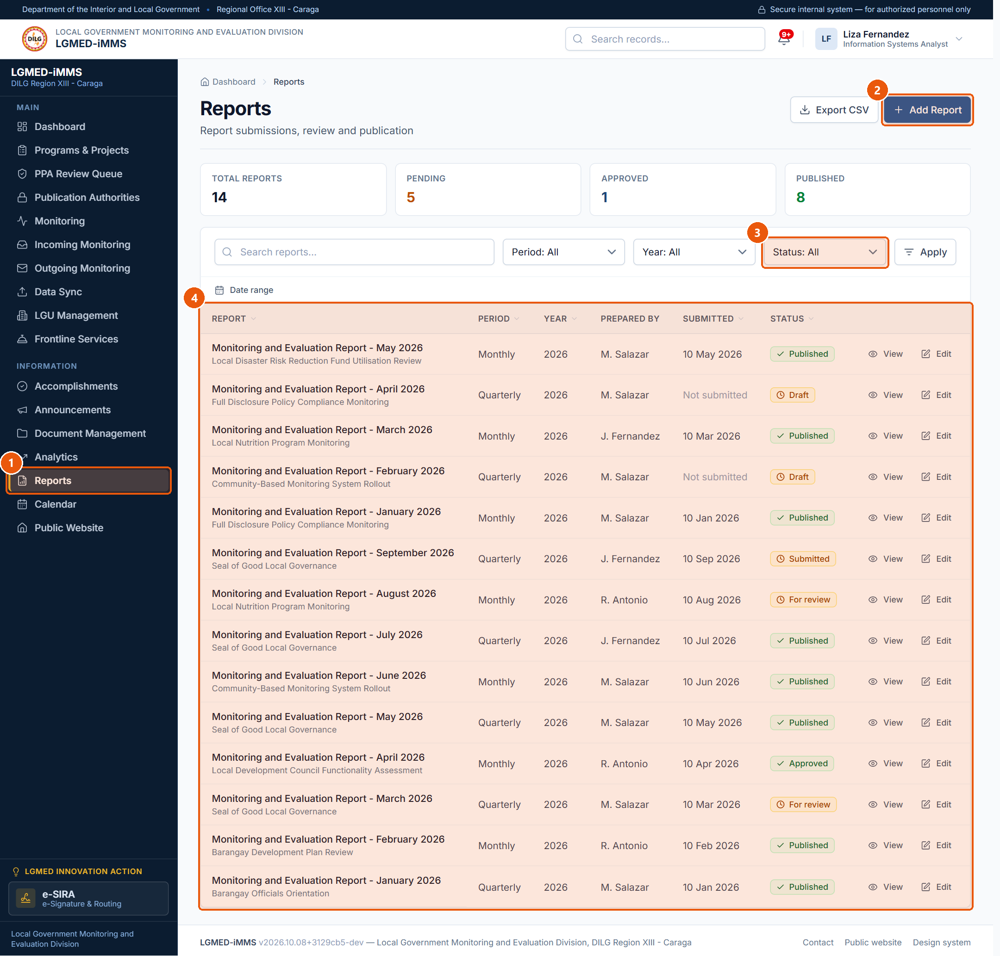

*Figure 65. Reports.* Signed in as: LGMED Staff.

| No. | Element | Description |
|:-:|---|---|
| 1 | **Reports** | Sidebar entry. |
| 2 | **Add Report** | Adds a report. |
| 3 | **Status** | Draft, Submitted, For review, Approved, Published, Returned. |
| 4 | **Records table** | One row per record. Underlined column headings sort the list; click again to reverse the order. |

### Procedure 10.14.1: Add a report

**Who can do this:** Encoder, LGMED Staff, Administrators.

**Steps:**

1. Click **Reports › Add Report**.
2. Under **Report Information**, enter the **Report title\***, **Reference number**, **Reporting period\***, **Year\***, **Program** and **Summary**.
3. Under **Submission**, enter **Prepared by**, attach the **File**, and choose the **Status\***.
4. Click **Save**.

**Expected Result:** The report is listed with its status. Submitting a report for review notifies those who can approve it.

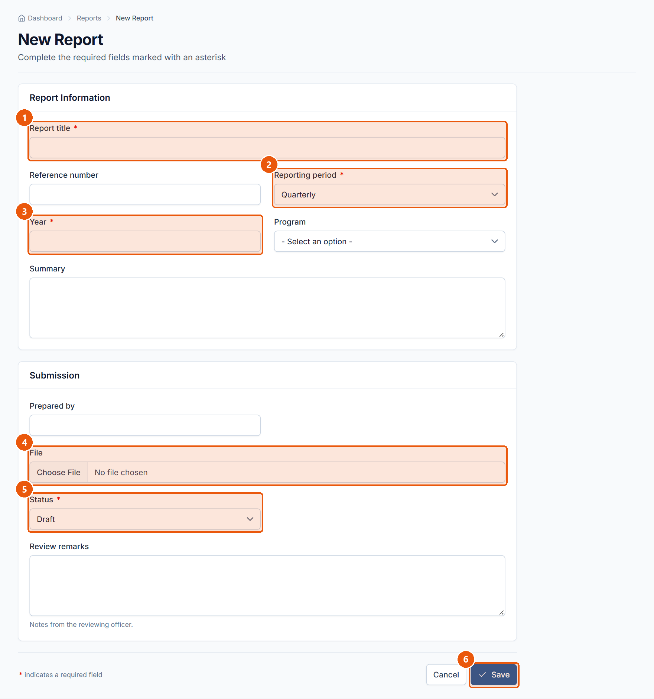

*Figure 66. New Report form.* Signed in as: LGMED Staff.

| No. | Element | Description |
|:-:|---|---|
| 1 | **Report title** | Required. |
| 2 | **Reporting period** | Required. Monthly, Quarterly, Semestral, Annual or Special report. |
| 3 | **Year** | Required. |
| 4 | **File** | The report file. |
| 5 | **Status** | Required. Where the report stands in review. |
| 6 | **Save** | Saves the report. |

### Procedure 10.14.2: Move a report through review

**Steps:** Open the report (Figure 67), click **Edit**, change the **Status** (for example from *For review* to *Approved* or *Returned*, then *Published*), add review remarks where offered, and click **Save**. The **Review Workflow** panel shows the stage reached.

**Important Notes:** The system notifies approvers when a report is submitted and withdraws that notice once it is approved.

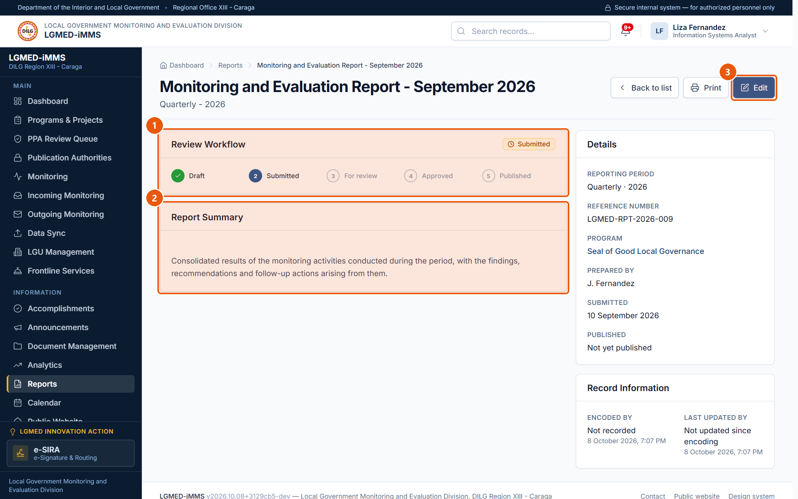

*Figure 67. A report and its review workflow.* Signed in as: LGMED Staff.

| No. | Element | Description |
|:-:|---|---|
| 1 | **Review Workflow** | Draft, Submitted, For review, Approved, Published. |
| 2 | **Report Summary** | Summary, file and any review remarks. |
| 3 | **Edit** | Changes the report, including its status. |

## 10.15 Calendar and Activity Monitoring

### A. Module overview

| Item | Details |
|---|---|
| Where | **Sidebar › Calendar** (`/app/calendar/`); **Activity Monitoring** (`/app/calendar/monitor/`, supervisors) |
| Purpose | Each employee's work plan. Every activity has an **owner** (whose activity it is) and may be **assigned to** someone else who carries it out. The owner decides who may see it. |
| Who | Everyone except Viewers can add activities. The owner edits and deletes their own activities; the assignee can report progress. Administrators (Division Chief) can see everyone's activities and the Activity Monitoring page but **cannot edit** another employee's activity; only the System Administrator can. |
| Visibility | **Private** (default), **Assigned users**, **Team** (the owner's section), **Organization-wide**. |
| Statuses | Planned, In progress, Completed, Postponed, Cancelled. |

### B. Visual interface guide

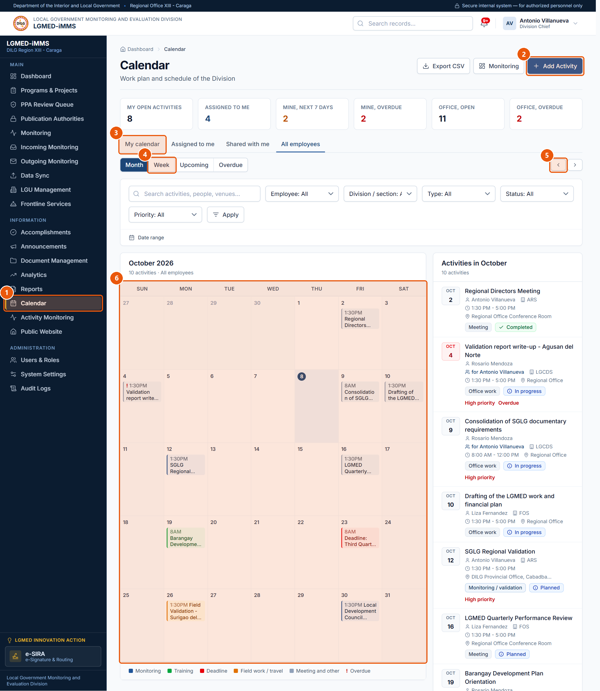

*Figure 68. The Calendar (All employees, month view).* Signed in as: Administrator (Division Chief).

| No. | Element | Description |
|:-:|---|---|
| 1 | **Calendar** | Sidebar entry. |
| 2 | **Add Activity** | Opens the full activity form. |
| 3 | **Scope** | My calendar, Assigned to me, Shared with me, All employees (supervisors). |
| 4 | **Period** | Month, Week, Upcoming, Overdue. |
| 5 | **Month navigation** | Previous and next month. |
| 6 | **Month grid** | Click anywhere in a day to see everything on it and add an activity for that day. |

**Scope and period.** *Scope* asks **whose** activities: **My calendar**, **Assigned to me**, **Shared with me**, **All employees** (supervisors). *Period* asks **over what stretch**: **Month**, **Week**, **Upcoming**, **Overdue**. They can be combined with the filters (Employee, Division / section, Type, Status, Priority).

### C. Procedures

### Procedure 10.15.1: Add an activity from a day on the calendar

**Who can do this:** Everyone except Viewers.

**Steps:**

1. Click **Calendar**. Click anywhere inside a day box (not on an existing activity).
2. The day dialog lists what is already on that day and shows a short form with the date filled in.
3. Enter the **Title\***, **Activity type\***, **Assigned to** (if someone else will do it), **Start date\*** (already filled in), **End date**, times, **Location**, **Priority\***, **Visibility\*** and **Description**. **More options** opens the full form instead.
4. Click **Save activity**.

**Expected Result:** The activity appears on that day. You are its owner.

**Visual Reference:** Figure 69.

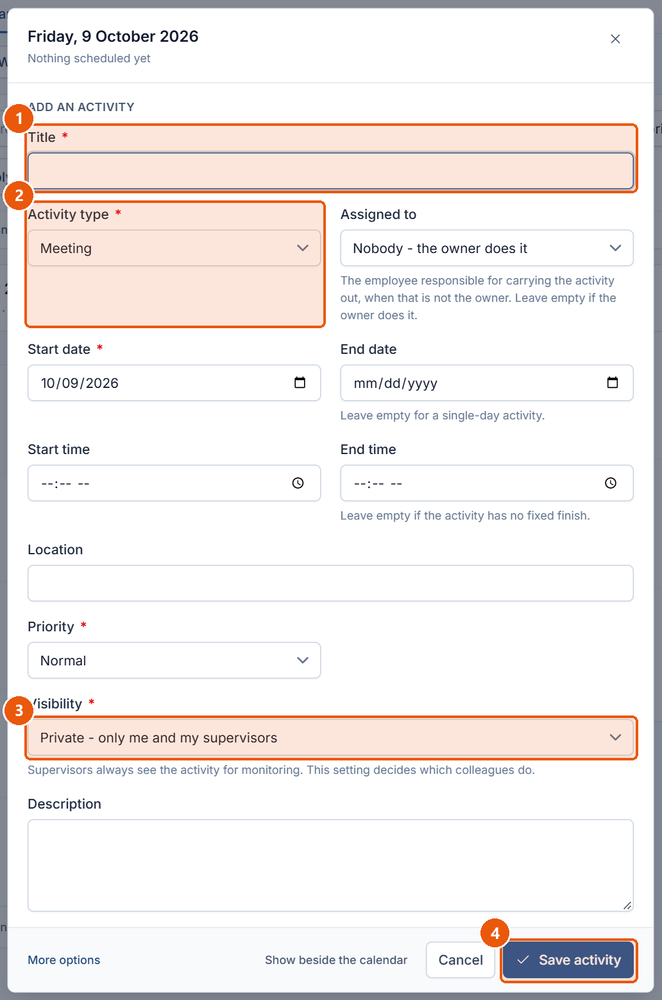

*Figure 69. The day dialog - quick add for the selected day.* Signed in as: LGMED Staff.

| No. | Element | Description |
|:-:|---|---|
| 1 | **Title** | Required. |
| 2 | **Activity type** | Required. |
| 3 | **Visibility** | Required. Private (only you and your supervisors), Assigned users, Team or Organization-wide. |
| 4 | **Save activity** | Saves the activity on that day. |

### Procedure 10.15.2: Add an activity with the full form

**Steps:**

1. Click **Calendar › Add Activity**.
2. Complete **Activity** (Title\*, Activity type\*, Description), **Ownership** (Assigned to, Department / division / section), **Schedule** (Start date\*, End date, times), **Venue and Participants** (Location, LGU concerned, Participants), **Tracking** (Priority\*, Status\*, Remarks) and **Visibility** (Visibility\*, **Show on the public calendar**).
3. Click **Save**.

**Expected Result:** The activity is saved and shown to the people its visibility allows.

**Visual Reference:** Figure 70.

**Important Notes:** An **Activity owner** field is shown only to administrators, who may file an activity for another employee; everyone else is automatically the owner. **Show on the public calendar** is accepted only for **Organization-wide** activities. You cannot assign an activity to someone who would not be able to see it.

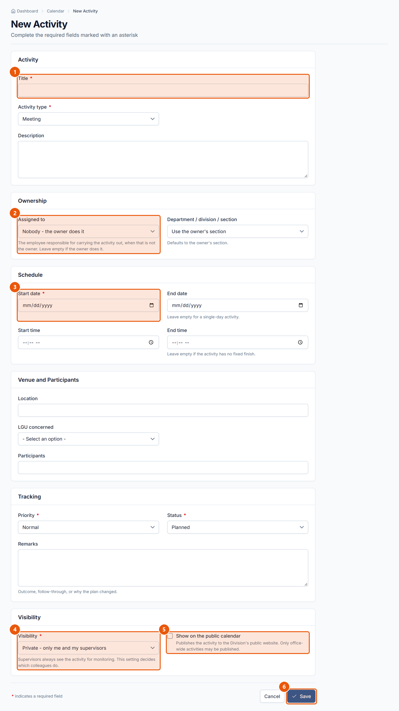

*Figure 70. New Activity form.* Signed in as: LGMED Staff.

| No. | Element | Description |
|:-:|---|---|
| 1 | **Title** | Required. |
| 2 | **Assigned to** | The person doing it when that is not the owner. |
| 3 | **Start date** | Required. |
| 4 | **Visibility** | Required. Defaults to Private. |
| 5 | **Show on the public calendar** | Allowed only for Organization-wide activities. |
| 6 | **Save** | Saves the activity. |

### Procedure 10.15.3: Report progress on an activity

**Who can do this:** The owner and the assigned employee.

**Steps:** Open the activity; under **Report progress**, choose the **Status**, add **Remarks** and click **Save update**.

**Expected Result:** The status changes. The assignee can report progress but cannot change the date, venue or visibility.

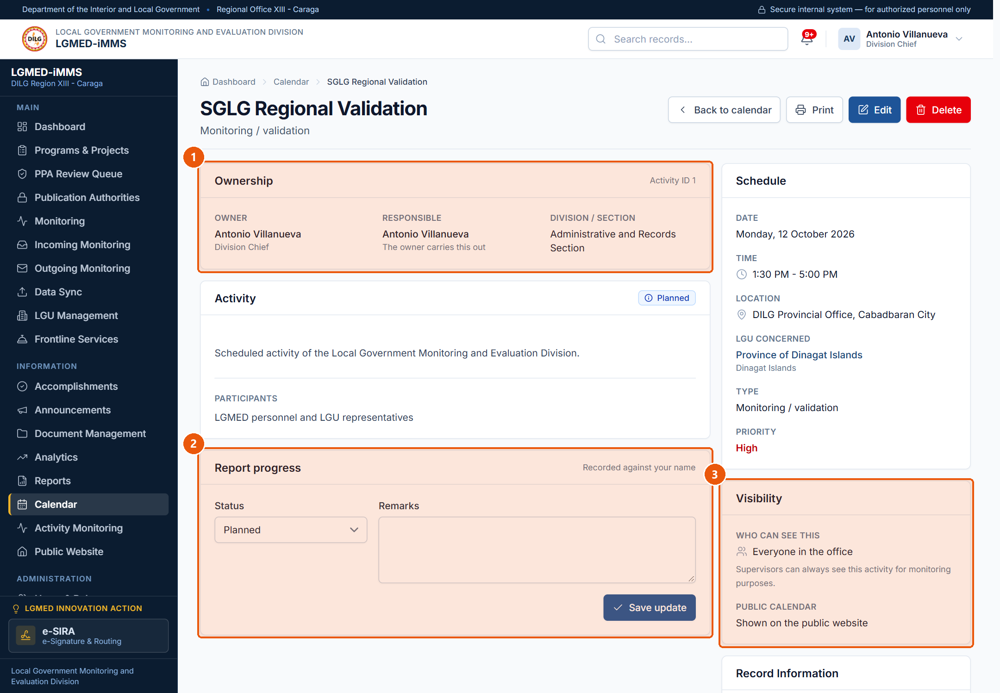

*Figure 71. An activity record.* Signed in as: Administrator (Division Chief).

| No. | Element | Description |
|:-:|---|---|
| 1 | **Ownership** | Owner, assignee and section. |
| 2 | **Report progress** | The owner or assignee updates the status and remarks, then clicks Save update. |
| 3 | **Visibility** | Who may see the activity. |

### Procedure 10.15.4: Monitor the office's workload (supervisors)

**Who can do this:** Administrators (Division Chief), System Administrator.

**Steps:** Click **Activity Monitoring**. Review **Workload by employee**, **Running today**, **By division / section**, **Planned ahead** and **Overdue**. Click a figure or **Calendar of …** to see the activities behind it; **Export CSV** downloads them.

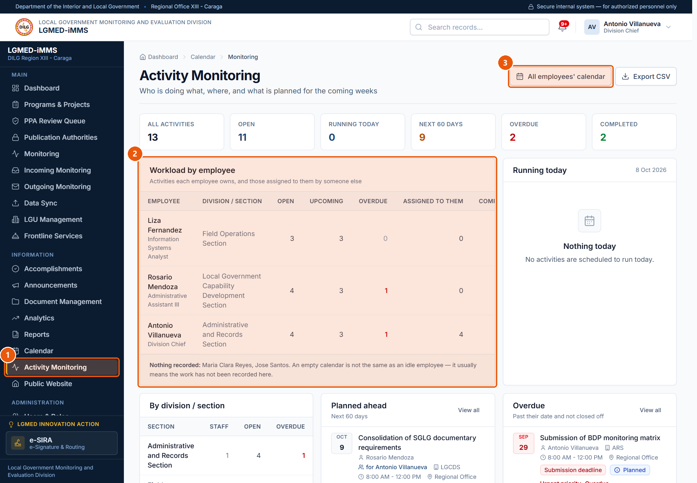

*Figure 72. Activity Monitoring (Division Chief).* Signed in as: Administrator (Division Chief).

| No. | Element | Description |
|:-:|---|---|
| 1 | **Activity Monitoring** | Sidebar entry for supervisors. |
| 2 | **Workload by employee** | Open, upcoming, overdue, assigned and completed counts per employee. |
| 3 | **All employees' calendar** | Opens everyone's activities. |

## 10.16 Public Website

### A. Module overview

| Item | Details |
|---|---|
| Where | **Sidebar › Public Website** (`/app/settings/public-site/`) |
| Purpose | One page that shows **what the public can see right now** (counted from the records), links to manage each kind of public content, and holds the website's **standing text**: homepage heading and introduction, mandate, About the Division, core functions, office details, privacy notice and accessibility statement. |
| Who | LGMED Staff and Administrators. |

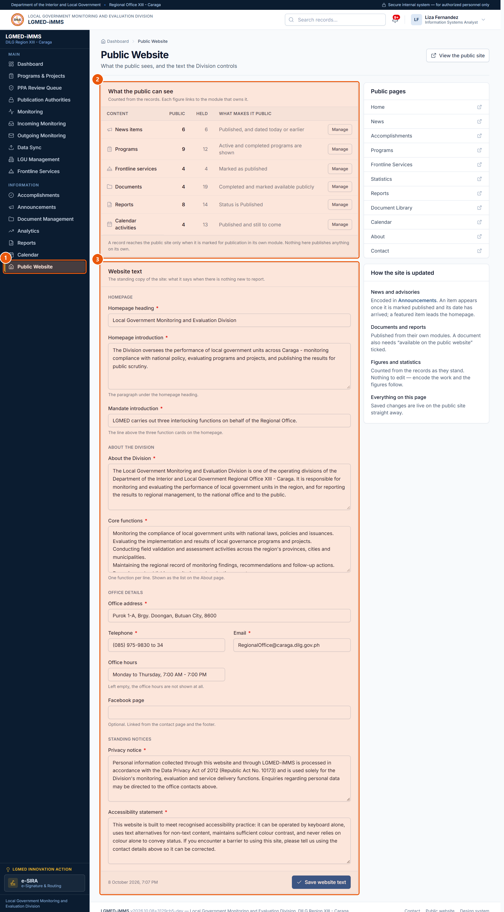

*Figure 73. Public Website management.* Signed in as: LGMED Staff.

| No. | Element | Description |
|:-:|---|---|
| 1 | **Public Website** | Sidebar entry (Administrators and LGMED Staff). |
| 2 | **What the public can see** | What is published right now, counted from the records. Manage opens the module. |
| 3 | **Website text** | The homepage heading, mandate, office details and standing notices. |

**What makes content public.** Nothing is public until someone decides it should be:

| Content | Becomes public when |
|---|---|
| Announcements | **Published on the public website** is ticked and the publication date has arrived. |
| Programs, projects, activities | An Administrator publishes the approved record (Section 10.3). Files also need a publication authority. |
| Frontline services | **Published on the public website** is ticked. |
| Documents | The document is **Completed** and, on its edit form, **Available on the public website** is ticked (the box is not offered when a document is first registered). Archiving takes it off the site. |
| Reports | The report's status is **Published**. |
| Calendar | The activity is **Organization-wide** and **Show on the public calendar** is ticked. |
| Accomplishments | The week is published and inside the disclosure window; only cleared items are listed. |

### Procedure 10.16.1: Update the website's standing text

**Who can do this:** LGMED Staff, Administrators.

**Steps:**

1. Click **Public Website** in the sidebar.
2. Under **Website text**, edit the **Homepage**, **About the Division**, **Office details** and **Standing notices** fields. Fields marked \* are required.
3. Click **Save website text**.
4. Use **Public pages** (each opens in a new tab) to check the result.

**Expected Result:** The homepage, About page and footer show the new text immediately.

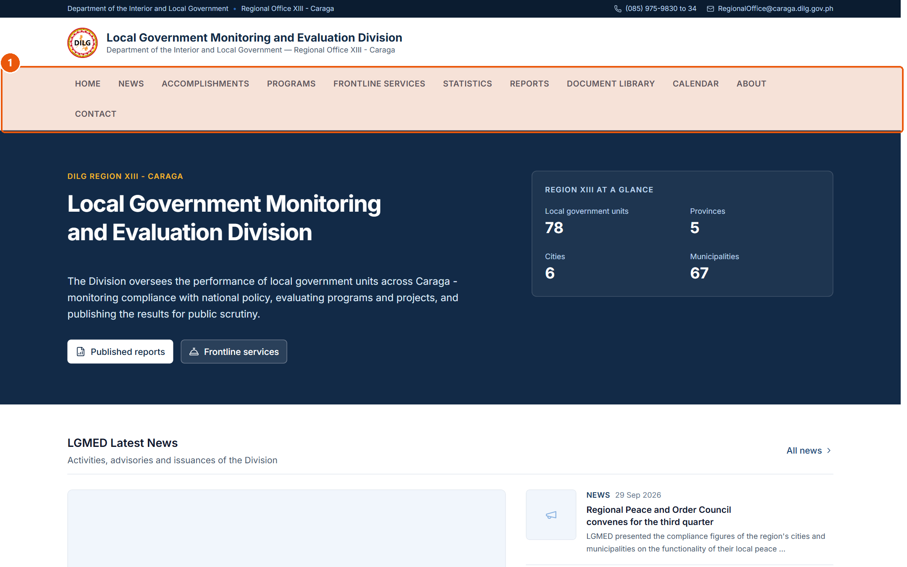

*Figure 74. The public website homepage.* Signed in as: Public visitor.

| No. | Element | Description |
|:-:|---|---|
| 1 | **Public navigation** | Home, News, Accomplishments, Programs, Frontline Services, Statistics, Reports, Document Library, Calendar, About, Contact. |

> **NOTE:** The administrator can take the whole public website offline for maintenance with **System Settings › Public website available** (Section 10.17). Visitors then see a maintenance notice; staff sign-in is unaffected.

## 10.17 Administration

The **Administration** group in the sidebar is shown to Administrators and the System Administrator only.

### A. Module overview

| Page | Where | Purpose | Who |
|---|---|---|---|
| **Users & Roles** | `/accounts/users/` | Create, edit, deactivate and reactivate accounts; reset passwords and two-step verification; open the permission matrix. | Administrators |
| **Roles & Permissions** | `/accounts/roles/` | The permission matrix, generated from the rules the system enforces. | Administrators |
| **Menu Permissions** | `/accounts/menu-permissions/` | Close modules to a whole role or to one account. | System Administrator only |
| **System Settings** | `/app/settings/` | Preferences and reference lists. | Administrators |
| **Audit Logs** | `/app/audit-logs/` | The append-only record of every change, sign-in, export and refused access. | Administrators |

### B. Visual interface guide

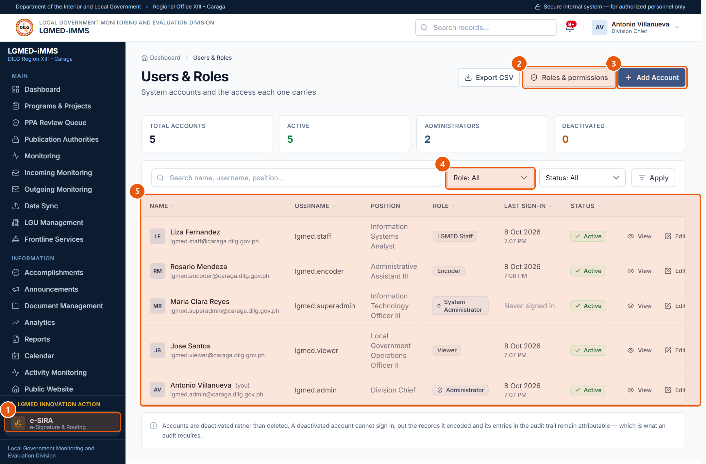

*Figure 75. Users & Roles.* Signed in as: Administrator (Division Chief).

| No. | Element | Description |
|:-:|---|---|
| 1 | **Users & Roles** | Sidebar entry (Administrators). |
| 2 | **Roles & permissions** | The permission matrix. |
| 3 | **Add Account** | Creates a user account. |
| 4 | **Role filter** | Narrows the list by role. |
| 5 | **Records table** | One row per record. Underlined column headings sort the list; click again to reverse the order. |

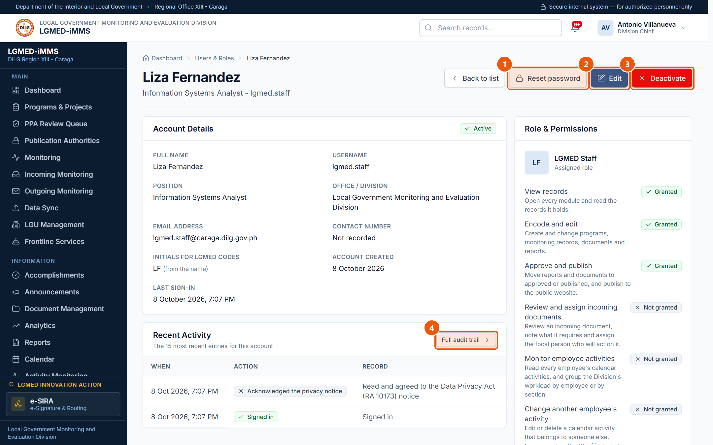

*Figure 76. A user account.* Signed in as: Administrator (Division Chief).

| No. | Element | Description |
|:-:|---|---|
| 1 | **Reset password** | Sets a new password for the user. |
| 2 | **Edit** | Changes the account details and role. |
| 3 | **Deactivate** | Blocks sign-in. Accounts are never deleted, so their history stays attributable. |
| 4 | **Full audit trail** | Everything this person did, in the audit log. |

### C. Procedures

### Procedure 10.17.1: Create a user account

**Who can do this:** Administrators.

**Steps:**

1. Click **Users & Roles › Add Account**.
2. Under **Account**, enter the **Username\***, **First name**, **Last name** and **Email address\***.
3. Under **Designation**, enter the **Position**, **Office**, **Contact number** and **Initials for LGMED codes** (used in LGMED control codes; include the middle initial if the office's naming rule requires it).
4. Under **Access**, choose the **Role\*** and keep **Active** ticked.
5. Click **Save**.

**Expected Result:** The account is created and listed. Where e-mail is configured, the system sends the new user an account notice.

**Visual Reference:** Figure 77.

**Important Notes:** Give each person the **lowest role** that lets them do their work. Administrator accounts must set up two-step verification at their first sign-in.

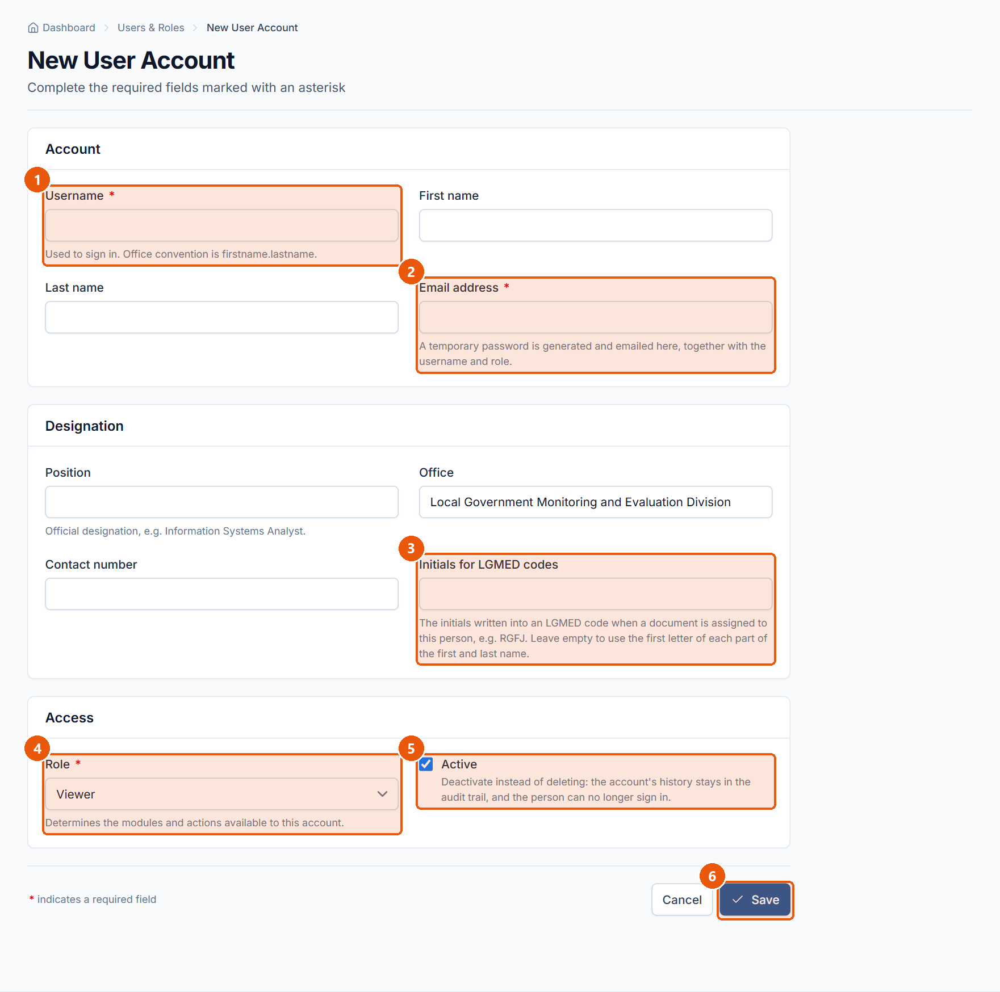

*Figure 77. New User Account form.* Signed in as: Administrator (Division Chief).

| No. | Element | Description |
|:-:|---|---|
| 1 | **Username** | Required. |
| 2 | **Email address** | Required. |
| 3 | **Initials for LGMED codes** | Used in LGMED control codes (e.g. middle initial included). |
| 4 | **Role** | Required. System Administrator, Administrator, LGMED Staff, Encoder or Viewer. |
| 5 | **Active** | Untick to create the account deactivated. |
| 6 | **Save** | Creates the account. |

### Procedure 10.17.2: Reset a user's password

**Steps:** Open the user, click **Reset password**, enter and confirm the new password, and click **Set new password**. Give the password to the user privately and ask them to keep it secret. Weak or mismatched passwords are refused.

### Procedure 10.17.3: Edit an account or change a role

**Steps:** Open the user, click **Edit**, change the details or **Role**, and click **Save**. Role changes are recorded in the audit log.

**Important Notes:** You cannot change **your own** role or deactivate **your own** account.

### Procedure 10.17.4: Deactivate an account or reset two-step verification

**Steps:**

1. Open the user.
2. Click **Deactivate** and confirm with **Deactivate account**. The person can no longer sign in. Reactivate it later with **Reactivate** on the same page.
3. If the person lost their phone and recovery codes, click **Reset two-step verification** in the **Two-Step Verification** panel; they will set it up again at their next sign-in.

**Important Notes:** Accounts are **never deleted**, so everything a person did remains attributable to them.

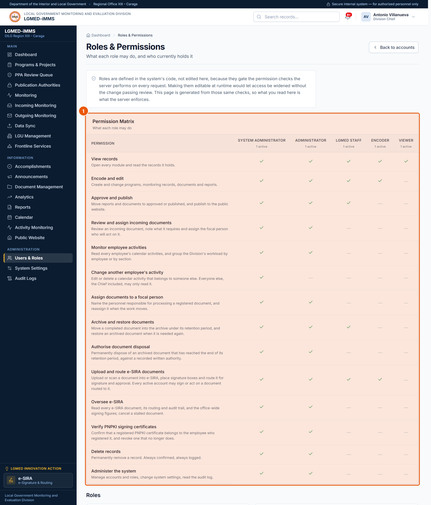

*Figure 78. Roles & Permissions - the permission matrix.* Signed in as: Administrator (Division Chief).

| No. | Element | Description |
|:-:|---|---|
| 1 | **Permission Matrix** | Which role holds which permission, generated from the rules the system enforces. |

### Procedure 10.17.5: Close modules to a role or an account (Menu Permissions)

**Who can do this:** System Administrator only.

**Steps:**

1. Click **Menu Permissions** in the sidebar (or **Menu permissions** on a user's page).
2. Under **Modules by Role**, untick a module for a role to close it (or tick to reopen it), then click **Save role permissions**.
3. Under **Modules by Account**, choose an account and click **Set modules** to set modules for that person only.

**Expected Result:** Closed modules disappear from the affected users' sidebars, and their addresses are refused.

**Important Notes:** Menu Permissions can only **narrow** access. A module a role is not permitted to use by its role cannot be opened to it here.

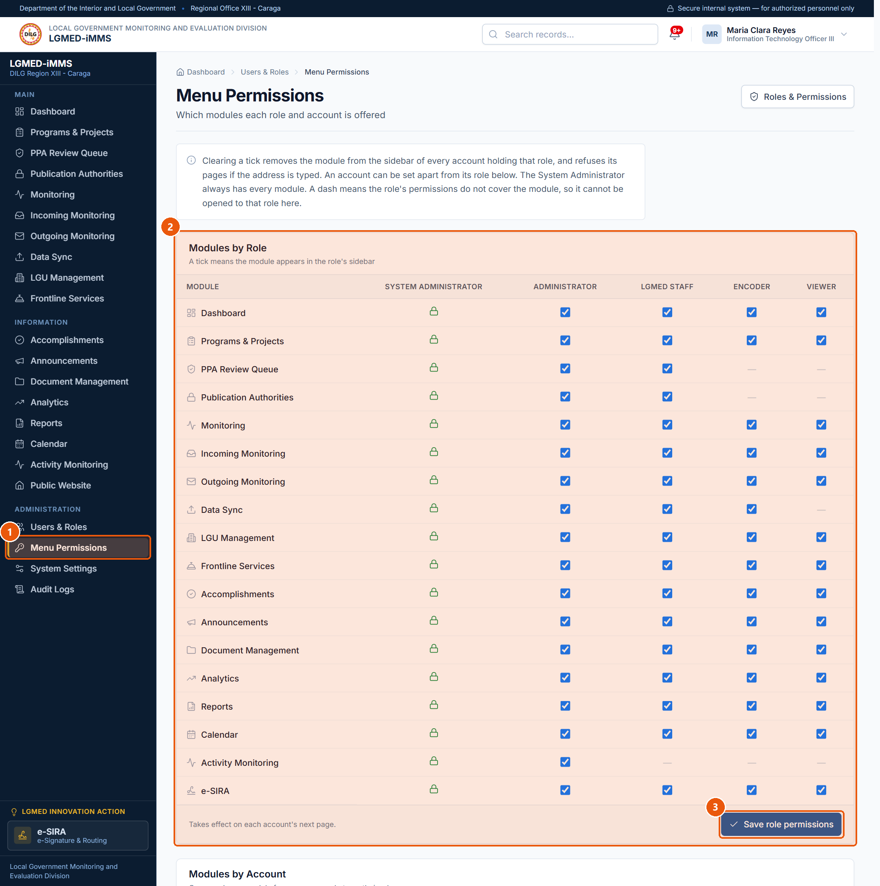

*Figure 79. Menu Permissions (System Administrator only).* Signed in as: System Administrator.

| No. | Element | Description |
|:-:|---|---|
| 1 | **Menu Permissions** | Sidebar entry for the System Administrator. |
| 2 | **Modules by Role** | Tick or untick which modules each role is offered; Save role permissions. |
| 3 | **Save role permissions** | Saves the matrix. |

### Procedure 10.17.6: Change system settings and reference lists

**Who can do this:** Administrators.

**Steps:**

1. Click **System Settings**.
2. Under **Preferences**, set:
    - **Records per page\*** (5–100) — rows in every list;
    - **Session warning\*** (1–60 minutes) — how long before the session expires the warning appears;
    - **System notice** and **Notice level\*** (Information, Warning, Urgent) — a banner shown to every signed-in user; tick **Cover the page and sound an alert** for an urgent full-screen notice; leave the notice empty for no banner;
    - **Public website available** — untick to show a maintenance notice on the public website.
3. Click **Save settings**.
4. To maintain a reference list (**Program categories**, **Document types** with their retention periods, **Departments, divisions and sections**, **Disposal authorities**, **Provinces**), click **Add**, or **Edit** / **Remove** on a row.

**Expected Result:** Settings take effect immediately for all users.

**Important Notes:** An entry that is in use cannot be removed; the system explains why. The **System Information** panel shows the version; **Administration** links to Users & roles, the permission matrix, the audit logs and the Django administration site (technical use only).

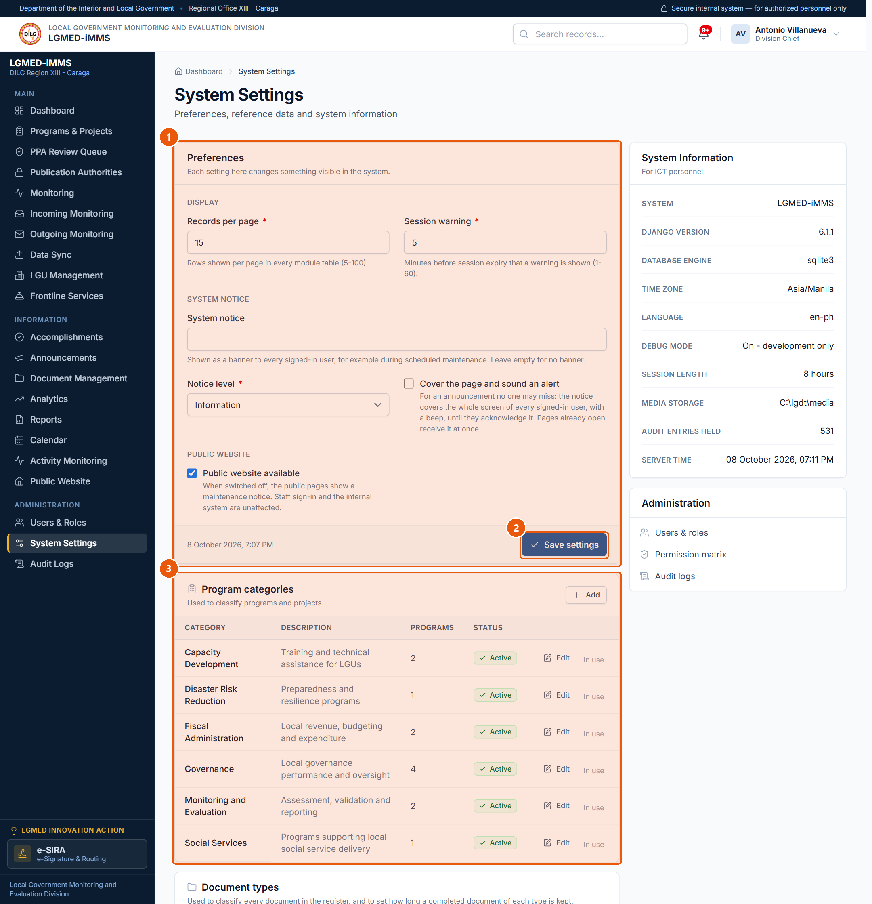

*Figure 80. System Settings.* Signed in as: Administrator (Division Chief).

| No. | Element | Description |
|:-:|---|---|
| 1 | **Preferences** | Records per page, session warning, system notice and the public website switch. |
| 2 | **Save settings** | Saves the preferences. |
| 3 | **Reference lists** | Program categories, document types, sections, disposal authorities, provinces. Add / Edit / Remove. |

### Procedure 10.17.7: Search the audit log

**Who can do this:** Administrators.

**Steps:**

1. Click **Audit Logs**.
2. Enter a **From date** and **To date** and click **Apply dates**, and/or tick **Only entries needing attention** (failed sign-ins, refused access and similar).
3. Search by actor, record or detail; filter by **Action**, **Record type** and **Actor**; click **Apply**.
4. Click an entry to see its details, including field-by-field changes.
5. Click **Export CSV** to download the filtered entries.

**Expected Result:** The matching entries are listed, newest first.

**Important Notes:** The audit log cannot be edited or deleted from the system. Passwords are never recorded.

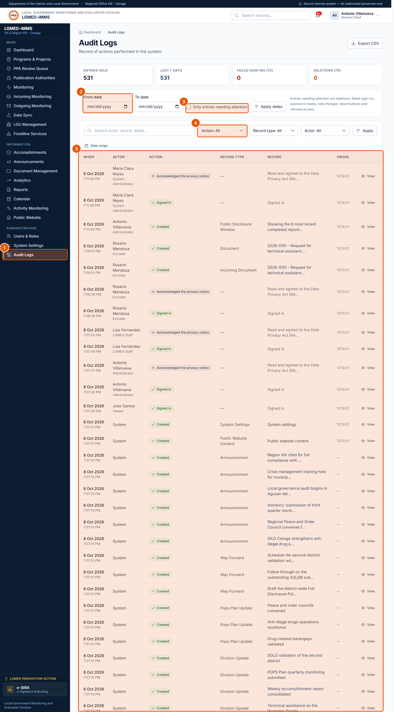

*Figure 81. Audit Logs.* Signed in as: Administrator (Division Chief).

| No. | Element | Description |
|:-:|---|---|
| 1 | **Audit Logs** | Sidebar entry (Administrators). |
| 2 | **Date range** | From date and To date; click Apply dates. |
| 3 | **Needing attention** | Failed sign-ins, refused access and similar. |
| 4 | **Filters** | Action, Record type and Actor. |
| 5 | **Records table** | One row per record. Underlined column headings sort the list; click again to reverse the order. |

## 10.18 e-SIRA — Electronic Signature, Identification, Routing and Approval

### A. Module overview

| Item | Details |
|---|---|
| Where | **LGMED Innovation Action › e-SIRA**, pinned at the foot of the sidebar (`/app/esira/`). Tabs: **Dashboard**, **Documents**, **My Digital Certificate**, **My Signature Style**, and for administrators **Certificate Verification** and **Audit Trail**. |
| Purpose | Upload or scan a document, place signature boxes, route it to signers and approvers in order, sign it digitally with a DICT PNPKI certificate, track it, and download the signed PDF. |
| Who | **Open e-SIRA and act on documents routed to you**: every active account (Viewers included). **Upload, place boxes, route**: Encoder, LGMED Staff, Administrators. **See all documents, cancel**: Administrators. **Verify certificates**: Administrators. |
| Step actions | Signature; Approval; Review / initials; For information / acknowledgement. |
| Statuses | Draft, Awaiting Signature, Out for Signature, Partially Signed, Routed, Fully Signed, Routing Completed, Completed, Rejected, Cancelled. |

> **IMPORTANT:** A **signature box** only marks *where* a signature will go and *whose* it is; it proves nothing. A **digital signature** is a real cryptographic signature made with the signer's own DICT PNPKI certificate. There is no simulated signing: a document is marked signed only after a real signature is found in the file.

### B. Visual interface guide

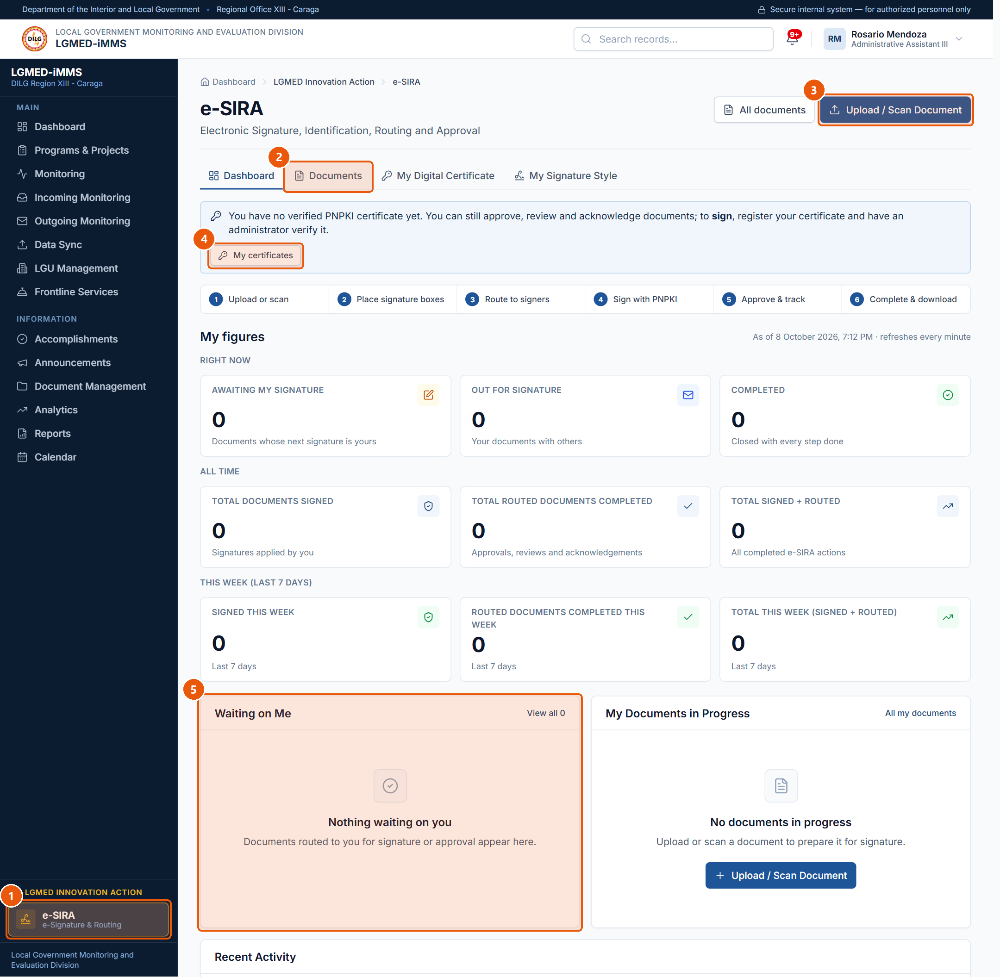

*Figure 82. e-SIRA dashboard.* Signed in as: Encoder.

| No. | Element | Description |
|:-:|---|---|
| 1 | **e-SIRA** | LGMED Innovation Action, pinned at the foot of the sidebar. |
| 2 | **e-SIRA menu** | Dashboard, Documents, My Digital Certificate, My Signature Style (and, for administrators, Certificate Verification and Audit Trail). |
| 3 | **Upload / Scan Document** | Starts a new document. |
| 4 | **My certificates** | Your PNPKI certificate and signature image. |
| 5 | **Waiting on Me** | Documents whose next step is yours. |

### C. Procedures

### Procedure 10.18.1: Register your digital certificate (one time)

**Purpose:** Prepare to sign documents.

**Who can do this:** Anyone who will sign.

**Steps:**

1. Open **e-SIRA › My Digital Certificate** (or **My certificates**).
2. Under **Digital certificate**, choose your PNPKI **.p12** file and type the **Certificate password\***.
3. Optionally upload a **Signature image** (PNG or JPG) to be drawn inside your signature boxes.
4. Keep **Require .p12 password when signing** switched on (recommended).
5. Click **Save certificate**.
6. Ask an administrator to verify the certificate (Procedure 10.18.6).

**Expected Result:** The certificate appears under **My Registered Certificates** as awaiting verification. You can sign once it is verified.

**Important Notes:** The file and password are stored encrypted. Until your certificate is verified you can still approve, review and acknowledge documents, but not sign.

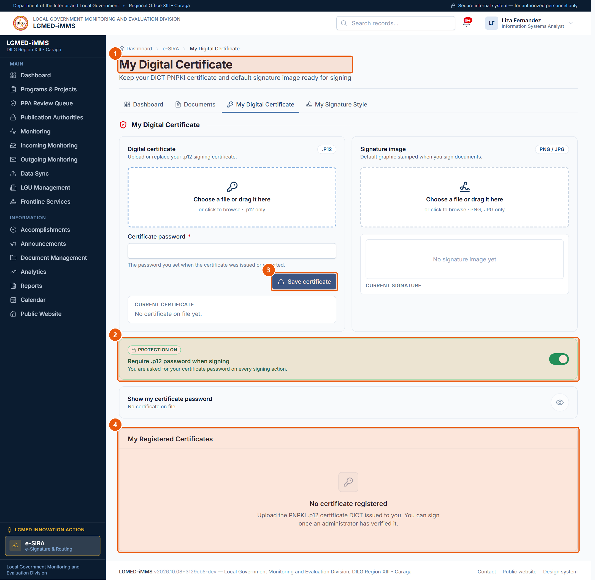

*Figure 83. My Digital Certificate.* Signed in as: LGMED Staff.

| No. | Element | Description |
|:-:|---|---|
| 1 | **Digital certificate** | Upload your DICT PNPKI .p12 file and its password. |
| 2 | **Require password when signing** | Recommended. Asks for the password each time you sign. |
| 3 | **Save certificate** | Registers the certificate. An administrator must verify it before you can sign. |
| 4 | **My Registered Certificates** | Your certificates and their verification status. |

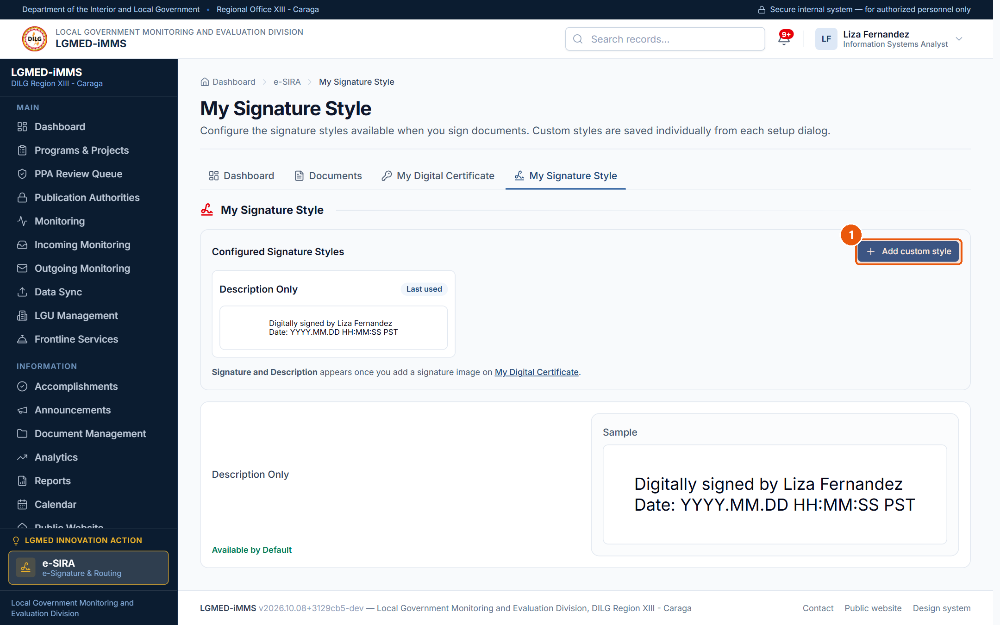

*Figure 84. My Signature Style.* Signed in as: LGMED Staff.

| No. | Element | Description |
|:-:|---|---|
| 1 | **Add custom style** | Adds a graphic style (up to 10). |

### Procedure 10.18.2: Upload a document and prepare signature boxes

**Who can do this:** Encoder, LGMED Staff, Administrators.

**Steps:**

1. Click **Upload / Scan Document**.
2. Enter the **Title\***, and optionally the **Document type** and **Description**.
3. Under **How is the document coming in?**, choose **Upload a PDF** and select the **PDF file**, or choose **Scan pages** and select the scanned images (they are combined into a PDF).
4. Click **Upload and prepare**. The signing workspace opens.
5. In **Signature Boxes**, choose the **Signer for new boxes**, click **Add Signature Box**, and drag the box into place. Use **Apply to All Pages** if needed; **Remove All Boxes** clears them.

**Expected Result:** The document is saved as a **Draft** with its boxes. Version 1 (the original) is never changed.

**Visual Reference:** Figures 85 and 86.

**Important Notes:** Upload limit 25 MB.

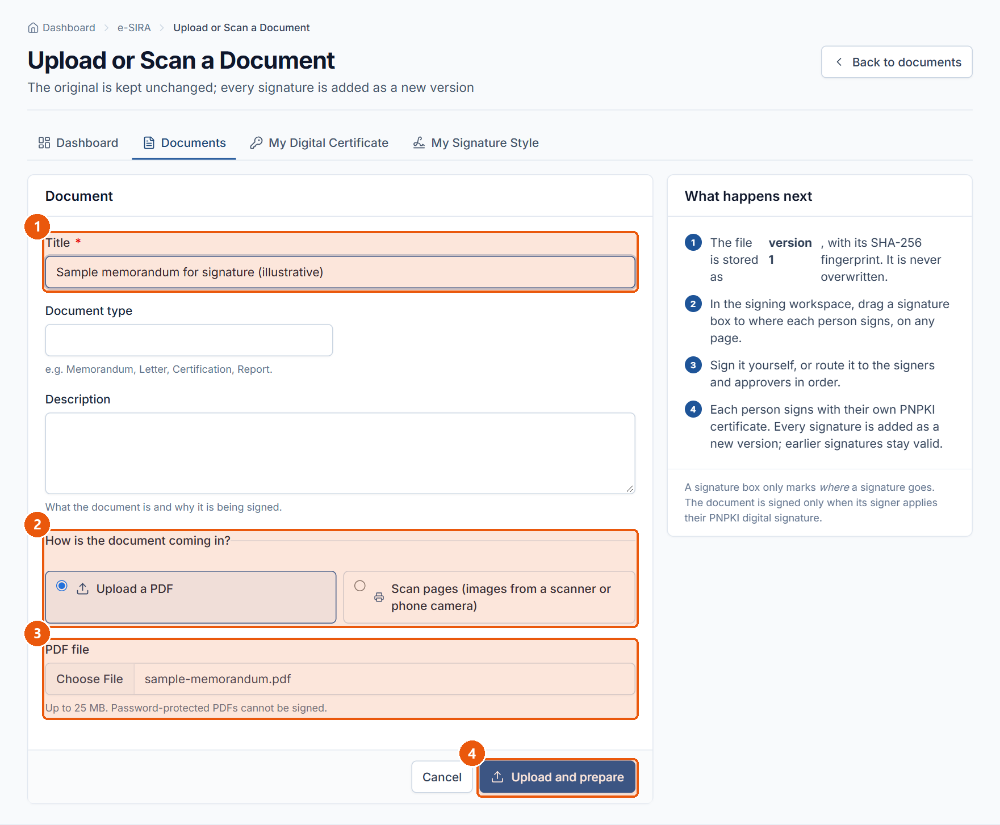

*Figure 85. Upload or Scan a Document.* Signed in as: Encoder.

| No. | Element | Description |
|:-:|---|---|
| 1 | **Title** | Required. |
| 2 | **How is the document coming in?** | Upload a PDF, or Scan pages (images from a scanner or phone camera). |
| 3 | **PDF file** | The PDF to be signed or routed. |
| 4 | **Upload and prepare** | Uploads the file and opens the signing workspace. |

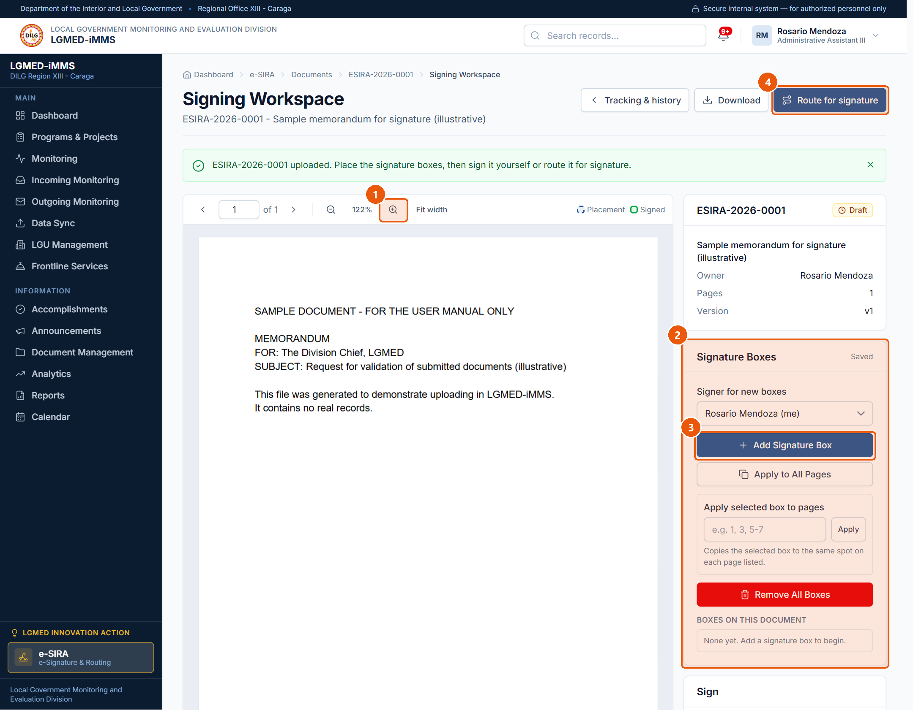

*Figure 86. The signing workspace - preview and signature boxes.* Signed in as: Encoder.

| No. | Element | Description |
|:-:|---|---|
| 1 | **Zoom and pages** | Zoom, fit width and move between pages. |
| 2 | **Signature Boxes** | Choose the signer for new boxes, then Add Signature Box and drag it into place. |
| 3 | **Add Signature Box** | Places a box on the current page. |
| 4 | **Route for signature** | Chooses who signs or approves, and in what order. |

### Procedure 10.18.3: Route the document

**Steps:**

1. In the workspace, click **Route for signature**.
2. For each step, choose the **Recipient**, the **Action required** (Signature, Approval, Review / initials, For information / acknowledgement), the **Purpose / instructions** and an optional due date.
3. Click **Add a step** for more recipients; steps run in order. **Remove this step** deletes one.
4. Click **Send on route**.

**Expected Result:** The first recipient is notified and the document's status changes (for example **Out for Signature** or **Routed**).

**Visual Reference:** Figures 87 and 88.

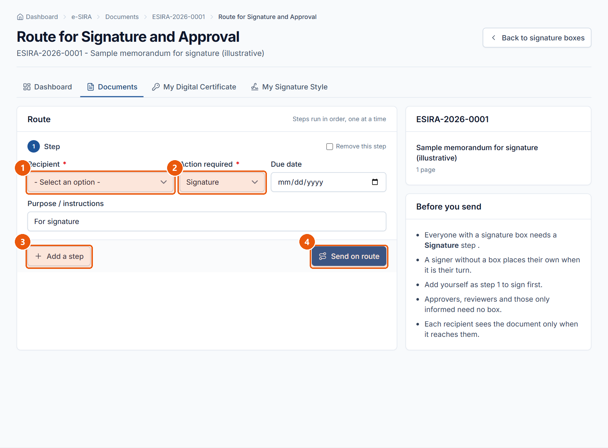

*Figure 87. Routing the document.* Signed in as: Encoder.

| No. | Element | Description |
|:-:|---|---|
| 1 | **Recipient** | The person for this step. |
| 2 | **Action required** | Signature, Approval, Review / initials, or For information / acknowledgement. |
| 3 | **Add a step** | Adds another recipient; steps run in order. |
| 4 | **Send on route** | Sends the document to the first recipient. |

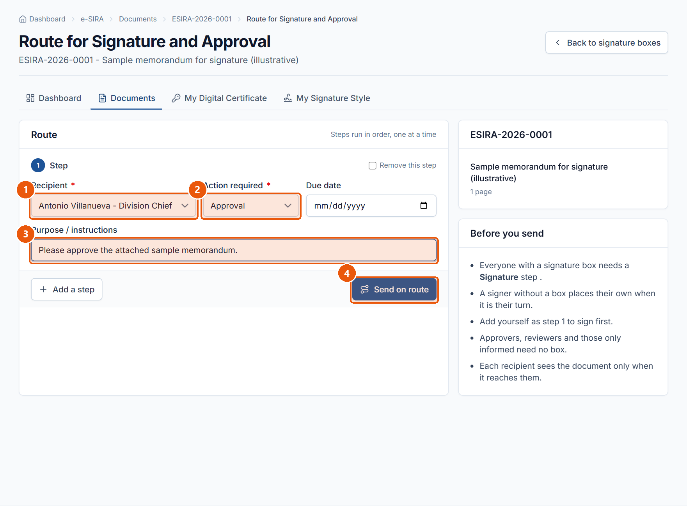

*Figure 88. A one-step route: the Division Chief is asked to approve.* Signed in as: Encoder.

| No. | Element | Description |
|:-:|---|---|
| 1 | **Recipient** | Antonio Villanueva (Division Chief) is chosen. |
| 2 | **Action required** | Approval. |
| 3 | **Purpose / instructions** | What the recipient is asked to do. |
| 4 | **Send on route** | Sends the document. |

### Procedure 10.18.4: Act on a document routed to you

**Who can do this:** The recipient whose turn it is.

**Steps:**

1. Open the document from **Waiting on Me** on the e-SIRA dashboard, or from your notification.
2. Click **View document** to read it.
3. Optionally type **Remarks** (required when rejecting; recorded on the routing slip). To pass it on after you, open **Forward to someone else after me** and choose the person, their action and instructions.
4. Depending on the step, click **Approve**, **Mark reviewed** or **Acknowledge**; or **Reject and return** to stop the route and send it back to the owner.
5. For a signature step, click **Open to sign** and follow Procedure 10.18.5.

**Expected Result:** Your step is recorded in **Routing History** and the next recipient is notified.

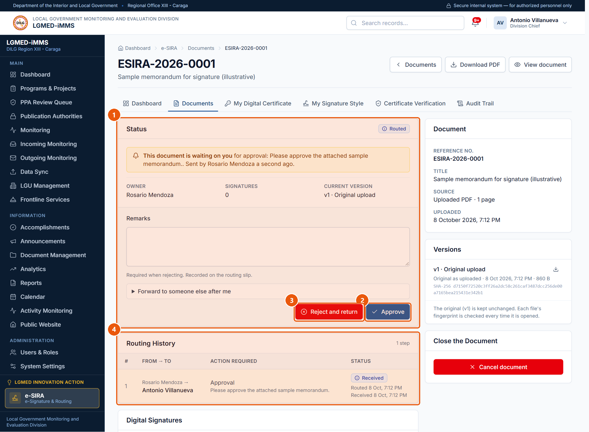

*Figure 89. The recipient acts on a routed document (Division Chief).* Signed in as: Administrator (Division Chief).

| No. | Element | Description |
|:-:|---|---|
| 1 | **Status** | Where the document stands and what is asked of you. |
| 2 | **Approve** | Completes your step (Mark reviewed or Acknowledge for those step types). |
| 3 | **Reject and return** | Stops the route and returns the document to its owner. |
| 4 | **Routing History** | Every step: when it was routed, received and acted on. |

### Procedure 10.18.5: Sign a document

**Who can do this:** The recipient of a signature step, with a **verified** PNPKI certificate.

**Steps:**

1. Open the document and click **Open to sign**.
2. Click **Sign Document** (or **Apply digital signature**).
3. In the sign dialog, type your certificate password (if required), choose a **Signature style**, optionally enter a **Reason for signing** and **Remarks**, and confirm.

**Expected Result:** A digital signature is applied in each of your boxes as a new version of the PDF; earlier signatures stay valid.

**Important Notes:** Signing is refused unless the certificate is registered to you, verified by an administrator, in date, and issued under the DICT PNPKI roots installed on the server. Refused attempts are recorded.

> **NOTE:** The signing dialog and a signed result were **not captured** for this manual, because the documentation copy has no PNPKI certificate. See the documentation report for the screenshots still required.

### Procedure 10.18.6: Verify a registered certificate (administrators)

**Steps:**

1. Open **e-SIRA › Certificate Verification**.
2. Under **Awaiting Verification**, compare the certificate's name, e-mail and serial number with the DICT PNPKI issuance record for that employee.
3. Click **Verify**, or **Reject**. A verified certificate can later be withdrawn with **Revoke**.

**Important Notes:** An administrator cannot verify their own certificate.

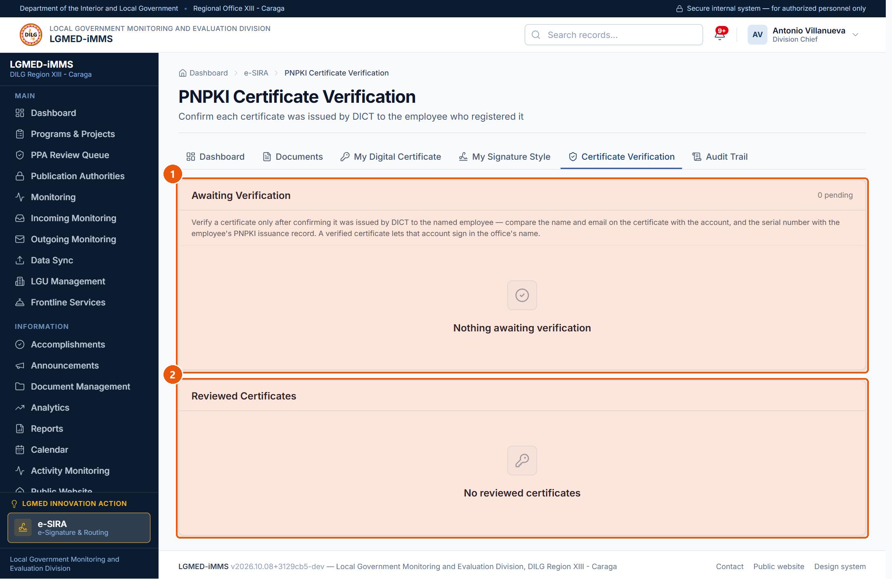

*Figure 90. PNPKI Certificate Verification (Administrators).* Signed in as: Administrator (Division Chief).

| No. | Element | Description |
|:-:|---|---|
| 1 | **Awaiting Verification** | Certificates registered by employees. Compare name, e-mail and serial number with the PNPKI issuance record, then Verify. |
| 2 | **Reviewed Certificates** | Verified or rejected certificates; a verified one can be revoked. |

### Procedure 10.18.7: Track, complete and download

**Steps:**

1. Open **e-SIRA › Documents** and use the views (**Awaiting my signature**, **Waiting on me**, **Owned by me**, **Out for signature**, **Signed by me** …) or the **Status** filter.
2. Open a document to see **Status**, **Routing History**, **Digital Signatures**, **Versions** and **Audit Trail**.
3. Click **Verify signatures** to check the signatures in the file itself.
4. When every step is done, the owner clicks **Mark as completed**; the document is locked.
5. Click **Download signed PDF** (or **Download version N**).

**Important Notes:** The owner or an administrator can **Cancel document** with a reason. Every view, download, box change, routing step and signature is recorded in the e-SIRA **Audit Trail**.

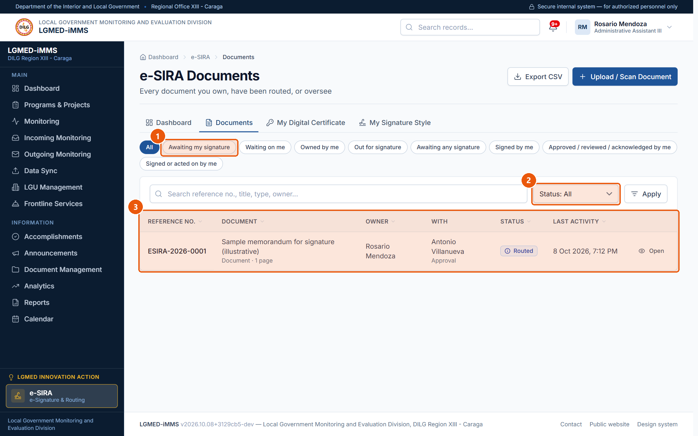

*Figure 91. e-SIRA Documents.* Signed in as: Encoder.

| No. | Element | Description |
|:-:|---|---|
| 1 | **Views** | Awaiting my signature, Waiting on me, Owned by me, Out for signature and more. |
| 2 | **Status** | Draft through Completed, Rejected or Cancelled. |
| 3 | **Records table** | One row per record. Underlined column headings sort the list; click again to reverse the order. |

### D. Workflow

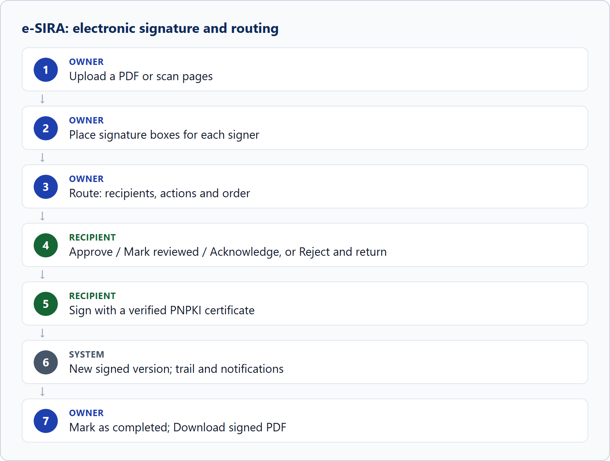

*Figure 92. e-SIRA: electronic signature and routing*

# 11. Common Tasks and Procedures

These procedures work the same way in every module.

### Procedure 11.1: Search and filter any list

1. Open the module from the sidebar.
2. Type in the search box and/or choose values in the filter drop-downs. Where a date range is offered, enter **From** and **To** (and, where asked, which date the range applies to).
3. Click **Apply**.
4. To start again, open the module from the sidebar (or click **Clear** where offered).

**Expected Result:** Only matching records are listed; the page title area shows the number of results.

### Procedure 11.2: Export a list to a spreadsheet (CSV)

1. Search and filter the list until it shows the records you need.
2. Click **Export CSV** (or **Export reports** on the Dashboard).
3. Open the downloaded `.csv` file in Excel.

**Important Notes:** The file contains exactly the rows on screen (all pages), with the same filters. Each export is written to the audit log with the number of rows. Treat exported files as official records: store them securely and delete them when no longer needed.

### Procedure 11.3: Print a record or report

1. Open the record, report or monitoring page.
2. Click **Print**.
3. Choose the printer (or *Save as PDF*) in the browser's print window.

**Expected Result:** A print-friendly version without the sidebar and buttons is printed.

### Procedure 11.4: Attach a file

1. Open the record and find its attachment panel (**Supporting Documents**, **Means of Verification**, **Document File**, etc.).
2. Choose the file, complete the required fields (title, type) and click the panel's button (**Attach**, **File the evidence**, **Upload version**, **Upload and screen**).

**Important Notes:** See Section 13.2 for file types and sizes.

### Procedure 11.5: Delete a record

1. Open the record (or use the bin icon on its row).
2. Click **Delete**.
3. Read the confirmation and click the red delete button, or **Cancel**.

**Important Notes:** Only Administrators can delete. Deletion cannot be undone. Where the module offers **Archive**, **Cancel** or **Deactivate**, use that instead so the history is kept.

# 12. Notifications and Alerts

LGMED-iMMS tells you about work in four ways:

| Kind | Where you see it | Examples |
|---|---|---|
| **Notifications** | The bell in the top bar and the **Notifications** page (Section 10.2) | Document awaiting review; incoming document assigned to you; document overdue; follow-up overdue; document completed; report awaiting approval. |
| **Confirmation messages** | A coloured message at the top of the page after you act | *Signed in as …*; record saved; record deleted. |
| **System notice** | A banner on every page (or, when urgent, a full-screen notice with an alert sound), set by the administrator in **System Settings** | Scheduled maintenance. |
| **Session warning** | A dialog shortly before your session expires | Save your work, then continue or sign in again. |

**Notification categories:** Awaiting review, Overdue, Awaiting publication, Assigned to you, Account, System.
**Priority levels:** Information, Needs action, Urgent.

How notifications behave:

- They are addressed to **you personally**, so the unread count means *things you have not yet dealt with*.
- Two kinds exist. **Event** notifications are raised when something happens (for example, a document is assigned to you). **Standing** notifications are raised for conditions that persist (for example, a follow-up past its due date); these are refreshed by a scheduled task each working morning.
- A standing problem is notified **once**, not every day.
- A notification **withdraws itself** when the work is done.
- You are not notified about your own actions, and deactivated accounts are not notified.

> **NOTE:** If overdue items never seem to produce notifications, the scheduled refresh may not be running on the server. Report this to the system administrator.

# 13. Data Validation and Error Handling

## 13.1 Form validation

When a form cannot be saved, it is shown again with:

- a summary at the top, and
- the reason in red under each field that needs attention.

Your entries are kept, so correct only what is marked and click **Save** again.

| Rule | Where it applies |
|---|---|
| Fields marked **\*** must be filled in. | All forms |
| Dates must be valid, and an end date cannot be before its start date. | Calendar, programs, accomplishments, disclosure window |
| An accomplishment's date must fall inside its reporting week (except **Upcoming** entries). | Accomplishments |
| Review comments are required when requesting revision or rejecting. | PPA review |
| A reason is required for a new document version, archiving, restoring, cancelling, returning for revision and cancelling an e-SIRA document. | Document Management, Outgoing, e-SIRA |
| **DISPOSE** must be typed to confirm a disposal, and a disposal authority chosen. | Document Management |
| A private activity cannot be shown on the public calendar, and cannot be assigned to someone who could not see it. | Calendar |
| A week cannot be published with nothing cleared. | Accomplishments |
| Passwords must be strong and must match. | Users & Roles |
| Records per page 5–100; session warning 1–60 minutes. | System Settings |

## 13.2 File uploads

| Where | Accepted types | Maximum size |
|---|---|---|
| Programs & Projects supporting documents | PDF, DOC/DOCX, XLS/XLSX, PPT/PPTX, JPG/JPEG, PNG | 25 MB |
| Document Management, Outgoing communications | PDF, DOC/DOCX, XLS/XLSX, CSV, PPT/PPTX, JPG/JPEG, PNG, GIF, BMP, WebP, TIF/TIFF | 25 MB |
| e-SIRA documents | PDF, or scanned page images | 25 MB |
| Accomplishment evidence (photographs) | JPG/JPEG, PNG, WebP, GIF (a *Photograph* must be an image) | — |
| Announcement photographs | JPG/JPEG, PNG, WebP, GIF | — |
| Profile photo | JPEG, PNG, WebP | 5 MB |
| e-SIRA signature image | PNG, JPG | 2 MB |
| e-SIRA certificate | .p12 / .pfx | — |
| Data Sync | Excel workbook (.xlsx) | — |

A file of the wrong type or too large is refused with a message under the field.

## 13.3 Error pages

| Page | Meaning | What to do |
|---|---|---|
| **Access denied (403)** | Your role, or the menu permissions, do not allow this page or action. | Use the sidebar. If you need access, ask an administrator. |
| **Page not found (404)** | The address is wrong, or the record does not exist or is not visible to you (for example, another employee's private calendar activity). | Check the address; return through the sidebar. |
| **Server error (500)** | An unexpected fault. | Note the time and what you were doing, and report it to the system administrator. |
| **Bad request (400)** | Usually an address the server does not recognise. | Use the address the administrator gave you. |
| **Maintenance notice** (public website) | The public website has been switched off by the administrator. | Staff sign-in still works at `/staff`. |

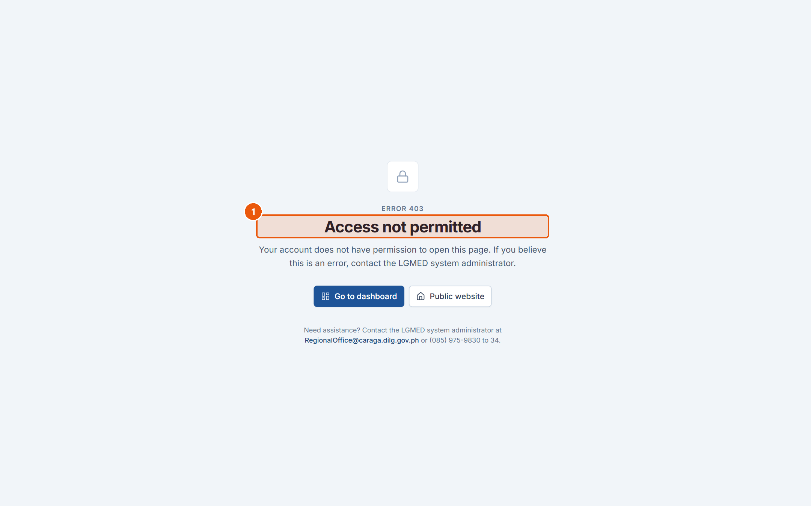

*Figure 93. The page shown when your role does not permit an action.* Signed in as: Viewer.

| No. | Element | Description |
|:-:|---|---|
| 1 | **Access denied** | The action is not available to your role. Use the sidebar to return. |

# 14. Frequently Asked Questions

**I cannot see a module that a colleague can see.**
The sidebar shows only the modules your role permits, and the System Administrator can close modules to a role or account. Ask an administrator if you need it.

**Why is there no Edit or Add button for me?**
Your role is read-only for that module (for example, Viewer), or the record has moved past the stage you may change (for example, an encoder can amend an incoming document only until the Division Chief acts on it).

**As an encoder, how do I assign a focal person?**
You cannot; naming the focal person is the Division Chief's decision. Record the document and the Chief is notified.

**I was assigned a document. Where do I report what I did?**
Acknowledge it on the incoming record (**Acknowledge receipt**), then report your action on its **Outgoing Monitoring** record with **Record update**.

**I recorded the communication sent, but the document is still open.**
Recording the communication does not close it. Record an update with the status **Completed**.

**Why does my week say parts are missing?**
A week is expected to have activities, communications, accomplishments, a means of verification, a POPS Plan update, ways forward and upcoming activities. **The Division's Week** panel lists what is still blank.

**I ticked an entry for the public website, but it is not on the site.**
An item is public only when it is cleared **and** its week is published **and** the week is inside the public disclosure window.

**Why can the Division Chief see my private calendar activity?**
Supervisors (Administrators) can read every activity so they can monitor the office's workload. They cannot change it.

**I lost my phone and cannot sign in.**
Use one of your recovery codes. If you have none, ask an administrator to **Reset two-step verification** on your account.

**Why can I not sign in e-SIRA documents?**
You need a registered PNPKI certificate that an administrator has verified, and it must be your turn on the route.

**Can a deleted record be recovered?**
No. Deletion is permanent, which is why only Administrators can delete and why archiving, cancelling and deactivating are offered instead.

**Does the system keep my records on my phone when installed as an app?**
No. Only the screen design and an offline notice are stored on the device.

# 15. Troubleshooting Guide

| Problem | Possible cause | What to do |
|---|---|---|
| The sign-in page does not open. | Wrong address; not on the office network; server not running. | Check the address with `/staff`; confirm you are connected to the office network; contact the system administrator. |
| *Sign-in unsuccessful.* | Wrong username or password; Caps Lock on; account deactivated. | Retype carefully (use the eye button); check Caps Lock; ask an administrator to reset your password or reactivate your account. |
| Sign-in is refused even with the correct password, or a notice says JavaScript is off. | JavaScript disabled, or the browser cannot reach Google for the sign-in security check. | Switch JavaScript on; try another browser; report to the administrator if the office network blocks `www.google.com`. |
| The authentication code is rejected. | Phone clock wrong; code expired; wrong account in the app. | Set the phone's time automatically; type the newest code; use a recovery code; ask an administrator to reset two-step verification. |
| I am signed out unexpectedly. | The browser was closed, or the session expired after inactivity. | Sign in again. Save work when the session warning appears. |
| The Privacy Notice keeps appearing. | The notice has not been accepted, or it was updated. | Tick the agreement box and click **I Agree and Continue**. |
| *Access denied* on a page. | Not permitted for your role or by menu permissions. | Use the sidebar; ask an administrator if you need access. |
| A record I expect is not in the list. | A filter, search or date range is still applied; archived records are hidden; it is not visible to you. | Clear the search and filters; choose **View: Archived** where applicable; check with the record's owner. |
| A file will not upload. | Wrong type or too large. | Check Section 13.2; reduce or convert the file. |
| A PDF does not display. | The browser blocked the viewer, or the file is damaged. | Download the file instead; try Chrome or Edge. |
| Charts show no data. | There are no records for the chosen year. | Change the **Year**. The panel says so when there is nothing to count. |
| An export opens with strange characters in Excel. | Excel's default text encoding. | Open Excel › **Data › From Text/CSV** and choose UTF-8. |
| *Install app* is not in the account menu. | The browser cannot install the site, or the address is not HTTPS. | Use Chrome or Edge on the system's HTTPS address. |
| e-SIRA refuses to sign. | No verified certificate; wrong password; certificate expired; not your turn; PNPKI roots not installed on the server. | Check **My Digital Certificate**; ask an administrator to verify; check **Waiting on Me**; report persistent errors. |
| Overdue items raise no notifications. | The scheduled notification refresh is not running. | Report to the system administrator. |

# 16. Security, Privacy, and Good Practices

LGMED-iMMS holds personal information about local government officials, focal persons and DILG personnel. Every user is bound by the **Data Privacy Act of 2012 (Republic Act No. 10173)** and the notice accepted at first sign-in.

**Your account**

- Never share your username, password, authentication codes or recovery codes. Nobody from the office will ask for them.
- Use a strong password that you do not use elsewhere.
- Set up two-step verification (mandatory for Administrators).
- Sign out when you leave your computer, and always on shared computers.
- Keep your e-SIRA certificate file and password private, and leave **Require .p12 password when signing** switched on.

**Records**

- Access and use records only as your official duties require.
- Check every file before uploading it, especially anything intended for the public website. The automated screening helps but is **not** a guarantee: *Low risk* means nothing was found.
- Clear items for the public website deliberately; never tick public options by habit.
- Prefer **Archive**, **Cancel** or **Deactivate** to deletion.
- Store exported and printed records securely and dispose of them properly.

**Accountability**

- Every sign-in, failed sign-in, change, export, download and refused access is recorded with the person's name and the time. The audit log cannot be edited from the system.
- Report any suspected data breach, loss or unauthorised access to the system administrator at once.

# 17. Glossary of Terms

| Term | Meaning |
|---|---|
| **Audit log / audit trail** | The permanent record of who did what and when. |
| **Archive** | To close a record and restrict access to it, without deleting it. |
| **Breadcrumb** | The path shown above the page title, for example *Dashboard › Incoming Monitoring*. |
| **Card / panel** | A boxed section of a page with its own heading. |
| **Control number** | The unique number the Document register gives each document (for example LGMED-2026-0010). |
| **Convocation** | The Monday meeting at which the Division's week is presented. |
| **CSV** | Comma-separated values: a plain spreadsheet file that opens in Excel. |
| **Data Sync** | Importing records from the Incoming and Outgoing Excel registers. |
| **Disclosure window** | How much of the published Accomplishments record the public website shows. |
| **Disposal authority** | A board resolution or approved records disposal schedule that authorises destroying archived documents. |
| **DNS / DMS number** | The office's document numbering reference for a received or sent document. |
| **Docket Number** | The key column of the Incoming spreadsheet register. |
| **e-SIRA** | Electronic Signature, Identification, Routing and Approval. |
| **Encoder** | The role that records data but does not review, assign, approve or publish. |
| **Focal person** | The officer assigned to act on a document. |
| **LGMED** | Local Government Monitoring and Evaluation Division. |
| **LGMED code** | The tracking code an acknowledged document carries in Outgoing Monitoring (for example LGMED-13 - RM - 2026-10-08-0004). |
| **LGU** | Local Government Unit: a province, city or municipality. |
| **Means of verification (MOV)** | Evidence that an accomplishment happened: a photograph, issuance, report, certificate, attendance sheet or letter. |
| **MFA / two-step verification** | Signing in with a password **and** a code from an authenticator app. |
| **Organizational Outcome** | One of the Department's five outcomes under which PPAs are organised. |
| **PAdES** | The standard for digital signatures inside PDF files used by e-SIRA. |
| **PNPKI** | Philippine National Public Key Infrastructure, operated by DICT, which issues the digital certificates used to sign. |
| **POPS Plan** | Peace and Order and Public Safety Plan. |
| **PPA** | Programs, Projects and Activities. |
| **PWA / Install app** | Installing the web system as an app on a computer or phone. |
| **Publication authority** | A memorandum that authorises releasing PPA files to the public. |
| **Recovery code** | A one-time code for signing in if your phone is unavailable. |
| **Reporting week** | One week of the Division's Updates & Accomplishments (Monday to Friday; updated Thursday; presented the following Monday). |
| **Retention period** | How long a document must be kept, set by its document type. |
| **Role** | The set of permissions given to an account: System Administrator, Administrator, LGMED Staff, Encoder or Viewer. |
| **Screening** | The automated check of uploaded PPA files for personal or confidential information. |
| **Signature box** | A rectangle on a PDF page showing where a person will sign; it is not itself a signature. |
| **Status** | The stage a record has reached in its workflow. |

# 18. Appendices and Reference Materials

## Appendix A. Page addresses

| Page | Address |
|---|---|
| Staff sign-in | `/staff` (opens `/accounts/login/`) |
| Dashboard | `/app/` |
| My Profile | `/accounts/profile/` |
| Notifications | `/app/notifications/` |
| Programs & Projects; Review Queue; Publication Authorities | `/app/programs/`; `/app/programs/queue/`; `/app/programs/authorities/` |
| Monitoring | `/app/monitoring/` |
| Incoming Monitoring; dashboard; reports | `/app/incoming/`; `/app/incoming/dashboard/`; `/app/incoming/reports/` |
| Outgoing Monitoring | `/app/outgoing/` |
| Data Sync | `/app/sync/` |
| LGU Management | `/app/lgus/` |
| Frontline Services | `/app/services/` |
| Accomplishments; entries; weeks; convocation; disclosure | `/app/updates/`; `/app/updates/entries/`; `/app/updates/weeks/`; `/app/updates/convocation/`; `/app/updates/public-disclosure/` |
| Announcements | `/app/announcements/` |
| Document Management; monitoring; files; retention | `/app/documents/`; `/app/documents/monitoring/`; `/app/documents/files/`; `/app/documents/retention/` |
| Analytics | `/app/analytics/` |
| Reports | `/app/reports/` |
| Calendar; Activity Monitoring | `/app/calendar/`; `/app/calendar/monitor/` |
| Public Website | `/app/settings/public-site/` |
| Users & Roles; Roles & Permissions; Menu Permissions | `/accounts/users/`; `/accounts/roles/`; `/accounts/menu-permissions/` |
| System Settings; Audit Logs | `/app/settings/`; `/app/audit-logs/` |
| e-SIRA | `/app/esira/` |
| Public website | `/`, `/announcements/`, `/accomplishments/`, `/programs/`, `/services/`, `/statistics/`, `/reports/`, `/documents/`, `/calendar/`, `/about/`, `/contact/` |

## Appendix B. Status reference

| Module | Statuses, in order |
|---|---|
| Monitoring | Scheduled → In progress → For review → Completed (or Cancelled) |
| Incoming Monitoring | For Division Chief review → Assigned → Acknowledged → In progress / For action / Pending → Completed (or Returned / for revision) |
| Document Management | Draft / Received → For review → For assignment → Assigned → In progress → For approval → Completed → Archived (or Cancelled) |
| Programs & Projects (publication) | Draft → For review (→ Screening → Review required) → Approved → Published → Unpublished → Archived |
| Reports | Draft → Submitted → For review → Approved → Published (or Returned) |
| Calendar | Planned → In progress → Completed (or Postponed, Cancelled) |
| Reporting weeks | Open for contributions → For the Chief's review → Reviewed → Published |
| Division update entries | Completed, Ongoing, Pending, Upcoming |
| e-SIRA | Draft → Awaiting Signature / Out for Signature / Routed → Partially Signed → Fully Signed / Routing Completed → Completed (or Rejected, Cancelled) |

## Appendix C. Where to get help

| Need | Contact |
|---|---|
| Account, password, two-step verification, access to a module | The LGMED-iMMS system administrator |
| Correcting your account details | **My Profile › Request a correction** |
| A suspected data breach or unauthorised access | The system administrator, immediately |
| Technical installation, backups, configuration | Project `README.md` and `docs/` (technical staff) |
